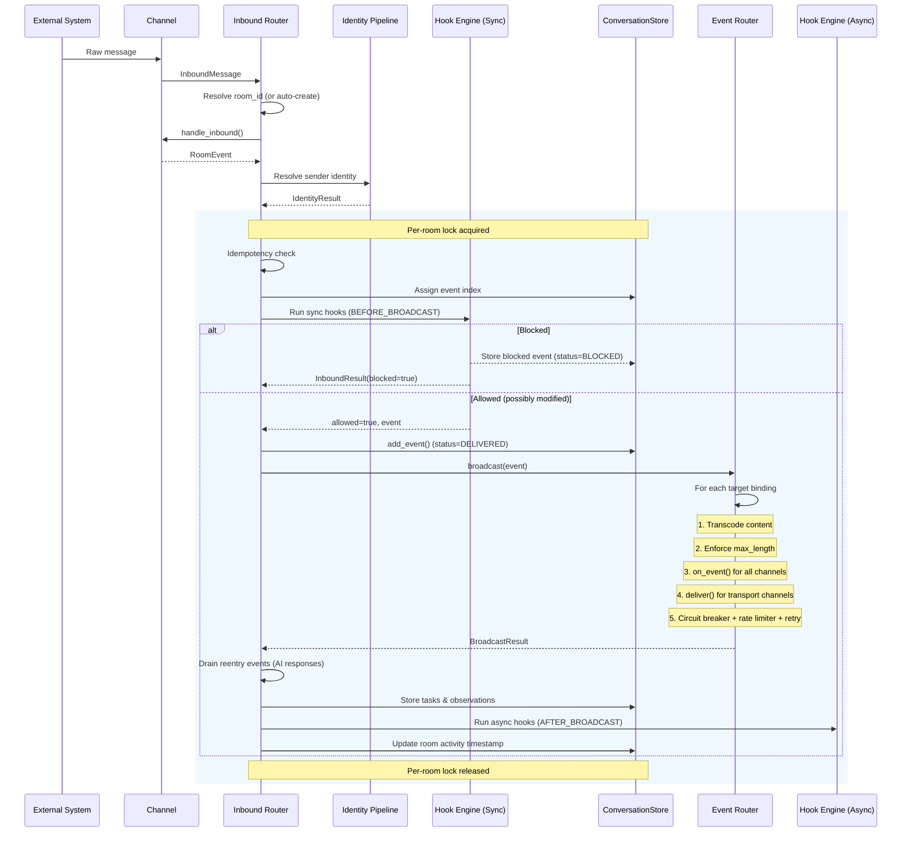
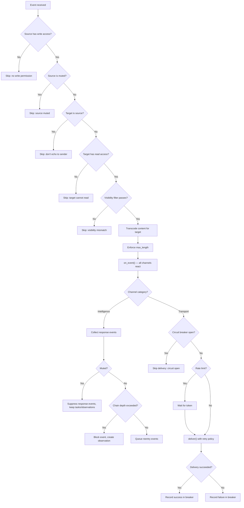
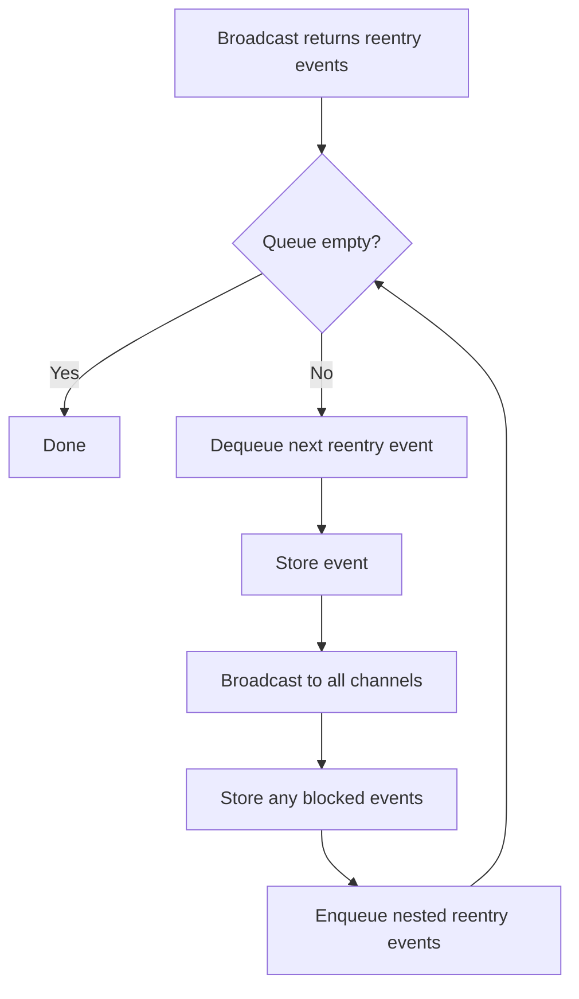
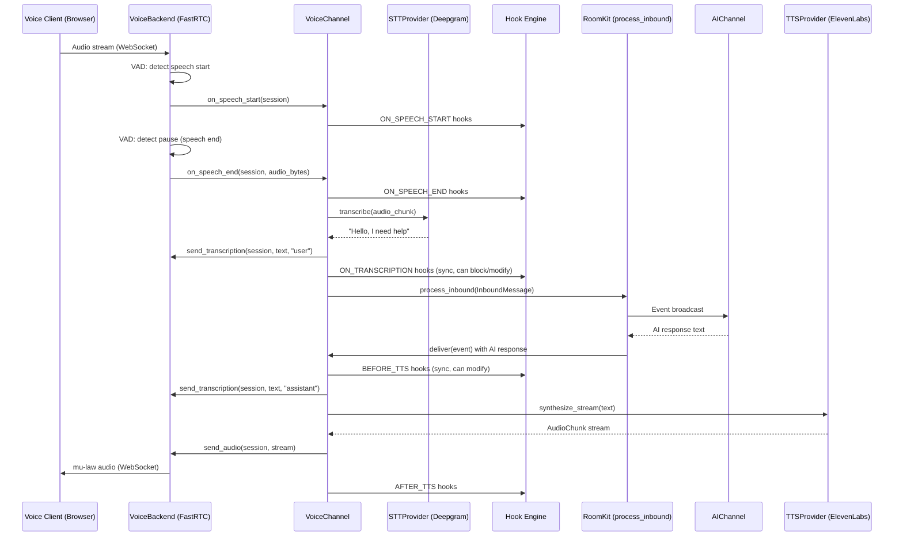
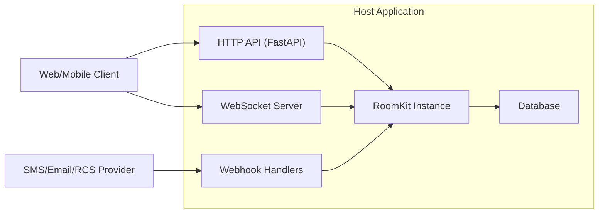

# Architecture

## High-Level Overview

RoomKit is a pure async Python library that implements a **room-based, multi-channel conversation orchestrator**. It provides a unified abstraction over heterogeneous communication channels (SMS, MMS, RCS, Email, WebSocket, HTTP webhooks, Messenger, WhatsApp) and intelligence layers (AI providers), all coordinated through a central event pipeline.

The architecture follows a **hub-and-spoke model**: the `RoomKit` orchestrator sits at the center, routing messages between channels attached to shared conversation rooms.

```mermaid
graph TB
    subgraph External["External Systems"]
        WS["WebSocket Clients"]
        SMS_EXT["SMS (Twilio, Telnyx, Sinch, VoiceMeUp)"]
        RCS_EXT["RCS (Twilio, Telnyx)"]
        EMAIL_EXT["Email (ElasticEmail, SendGrid)"]
        MSG_EXT["Facebook Messenger"]
        WA_EXT["WhatsApp"]
        HTTP_EXT["HTTP Webhooks"]
        AI_EXT["AI APIs (Anthropic, OpenAI, Gemini)"]
        VOICE_EXT["Voice Clients (FastRTC / WebRTC)"]
        STT_EXT["STT (Deepgram)"]
        TTS_EXT["TTS (ElevenLabs)"]
    end

    subgraph RoomKit["RoomKit Orchestrator"]
        IR["Inbound Router"]
        IP["Identity Pipeline"]
        HE["Hook Engine"]
        ER["Event Router"]
        TC["Transcoder"]
        CB["Circuit Breakers"]
        RL["Rate Limiter"]
        LM["Lock Manager"]
        RT["Realtime Backend"]
    end

    subgraph Channels["Channel Layer"]
        WS_CH["WebSocketChannel"]
        SMS_CH["SMSChannel"]
        RCS_CH["RCSChannel"]
        EMAIL_CH["EmailChannel"]
        MSG_CH["MessengerChannel"]
        WA_CH["WhatsAppChannel"]
        HTTP_CH["HTTPChannel"]
        AI_CH["AIChannel"]
        VOICE_CH["VoiceChannel"]
    end

    subgraph VoiceStack["Voice Stack"]
        VB["VoiceBackend (FastRTC)"]
        STT["STTProvider (Deepgram)"]
        TTS["TTSProvider (ElevenLabs)"]
    end

    subgraph Storage["Storage Layer"]
        STORE["ConversationStore"]
        MEM["InMemoryStore"]
    end

    WS --> WS_CH
    SMS_EXT --> SMS_CH
    RCS_EXT --> RCS_CH
    EMAIL_EXT --> EMAIL_CH
    MSG_EXT --> MSG_CH
    WA_EXT --> WA_CH
    HTTP_EXT --> HTTP_CH
    AI_EXT --> AI_CH
    VOICE_EXT --> VB

    WS_CH --> IR
    SMS_CH --> IR
    RCS_CH --> IR
    EMAIL_CH --> IR
    MSG_CH --> IR
    HTTP_CH --> IR
    VOICE_CH --> IR

    IR --> IP
    IP --> HE
    HE --> ER
    ER --> TC
    ER --> CB
    ER --> RL

    ER --> WS_CH
    ER --> SMS_CH
    ER --> RCS_CH
    ER --> EMAIL_CH
    ER --> MSG_CH
    ER --> WA_CH
    ER --> HTTP_CH
    ER --> AI_CH
    ER --> VOICE_CH

    HE --> STORE
    ER --> STORE
    STORE --> MEM

    WS_CH -.-> RT
    RT -.-> WS_CH

    VOICE_CH --> VB
    VOICE_CH --> STT
    VOICE_CH --> TTS
    VB --> VOICE_EXT
    STT --> STT_EXT
    TTS --> TTS_EXT
```



---

## Component Breakdown

### Core Components

The `RoomKit` class is composed via four mixins, each responsible for a distinct aspect of the orchestrator:

| Mixin | File | Responsibility |
|---|---|---|
| **InboundMixin** | `core/_inbound.py` | Full inbound message pipeline: room routing, identity resolution, hook execution, event storage, broadcast, reentry drain loop. |
| **ChannelOpsMixin** | `core/_channel_ops.py` | Channel registration, attachment/detachment, muting/unmuting, visibility and access control, binding metadata updates. |
| **RoomLifecycleMixin** | `core/_room_lifecycle.py` | Room CRUD, timer-based state transitions (ACTIVE/PAUSED/CLOSED), participant management, identity resolution for participants. |
| **HelpersMixin** | `core/_helpers.py` | Shared utilities: context building, binding lookups, system event emission, framework event dispatch, identity hook execution, side-effect persistence. |

Supporting core modules:

| Component | File | Responsibility |
|---|---|---|
| **HookEngine** | `core/hooks.py` | Manages global and per-room hooks. Executes sync pipelines (block/allow/modify) and async side effects. Priority-based ordering with timeout enforcement. Supports channel-type/ID/direction filtering. |
| **EventRouter** | `core/event_router.py` | Broadcasts events to eligible channels. Enforces access control, transcodes content, applies circuit breakers and rate limiting. Collects reentry events and side effects. |
| **InboundRoomRouter** | `core/inbound_router.py` | Resolves which room an inbound message belongs to. Default implementation queries the store by channel binding, then by participant + channel type. |
| **ContentTranscoder** | `core/transcoder.py` | Converts content between channel capabilities (e.g., rich text to plain text for SMS, media to caption text). |
| **CircuitBreaker** | `core/circuit_breaker.py` | Fault isolation via closed/open/half-open state machine. Per-channel instances isolate failing providers. |
| **TokenBucketRateLimiter** | `core/rate_limiter.py` | Per-channel token bucket rate limiter. Supports per-second, per-minute, and per-hour limits. |
| **RoomLockManager** | `core/locks.py` | Room-level async locks preventing race conditions during concurrent inbound message processing. Ships with `InMemoryLockManager` (LRU eviction, max 1024 locks). |
| **RetryWithBackoff** | `core/retry.py` | Exponential backoff retry mechanism for transient delivery failures. Configurable per channel binding. |
| **RealtimeBackend** | `realtime/base.py` | Pluggable backend for ephemeral events (typing, presence, read receipts). Ships with `InMemoryRealtime`. |

### Channel Layer

Channels bridge external systems and the RoomKit event pipeline. Two categories exist:

- **Transport** channels push events to external recipients via `deliver()`.
- **Intelligence** channels react to events by generating content via `on_event()`.

All transport channels (SMS, RCS, Email, WhatsApp, Messenger, HTTP) use the unified `TransportChannel` class, configured via factory functions with channel-specific capabilities. Only `WebSocketChannel` and `AIChannel` have dedicated implementations.

| Channel | Category | Factory | Provider(s) |
|---|---|---|---|
| `WebSocketChannel` | Transport | Direct class | Built-in (callback-based) |
| `SMSChannel` | Transport | `SMSChannel()` factory | VoiceMeUp, Twilio, Telnyx, Sinch |
| `RCSChannel` | Transport | `RCSChannel()` factory | Twilio RCS, Telnyx RCS |
| `EmailChannel` | Transport | `EmailChannel()` factory | ElasticEmail, SendGrid (scaffolded) |
| `MessengerChannel` | Transport | `MessengerChannel()` factory | Facebook Messenger |
| `WhatsAppChannel` | Transport | `WhatsAppChannel()` factory | WhatsApp Business (mock only) |
| `HTTPChannel` | Transport | `HTTPChannel()` factory | Generic webhook |
| `AIChannel` | Intelligence | Direct class | Anthropic Claude, OpenAI GPT, Google Gemini |
| `VoiceChannel` | Transport | Direct class | FastRTC backend + Deepgram STT + ElevenLabs TTS |
| `RealtimeVoiceChannel` | Transport | Direct class | Gemini Live / OpenAI Realtime + WebSocket or WebRTC transport |

The `TransportChannel` class is data-driven: it reads a `recipient_key` from binding metadata for the delivery address, and passes configurable `defaults` to the provider's `send()` method. This eliminates the need for per-channel subclasses.

### Voice Stack

The voice subsystem provides real-time audio support via three pluggable abstractions:

| Component | ABC | Implementations | Responsibility |
|---|---|---|---|
| **VoiceBackend** | `voice/base.py` | `FastRTCVoiceBackend` (FastRTC WebSocket), `MockVoiceBackend` | Audio transport: WebSocket/WebRTC connections, VAD callbacks, session management, audio streaming |
| **STTProvider** | `voice/stt.py` | `DeepgramSTTProvider`, `MockSTTProvider` | Speech-to-text: transcribe audio chunks or streams to text |
| **TTSProvider** | `voice/tts.py` | `ElevenLabsTTSProvider`, `MockTTSProvider` | Text-to-speech: synthesize text to audio chunks for streaming |

The `VoiceChannel` orchestrates the full pipeline:

```
Client audio → VoiceBackend (VAD) → STTProvider → Hook pipeline → process_inbound()
                                                                        ↓
Client audio ← VoiceBackend ← TTSProvider ← AI response ← Event broadcast
```

**VoiceBackend capabilities** are declared via `VoiceCapability` flags:
- `INTERRUPTION` -- Backend can cancel ongoing audio playback
- `PARTIAL_STT` -- Backend provides partial/streaming transcription
- `VAD_SILENCE` -- Backend emits silence detection events
- `VAD_AUDIO_LEVEL` -- Backend emits periodic audio level events
- `BARGE_IN` -- Backend detects user interrupting TTS playback

**Voice hook triggers** extend the standard hook system:
- `ON_SPEECH_START`, `ON_SPEECH_END` -- VAD events
- `ON_TRANSCRIPTION` -- After STT, sync (can modify or block the text)
- `BEFORE_TTS`, `AFTER_TTS` -- Around TTS synthesis, sync (can modify text)
- `ON_BARGE_IN`, `ON_TTS_CANCELLED` -- Interruption events
- `ON_PARTIAL_TRANSCRIPTION`, `ON_VAD_SILENCE`, `ON_VAD_AUDIO_LEVEL` -- Streaming events

### Realtime Voice Stack

For speech-to-speech AI (no intermediate STT/TTS), the `RealtimeVoiceChannel` uses a separate architecture:

| Component | ABC | Implementations | Responsibility |
|---|---|---|---|
| **RealtimeVoiceProvider** | `voice/realtime/provider.py` | `GeminiLiveProvider`, `OpenAIRealtimeProvider`, `MockRealtimeProvider` | Speech-to-speech AI: connect, send/receive audio, tool calling, transcriptions |
| **RealtimeAudioTransport** | `voice/realtime/transport.py` | `WebSocketRealtimeTransport`, `FastRTCRealtimeTransport`, `MockRealtimeTransport` | Browser-to-server audio: WebSocket or WebRTC connections, no VAD |

```
Client audio → Transport (passthrough) → Provider (server-side VAD + AI) → Transport → Client
                    ↓                           ↓
              on_audio_received          transcriptions emitted as RoomEvents
```

The `FastRTCRealtimeTransport` uses FastRTC in passthrough mode (no `ReplyOnPause`) for WebRTC audio. The `WebSocketRealtimeTransport` uses WebSocket for the same purpose. Both transports leave VAD to the provider's server-side implementation.

### Storage Layer

The `ConversationStore` ABC defines the complete persistence interface:

- **Rooms** -- CRUD, pagination, filtering by organization/status/metadata, find by participant
- **Events** -- Timeline storage, idempotency keys, visibility filtering, event counting
- **Bindings** -- Channel-to-room attachment management (add, get, update, remove, list)
- **Participants** -- Room membership tracking with identity resolution
- **Identities** -- Resolved user identity records and address linking
- **Tasks** -- Work items generated as side effects (add, get, list, update)
- **Observations** -- Intelligence findings with category and confidence (add, list)
- **Read tracking** -- Per-channel read markers, mark-all-read, and unread counts

The library ships with `InMemoryStore` for development and testing. The ABC is designed for drop-in replacement with any persistent backend (PostgreSQL, Redis, etc.).

### Model Layer

All data models use **Pydantic v2** `BaseModel` for validation and serialization. Content types use a discriminated union pattern for type-safe polymorphism. See [technical.md](technical.md#data-models) for the full schema reference.

---

## Data Flow

### Inbound Message Pipeline



### Event Routing Decision Flow

For each target channel binding, the EventRouter applies this logic:



Note: muted channels **do** receive events via `on_event()` and can produce side effects (tasks, observations). Only their `response_events` are suppressed. The RFC principle is: "muting silences the voice, not the brain."

### Reentry Drain Loop

When AI channels generate response events, these are processed in a drain loop within the same locked section:



This ensures AI-to-AI conversations complete atomically within a single `process_inbound` call, bounded by the `max_chain_depth` limit.

### Voice Pipeline

When a `VoiceChannel` is configured with a backend, STT, and TTS, the full real-time voice pipeline runs:



---

## External Integrations

### AI Providers

| Provider | SDK | Purpose |
|---|---|---|
| Anthropic Claude | `anthropic>=0.30` | Conversational AI responses via `AnthropicAIProvider` |
| OpenAI | `openai>=1.30` | Conversational AI responses via `OpenAIAIProvider` |
| Google Gemini | `google-genai>=1.0.0` | Conversational AI responses via `GeminiAIProvider` with native vision and function calling |
| Mistral AI | `mistralai>=1.0` | Conversational AI responses via `MistralAIProvider` with streaming, vision (Pixtral), and function calling |

All AI providers support:
- **Per-room configuration** via binding metadata (system_prompt, temperature, max_tokens)
- **Function calling / tools** via the `AITool` model
- **Vision** (Gemini built-in, others configurable via `supports_vision`)

### Voice Providers

| Provider | SDK | Purpose |
|---|---|---|
| Deepgram | `httpx>=0.27`, `websockets>=13.0` | Streaming speech-to-text via `DeepgramSTTProvider` |
| ElevenLabs | `httpx>=0.27`, `websockets>=13.0` | Text-to-speech synthesis via `ElevenLabsTTSProvider` |
| FastRTC | `fastrtc`, `numpy` | WebSocket audio transport with VAD via `FastRTCVoiceBackend`; WebRTC passthrough via `FastRTCRealtimeTransport` |
| Gemini Live | `google-genai>=1.0.0` | Speech-to-speech AI via `GeminiLiveProvider` |
| OpenAI Realtime | `openai>=1.30`, `websockets>=13.0` | Speech-to-speech AI via `OpenAIRealtimeProvider` |

Voice providers use the same **lazy dependency loading** pattern as other providers -- the SDK is imported only when the provider is instantiated. The `roomkit[fastrtc]` optional extra installs FastRTC and NumPy.

### Communication Providers

| Provider | SDK | Channel | Features |
|---|---|---|---|
| VoiceMeUp | `httpx>=0.27` | SMS/MMS | Delivery, webhook ingestion, MMS aggregation |
| Twilio | `twilio>=9.0` | SMS/MMS, RCS | Delivery, signature verification (HMAC-SHA1) |
| Telnyx | `httpx>=0.27` | SMS/MMS, RCS | Delivery, capability check, signature verification (ED25519) |
| Sinch | `httpx>=0.27` | SMS/MMS | Delivery, signature verification (HMAC-SHA1) |
| ElasticEmail | `httpx>=0.27` | Email | Email delivery |
| SendGrid | -- | Email | Config scaffolded |
| Facebook Messenger | `httpx>=0.27` | Messenger | Delivery and webhook parsing |

All external providers use **lazy dependency loading** -- the SDK is only imported when the specific provider class is instantiated. This keeps the core library lightweight with only `pydantic` as a hard dependency.

---

## Infrastructure and Deployment

### Runtime Requirements

- **Python 3.12+** (tested on 3.12 and 3.13)
- **AsyncIO** event loop (all I/O is async/await)
- No OS-level dependencies, no compiled extensions (optional: PyNaCl for Telnyx signature verification)

### Deployment Topology

RoomKit is a **library, not a standalone service**. It is designed to be embedded into a host application (e.g., a FastAPI or Starlette server). Typical deployment:



### Packaging

- **Build system:** Hatchling
- **Distribution:** Wheel (`py3-none-any`)
- **Package manager:** uv (with `pyproject.toml` + `uv.lock`)
- **PEP 561 compliant:** Ships with `py.typed` marker for downstream type checking
- **AI documentation:** Ships with `AGENTS.md` and `llms.txt` for LLM/AI agent consumption

---

## Scalability Considerations

### Concurrency Model

- **Room-level locking** via `RoomLockManager` ensures atomic event processing per room while allowing full concurrency across rooms. The `InMemoryLockManager` uses LRU eviction (max 1024 locks) to bound memory usage.
- **Async I/O** throughout -- no blocking calls, suitable for high-concurrency event loops.
- **Parallel broadcast** -- event delivery to multiple channels runs concurrently via `asyncio.gather()`.
- **Configurable timeouts** -- Identity resolution (default 10s) and locked processing (default 30s) both have enforced timeouts to prevent resource starvation.

### Resilience Patterns

| Pattern | Implementation | Purpose |
|---|---|---|
| **Circuit Breaker** | `CircuitBreaker` (closed/open/half-open) | Isolate failing providers; auto-recovery after timeout (default 60s, trips after 5 consecutive failures) |
| **Rate Limiting** | `TokenBucketRateLimiter` | Per-channel token bucket; configurable per-second/minute/hour limits with wait-based backpressure |
| **Retry with Backoff** | `retry_with_backoff` | Exponential backoff (`base * exponential_base^attempt`, capped at `max_delay_seconds`) for transient failures |
| **Chain Depth Limit** | `max_chain_depth` (default 5) | Prevent infinite event loops from AI reentry; exceeded events stored as BLOCKED with observations |
| **Idempotency** | `idempotency_key` on events | Prevent duplicate processing (checked inside room lock to avoid TOCTOU races) |
| **Process Timeout** | `process_timeout` (default 30s) | Prevent runaway locked processing from starving other rooms |
| **Identity Timeout** | `identity_timeout` (default 10s) | Prevent slow identity resolvers from blocking the pipeline |

### Horizontal Scaling

The `ConversationStore`, `RoomLockManager`, and `RealtimeBackend` ABCs are the extension points for distributed deployments:

- Replace `InMemoryStore` with a shared backend (PostgreSQL, Redis) for persistent state across replicas
- Replace `InMemoryLockManager` with a distributed lock (Redis, Postgres advisory locks) for multi-process deployments
- Replace `InMemoryRealtime` with Redis pub/sub or NATS for distributed ephemeral events
- The `InboundRoomRouter` is also pluggable for custom routing strategies

### Backpressure

RoomKit does not enforce a global concurrency limit on `process_inbound()` calls. Each call acquires a per-room lock internally, but across different rooms, processing is fully concurrent. The host application should apply upstream concurrency control:

```python
# Semaphore-based backpressure
semaphore = asyncio.Semaphore(100)

async def handle_webhook(message: InboundMessage) -> InboundResult:
    async with semaphore:
        return await kit.process_inbound(message)
```

---

## Security Architecture

### Authentication and Authorization

RoomKit operates at the **library level** and delegates authentication to the host application. The security model within RoomKit is based on:

1. **Channel Access Control** -- Each `ChannelBinding` specifies an `Access` level:
   - `READ_WRITE` -- Full send and receive
   - `READ_ONLY` -- Observe events, cannot send
   - `WRITE_ONLY` -- Send events, does not receive broadcasts
   - `NONE` -- Channel is attached but inactive

2. **Visibility Filtering** -- Events can be scoped via the `visibility` field:
   - `"all"` -- Visible to all channels
   - `"none"` -- Visible to no channels
   - `"transport"` -- Only visible to transport channels
   - `"intelligence"` -- Only visible to intelligence channels
   - `"channel-a,channel-b"` -- Comma-separated list of specific channel IDs
   - `"channel-a"` -- Single channel ID

3. **Muting** -- Channels can be muted per-room, suppressing their response events without detaching. Muted channels still receive events and produce side effects (tasks, observations).

4. **Direction Control** -- Channels declare their direction (`INBOUND`, `OUTBOUND`, `BIDIRECTIONAL`), enforced during target filtering.

### Data Protection

- **SecretStr for credentials** -- All provider configurations (API keys, tokens) use Pydantic's `SecretStr` type, preventing accidental logging or serialization of secrets.
- **No credential storage** -- RoomKit does not persist credentials; they are passed at provider initialization.
- **Blocked event audit trail** -- Events blocked by hooks are stored with `status=BLOCKED`, the blocking hook name in `blocked_by`, and the reason. This provides a complete audit trail.
- **Framework events** -- All significant actions (room created, channel attached, event blocked, delivery failed, chain depth exceeded, process timeout) emit `FrameworkEvent` objects for observability.
- **Webhook signature verification** -- Providers support signature verification (Telnyx ED25519, Twilio/Sinch HMAC-SHA1).

### Hook Security

- **Sync hooks** execute sequentially in priority order, stopping on the first `block` result. This ensures deterministic, auditable content filtering.
- **Async hooks** run concurrently with configurable timeouts (default 30s), preventing runaway hook functions from blocking the pipeline.
- **Hook errors** are logged and collected as `hook_errors` in the pipeline result, then emitted as framework events, but do not crash the pipeline.
- **Per-room hooks** allow dynamic hook management scoped to specific conversations.
- **Hook filtering** -- Hooks can be filtered by `channel_types`, `channel_ids`, and `directions` to run only for specific event sources.

### Identity Resolution

- Pluggable `IdentityResolver` supports multi-step identification workflows with a configurable timeout (default 10s)
- Statuses: `IDENTIFIED`, `PENDING`, `AMBIGUOUS`, `UNKNOWN`, `CHALLENGE_SENT`, `REJECTED`
- Hooks (`ON_IDENTITY_UNKNOWN`, `ON_IDENTITY_AMBIGUOUS`) allow custom challenge/verification flows
- Identity hooks can resolve, challenge, or reject -- challenge hooks can inject verification messages back to the sender
- Identity hooks support the same filtering as regular hooks (`channel_types`, `channel_ids`, `directions`)
- Identity is tracked per-participant per-room for audit compliance
- Participants can be manually resolved via `resolve_participant()` after the fact
- Identity resolution can be restricted to specific channel types via `identity_channel_types` parameter
