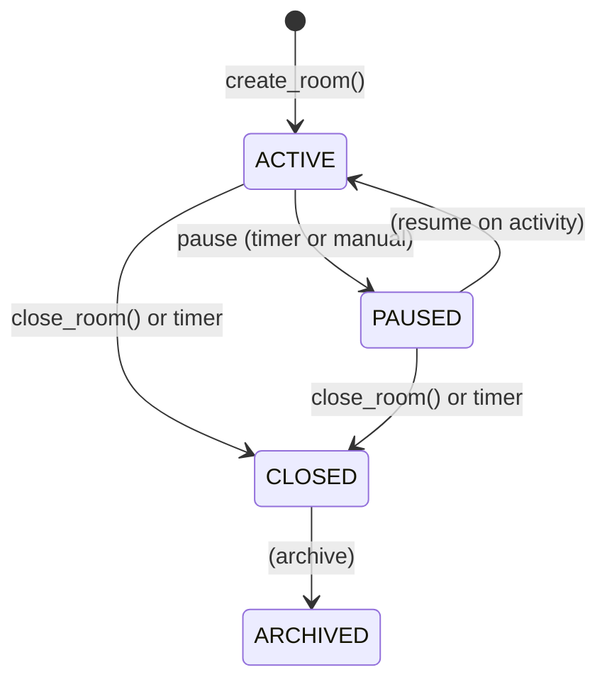
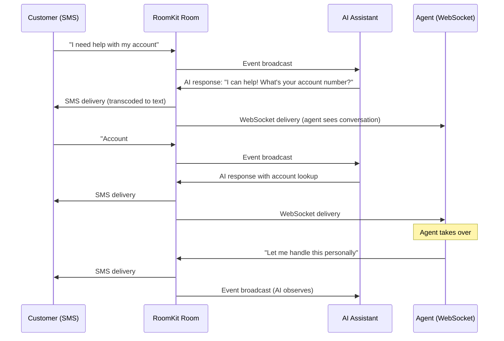
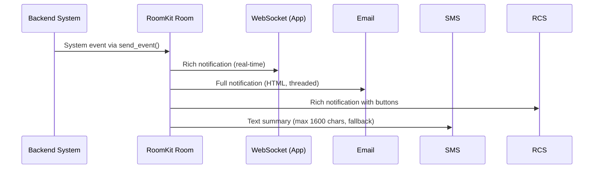
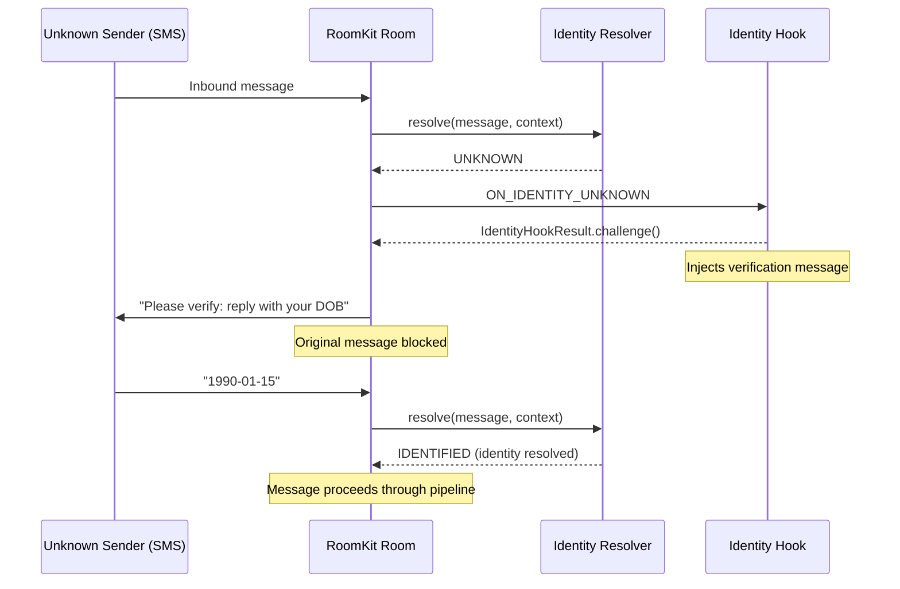
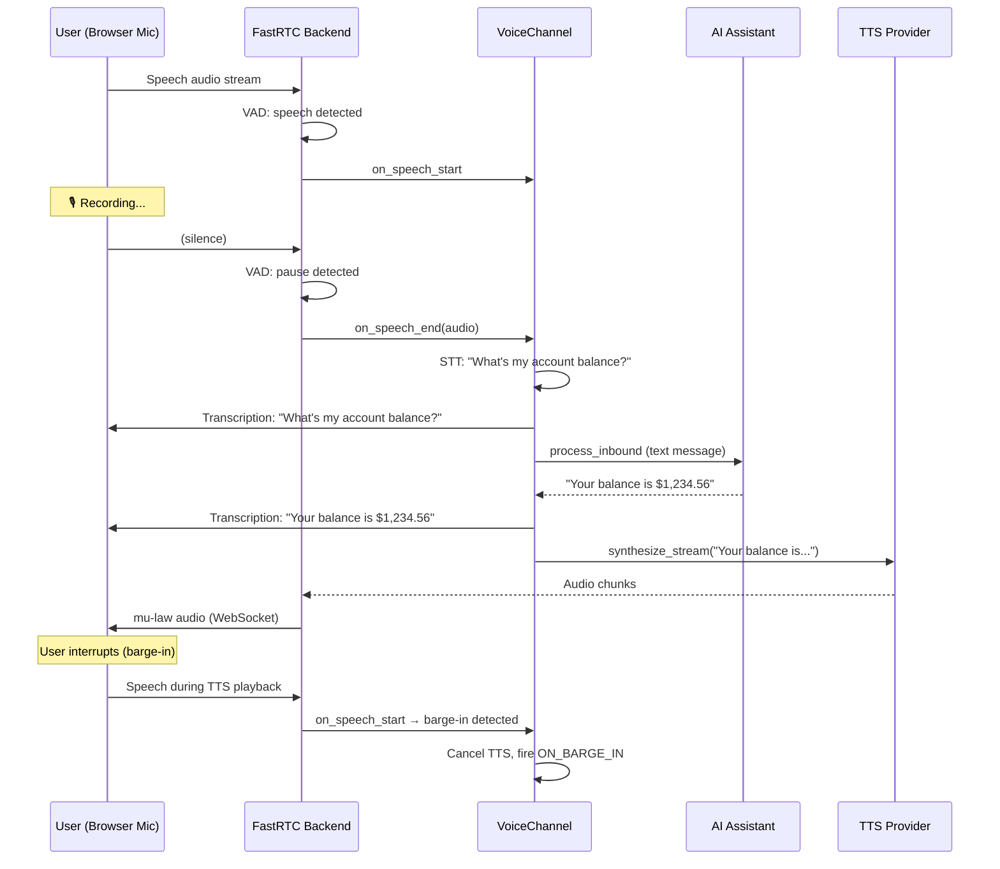
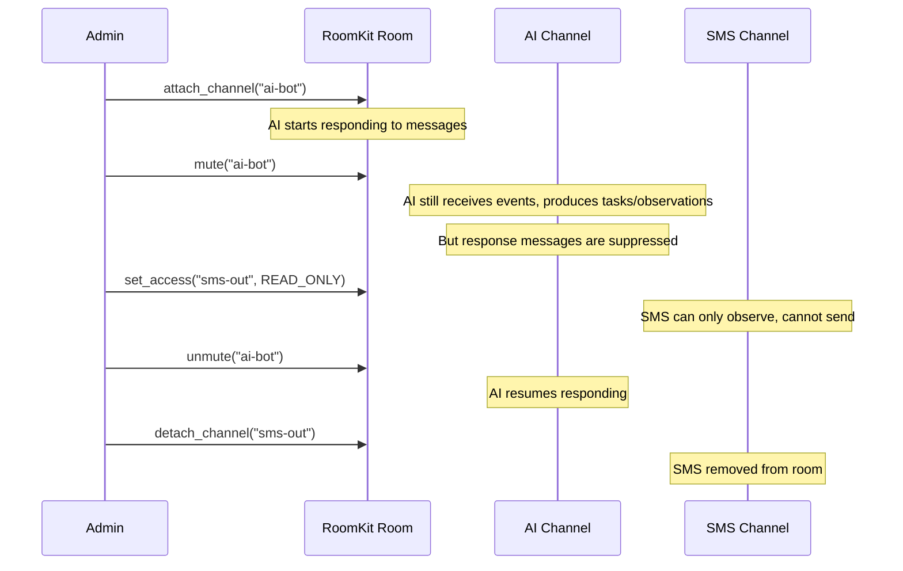

# Features

## Why RoomKit

RoomKit is designed around architectural patterns that solve real problems in multi-channel conversation systems. Here's what makes it valuable for production use:

### Hook System with 27 Triggers

Instead of a single "webhook" callback, RoomKit provides **27 distinct hook triggers** covering the full event lifecycle -- including 10 voice triggers and 2 realtime voice triggers. This enables:

- **Memory injection** — Add context before AI generates responses (`BEFORE_BROADCAST`)
- **Compliance filtering** — Block or modify messages based on content rules
- **Expertise weighting** — Route messages to specialized handlers based on content
- **Audit trails** — Log events at every stage for compliance requirements

Hooks support filtering by channel type, channel ID, and direction, so you don't need conditional logic inside your handlers.

### Channel Categories (Transport vs Intelligence)

RoomKit separates channels into two categories:

- **Transport** — Delivers messages to external systems (SMS, Email, WebSocket, etc.)
- **Intelligence** — Generates content (AI providers)

This clean separation means AI isn't bolted on as an afterthought. Intelligence channels participate in conversations as first-class citizens with their own lifecycle, muting, and configuration.

### Identity Resolution Pipeline

The "who is this sender?" problem gets a dedicated pipeline with:

- Pluggable resolvers for any user directory
- Multiple resolution statuses: identified, pending, ambiguous, unknown, rejected
- Hook triggers for each status (`ON_IDENTITY_AMBIGUOUS`, `ON_IDENTITY_UNKNOWN`)
- Challenge/response flows for verification
- Channel type filtering (e.g., only resolve SMS, skip WebSocket)

### Ephemeral Events Without Persistence Overhead

Typing indicators, presence, and read receipts don't belong in your conversation store. RoomKit's `RealtimeBackend` handles ephemeral events separately:

- No storage bloat from transient state
- Pluggable backend (in-memory for single-process, Redis/NATS for distributed)
- Same pub/sub pattern as persistent events

### Production-Ready Resilience

Built-in patterns that you'd otherwise have to implement yourself:

- **Circuit breakers** — Failing providers don't take down the whole room
- **Rate limiting** — Per-channel token bucket with configurable limits
- **Retry with backoff** — Exponential backoff for transient failures
- **Chain depth limiting** — Prevents AI-to-AI infinite loops
- **Idempotency** — Duplicate detection inside the room lock

### Real-Time Voice as a First-Class Channel

Voice isn't bolted on -- it's a full `Channel` implementation with:

- Pluggable STT/TTS providers (Deepgram, ElevenLabs, sherpa-onnx, or custom)
- Pluggable voice backends (FastRTC for WebSocket/WebRTC transport)
- Barge-in detection (user interrupts TTS playback)
- 10 voice-specific hook triggers for fine-grained control
- The same hook pipeline as text channels (transcription goes through `process_inbound()`)

### Speech-to-Speech AI (Realtime Voice)

`RealtimeVoiceChannel` wraps speech-to-speech APIs (Gemini Live, OpenAI Realtime) as a first-class channel:

- Audio flows directly between the user and the AI provider -- no intermediate STT/TTS
- Transcriptions are emitted as RoomEvents so other channels see the conversation
- Text injection from supervisors or other channels into the AI session
- Tool/function calling with pluggable `ToolHandler` (supports MCP)
- Auto-reconnect on connection drops with exponential backoff
- Per-session configuration via binding metadata (system prompt, voice, tools, temperature)
- Pluggable transports: `WebSocketRealtimeTransport` (WebSocket) or `FastRTCRealtimeTransport` (WebRTC via FastRTC)

### Shared Patterns

RoomKit uses **FastAPI + Pydantic v2 + async Python** patterns throughout. If your application uses these, integration is straightforward — models work directly, async patterns align, and type hints are comprehensive.

---

## Core Features

### Multi-Channel Conversation Rooms

RoomKit provides a **room-based abstraction** for managing conversations across multiple communication channels simultaneously. A room is a shared conversation context where messages flow between all attached channels.

```python
kit = RoomKit()

# Register channels
kit.register_channel(WebSocketChannel("ws-user"))
kit.register_channel(SMSChannel("sms-user", provider=sms_provider))
kit.register_channel(RCSChannel("rcs-user", provider=rcs_provider))
kit.register_channel(AIChannel("ai-bot", provider=ai_provider))

# Create a room and attach channels
room = await kit.create_room(room_id="support-123")
await kit.attach_channel("support-123", "ws-user")
await kit.attach_channel("support-123", "sms-user",
    metadata={"phone_number": "+15551234567"})
await kit.attach_channel("support-123", "rcs-user",
    metadata={"phone_number": "+15551234567"})
await kit.attach_channel("support-123", "ai-bot", category=ChannelCategory.INTELLIGENCE)
```

When a message arrives on any channel, it is automatically broadcast to all other attached channels, with content transcoded as needed for each target's capabilities.

### Room Lifecycle Management

Rooms follow a state machine with four statuses:



- **ACTIVE** -- Messages flow normally between all attached channels
- **PAUSED** -- Room is temporarily suspended; closed timer continues
- **CLOSED** -- Conversation is ended; no new messages accepted
- **ARCHIVED** -- Final state for long-term storage

Timer-based automation:

```python
from roomkit import RoomTimers

await kit.create_room(
    room_id="support-123",
    metadata={"timers": RoomTimers(
        inactive_after_seconds=300,     # Auto-pause after 5min inactivity
        closed_after_seconds=3600,      # Auto-close after 1hr inactivity
    )},
)

# Check and apply timer transitions for all active/paused rooms
transitioned = await kit.check_all_timers()
```

### Event Pipeline

Every message passes through a deterministic processing pipeline:

1. **Inbound routing** -- Resolve which room the message belongs to (by channel binding or participant)
2. **Auto-create** -- If no room found, create a new room and attach the channel
3. **Channel conversion** -- `handle_inbound()` converts the raw message to a `RoomEvent`
4. **Identity resolution** -- Identify the sender (optional, with timeout and channel filtering)
5. **Room lock** -- Acquire per-room lock for atomic processing
6. **Idempotency check** -- Reject duplicate messages by `idempotency_key`
7. **Sync hooks** -- Content filtering, modification, or blocking (BEFORE_BROADCAST)
8. **Event storage** -- Persist the event to the conversation store
9. **Broadcast** -- Deliver to all eligible channels via the EventRouter
10. **Reentry drain** -- Process AI response events in a loop (bounded by `max_chain_depth`)
11. **Side effects** -- Persist tasks and observations
12. **Async hooks** -- Side effects, logging, analytics (AFTER_BROADCAST)
13. **Activity update** -- Update room timestamp and latest event index

### Hook System

Hooks intercept events at specific points in the pipeline for business logic injection.

**Sync hooks** run before broadcast and can block, allow, or modify events:

```python
@kit.hook(HookTrigger.BEFORE_BROADCAST, name="profanity_filter")
async def profanity_filter(event: RoomEvent, ctx: RoomContext) -> HookResult:
    text = Channel.extract_text(event)
    if contains_profanity(text):
        return HookResult.block("Message contains inappropriate language")
    return HookResult.allow()
```

**Async hooks** run after broadcast for side effects:

```python
@kit.hook(HookTrigger.AFTER_BROADCAST, execution=HookExecution.ASYNC, name="logger")
async def log_event(event: RoomEvent, ctx: RoomContext) -> None:
    await analytics.track("message_sent", {"room": event.room_id})
```

Hook features:
- **Priority ordering** -- Hooks execute in priority order (lower numbers first)
- **Per-room hooks** -- Attach hooks to specific rooms dynamically via `add_room_hook()`
- **Global hooks** -- Apply to all rooms via the `@kit.hook()` decorator
- **Timeout protection** -- Configurable timeout per hook (default 30s)
- **Error isolation** -- Hook failures are logged and collected as `hook_errors` but don't crash the pipeline
- **Event injection** -- Hooks can inject synthetic events via `HookResult.injected_events`
- **Task/observation creation** -- Hooks can create side-effect tasks and observations
- **Event filtering** -- Hooks can be filtered by channel type, channel ID, and direction

**Hook filtering** allows hooks to run only for specific event sources:

```python
from roomkit import ChannelType, ChannelDirection

# Only run for inbound SMS/MMS events
@kit.hook(
    HookTrigger.BEFORE_BROADCAST,
    name="rehost_media",
    channel_types={ChannelType.SMS, ChannelType.MMS},
    directions={ChannelDirection.INBOUND},
)
async def rehost_media(event: RoomEvent, ctx: RoomContext) -> HookResult:
    # Only called for inbound SMS/MMS — no need to check inside
    ...
    return HookResult.allow()

# Only run for a specific channel
@kit.hook(
    HookTrigger.BEFORE_BROADCAST,
    name="voicemeup_specific",
    channel_ids={"sms-voicemeup"},
)
async def voicemeup_hook(event: RoomEvent, ctx: RoomContext) -> HookResult:
    ...
```

Filter options:
- `channel_types: set[ChannelType]` -- Only run for these channel types (e.g., `{ChannelType.SMS}`)
- `channel_ids: set[str]` -- Only run for these channel IDs (e.g., `{"sms-voicemeup"}`)
- `directions: set[ChannelDirection]` -- Only run for these directions (e.g., `{ChannelDirection.INBOUND}`)

**Hook triggers:**

| Trigger | Execution | Use Case |
|---|---|---|
| `BEFORE_BROADCAST` | Sync | Content filtering, modification, blocking |
| `AFTER_BROADCAST` | Async | Logging, analytics, notifications |
| `ON_ROOM_CREATED` | Async | Room initialization |
| `ON_ROOM_PAUSED` | Async | Inactivity alerts |
| `ON_ROOM_CLOSED` | Async | Cleanup, archival |
| `ON_CHANNEL_ATTACHED` | Async | Welcome messages |
| `ON_CHANNEL_DETACHED` | Async | Farewell messages |
| `ON_CHANNEL_MUTED` | Async | State tracking |
| `ON_CHANNEL_UNMUTED` | Async | State tracking |
| `ON_IDENTITY_AMBIGUOUS` | Both | Multi-candidate disambiguation |
| `ON_IDENTITY_UNKNOWN` | Both | Unknown sender handling |
| `ON_PARTICIPANT_IDENTIFIED` | Async | Post-identification actions |
| `ON_TASK_CREATED` | Async | Task routing |
| `ON_DELIVERY_STATUS` | Async | Outbound message tracking |
| `ON_ERROR` | Async | Error monitoring |
| `ON_SPEECH_START` | Async | Voice: speech detected |
| `ON_SPEECH_END` | Async | Voice: speech ended with audio |
| `ON_TRANSCRIPTION` | Sync | Voice: modify/block transcribed text |
| `BEFORE_TTS` | Sync | Voice: modify/block text before synthesis |
| `AFTER_TTS` | Async | Voice: after audio sent |
| `ON_BARGE_IN` | Async | Voice: user interrupted TTS |
| `ON_TTS_CANCELLED` | Async | Voice: TTS playback cancelled |
| `ON_PARTIAL_TRANSCRIPTION` | Async | Voice: streaming transcription |
| `ON_VAD_SILENCE` | Async | Voice: silence detected |
| `ON_VAD_AUDIO_LEVEL` | Async | Voice: audio level updates |
| `ON_SESSION_STARTED` | Async | Session started on any channel (voice or text), safe to greet |

### AI Intelligence Layer

The `AIChannel` is a special channel category (`INTELLIGENCE`) that generates AI responses:

```python
from roomkit import AIChannel, AnthropicAIProvider, AnthropicConfig

provider = AnthropicAIProvider(AnthropicConfig(api_key="sk-..."))
ai = AIChannel(
    "ai-assistant",
    provider=provider,
    system_prompt="You are a helpful customer support agent.",
    temperature=0.7,
    max_tokens=1024,
    max_context_events=50,  # Window of conversation history
)
```

AI features:
- **Context-aware** -- Builds conversation context from recent room events
- **Self-loop prevention** -- Skips events from itself to prevent self-echoing
- **Chain depth limiting** -- Global `max_chain_depth` (default 5) prevents runaway AI-to-AI loops; exceeded events are stored as BLOCKED with an observation
- **Provider-agnostic** -- Swap between Anthropic, OpenAI, Gemini, Mistral, or custom providers
- **Capability-aware generation** -- AI considers target transport channel capabilities when generating responses
- **Mute-aware** -- Muted AI channels still process events (tasks, observations) but suppress response messages
- **Vision support** -- Providers with vision capability can receive and process images
- **Function calling** -- Tools can be defined for AI to call external functions

#### Per-Room AI Configuration

AI channels support per-room configuration via binding metadata, allowing different rooms to have different AI behaviors:

```python
# Default AI configuration comes from the AIChannel constructor
ai = AIChannel("ai-bot", provider=provider, system_prompt="Default prompt")

# Override per room via binding metadata
await kit.attach_channel("legal-room", "ai-bot",
    category=ChannelCategory.INTELLIGENCE,
    metadata={
        "system_prompt": "You are a legal assistant. Be precise and cite sources.",
        "temperature": 0.3,
        "max_tokens": 2048,
    },
)

await kit.attach_channel("creative-room", "ai-bot",
    category=ChannelCategory.INTELLIGENCE,
    metadata={
        "system_prompt": "You are a creative writing assistant. Be imaginative!",
        "temperature": 0.9,
        "max_tokens": 4096,
    },
)
```

#### Function Calling / Tools

AI channels support function calling via the `tools` binding metadata:

```python
await kit.attach_channel("support-room", "ai-bot",
    category=ChannelCategory.INTELLIGENCE,
    metadata={
        "system_prompt": "You are a support agent with access to tools.",
        "tools": [
            {
                "name": "lookup_order",
                "description": "Look up an order by order ID",
                "parameters": {
                    "type": "object",
                    "properties": {
                        "order_id": {"type": "string", "description": "The order ID"},
                    },
                    "required": ["order_id"],
                },
            },
            {
                "name": "create_ticket",
                "description": "Create a support ticket",
                "parameters": {
                    "type": "object",
                    "properties": {
                        "subject": {"type": "string"},
                        "priority": {"type": "string", "enum": ["low", "medium", "high"]},
                    },
                },
            },
        ],
    },
)
```

Tool calls are returned in `AIResponse.tool_calls` for the host application to execute.

#### Streaming with Tools

When tools are configured and the AI provider supports streaming, RoomKit uses a **streaming tool loop** that delivers text progressively while handling tool calls between generation rounds:

```python
from roomkit import AIChannel, AnthropicAIProvider, AnthropicConfig

async def tool_handler(name: str, arguments: dict) -> str:
    if name == "lookup_order":
        return '{"status": "shipped", "eta": "2026-02-20"}'
    return '{"error": "Unknown tool"}'

ai = AIChannel(
    "ai-assistant",
    provider=AnthropicAIProvider(AnthropicConfig(api_key="sk-...")),
    tool_handler=tool_handler,
    max_tool_rounds=10,  # default
)
```

The streaming tool loop works as follows:

1. **Stream generation** -- text deltas are yielded to downstream channels as they arrive
2. **Collect tool calls** -- any tool calls from the generation are gathered after streaming completes
3. **Execute tools** -- each tool call is dispatched to the `tool_handler`
4. **Re-generate** -- the loop continues with tool results appended to the conversation context

This means downstream channels (WebSocket, Voice/TTS) receive text in real time during each generation round, with no delay waiting for tool calls to complete. The `max_tool_rounds` parameter controls the maximum number of tool execution rounds (default 10).

Providers that support structured streaming (`supports_structured_streaming=True`) emit `StreamTextDelta`, `StreamToolCall`, and `StreamDone` events. The Anthropic provider has native support; other providers use a default fallback that wraps `generate()`.

See the [Streaming with Tools guide](guides/streaming-tools.md) for architecture details and the full event protocol.

#### MCP Tool Provider

`MCPToolProvider` bridges [MCP](https://modelcontextprotocol.io/) servers into RoomKit's tool system. It discovers tools from a remote MCP server and exposes them as `AITool` objects with a standard `ToolHandler` for `AIChannel`:

```python
from roomkit import AIChannel, compose_tool_handlers
from roomkit.tools import MCPToolProvider

async with MCPToolProvider.from_url("http://localhost:8000/mcp") as mcp:
    handler = compose_tool_handlers(local_handler, mcp.as_tool_handler())
    ai = AIChannel("ai", provider=provider, tool_handler=handler)
```

`compose_tool_handlers` chains multiple handlers with first-match-wins dispatch, so MCP tools and local tools work side by side. Supports both streamable HTTP and SSE transports. Install with `pip install roomkit[mcp]`. See the [MCP Tool Provider guide](guides/mcp-tool-provider.md) for details.

#### Agent Skills

RoomKit supports the [Agent Skills](https://agentskills.io) open standard for packaging knowledge, instructions, and scripts into reusable skill bundles. Skills complement MCP (runtime tool integration) with a structured knowledge-packaging format adopted by Claude Code, Cursor, Gemini CLI, and others.

```python
from roomkit import AIChannel, SkillRegistry

# Discover skills from a directory of SKILL.md packages
registry = SkillRegistry()
registry.discover("./skills")

# Pass to AIChannel — tools are auto-registered
ai = AIChannel(
    "ai-assistant",
    provider=provider,
    system_prompt="You are a helpful assistant.",
    skills=registry,
)
```

When skills are configured, the AI channel automatically:

- Appends `<available_skills>` XML to the system prompt
- Registers `activate_skill` and `read_skill_reference` tools
- Optionally registers `run_skill_script` when a `ScriptExecutor` is provided

The `ScriptExecutor` ABC has no default implementation — execution policy (sandboxing, timeouts, interpreters) is always the integrator's responsibility.

See the [Agent Skills guide](guides/agent-skills.md) for full details on skill directory structure, script execution, and configuration.

#### AI Thinking / Reasoning

AI models with chain-of-thought reasoning (Claude 3.5+, DeepSeek-R1, QwQ) can expose their internal thinking. RoomKit captures this reasoning, preserves it across tool-loop rounds, and exposes it through hooks and ephemeral events.

```python
ai = AIChannel(
    "ai-thinker",
    provider=provider,
    system_prompt="Think step by step before answering.",
    thinking_budget=8192,  # Token budget for reasoning
)

# Per-room override via binding metadata
await kit.attach_channel("math-room", "ai-thinker",
    category=ChannelCategory.INTELLIGENCE,
    metadata={"thinking_budget": 16384},
)
```

Thinking support varies by provider:

- **Anthropic** — Native extended thinking API with signature-based round-trip fidelity
- **Ollama / vLLM** — `<think>...</think>` tag parsing with streaming support (handles tags split across chunk boundaries)
- **Gemini** — Accepted but no effect (Gemini does not currently emit thinking content)

During streaming, thinking arrives as `StreamThinkingDelta` events before text. The `ON_AI_THINKING` hook fires when reasoning is produced, and `THINKING_START` / `THINKING_END` ephemeral events enable real-time UI indicators.

See the [AI Thinking guide](guides/ai-thinking.md) for full details on configuration, streaming, and provider-specific behavior.

#### Vision Support

AI providers can optionally support vision (image processing) by setting `supports_vision=True`. When enabled:

- The `AIChannel.capabilities()` includes `MEDIA` in supported media types
- The transcoder passes images through instead of converting to text
- `AIMessage.content` becomes multimodal: `str | list[AITextPart | AIImagePart]`

```python
from roomkit import AIChannel, AIProvider, AIContext, AIResponse, AITextPart, AIImagePart

class VisionAIProvider(AIProvider):
    @property
    def supports_vision(self) -> bool:
        return True  # Enable vision capability

    @property
    def model_name(self) -> str:
        return "gpt-4o"

    async def generate(self, context: AIContext) -> AIResponse:
        for msg in context.messages:
            if isinstance(msg.content, list):
                # Multimodal content: text and images
                for part in msg.content:
                    if isinstance(part, AITextPart):
                        print(f"Text: {part.text}")
                    elif isinstance(part, AIImagePart):
                        print(f"Image: {part.url} ({part.mime_type})")
            else:
                # Plain text content
                print(f"Text: {msg.content}")
        return AIResponse(content="I can see the image!")

# Gemini has built-in vision support
from roomkit import GeminiAIProvider, GeminiConfig

gemini = GeminiAIProvider(GeminiConfig(api_key="..."))
assert gemini.supports_vision is True  # All Gemini models support vision
```

### Multi-Agent Orchestration

Route conversations between multiple AI agents with state tracking, handoff protocol, and pipeline workflows. A `ConversationRouter` (installed as a BEFORE_BROADCAST hook) directs events to the right agent based on conversation phase, rules, and affinity. Agents transfer conversations via the `handoff_conversation` tool.

```python
from roomkit import (
    ConversationPipeline,
    HandoffHandler,
    HandoffMemoryProvider,
    HookExecution,
    HookTrigger,
    PipelineStage,
    SlidingWindowMemory,
    setup_handoff,
)

# Define a pipeline: triage -> handler -> resolver
pipeline = ConversationPipeline(
    stages=[
        PipelineStage(phase="triage", agent_id="agent-triage", next="handling"),
        PipelineStage(phase="handling", agent_id="agent-handler", next="resolution"),
        PipelineStage(phase="resolution", agent_id="agent-resolver", next=None),
    ],
    supervisor_id="agent-supervisor",
)

# Generate router and install as a hook
router = pipeline.to_router()
kit.hook(HookTrigger.BEFORE_BROADCAST, execution=HookExecution.SYNC, priority=-100)(
    router.as_hook()
)

# Wire handoff into each agent
handler = HandoffHandler(kit=kit, router=router, phase_map=pipeline.get_phase_map())
for channel in [ai_triage, ai_handler, ai_resolver]:
    channel._memory = HandoffMemoryProvider(channel._memory)
    setup_handoff(channel, handler)
```

Key features:

- **ConversationState** — Immutable state model tracking phase, active agent, handoff count, and transition history
- **ConversationRouter** — Three-tier agent selection: affinity, rule matching, default fallback
- **HandoffHandler** — Validates targets, updates state, persists, emits system events
- **HandoffMemoryProvider** — Injects handoff context (summary, reason) into the receiving agent's prompt
- **ConversationPipeline** — Syntactic sugar for sequential workflows with optional loops (`can_return_to`)
- **Supervisor** — A designated agent that always receives events regardless of routing

See the [Orchestration guide](guides/orchestration.md) for details on state management, routing rules, and handoff configuration.

### Agent Delegation

Delegate tasks to background agents while conversations continue. A voice agent can hand off a PR review to a specialist while still chatting with the user:

```python
# One call: creates child room, attaches agent, shares channels, runs task
task = await kit.delegate(
    room_id="call-room",
    agent_id="pr-reviewer",
    task="Review the latest PR on roomkit",
    share_channels=["email-out"],
    notify="voice-assistant",
)

# Fire and forget, or block for result
result = await task.wait(timeout=30.0)
```

Key features:

- **Child room isolation** — each task gets its own room, event history, and agent
- **Channel sharing** — shared channels use the same provider instance (e.g. shared `EmailChannel`)
- **Result routing** — system prompt injection on the `notify` channel
- **Tool integration** — `setup_delegation()` lets the AI decide when to delegate (same pattern as `setup_handoff()`)
- **Pluggable backend** — `TaskRunner` ABC with `InMemoryTaskRunner` default; swap in Redis/Celery for distributed deployments
- **Hooks** — `ON_TASK_DELEGATED` and `ON_TASK_COMPLETED` for observability

See the [Agent Delegation guide](guides/agent-delegation.md) for the full API, tool integration, and custom task runners.

### Memory Providers

The `MemoryProvider` ABC controls how conversation history is retrieved for AI context. By default, `AIChannel` uses a sliding window of recent events. Custom providers can inject summaries, retrieve from vector stores, or combine strategies:

```python
from roomkit import AIChannel, MemoryProvider, MemoryResult, AIMessage, SlidingWindowMemory

# Default — last 50 events (same as omitting memory)
ai = AIChannel("ai", provider=provider, max_context_events=50)

# Custom provider that injects a summary
class SummaryMemory(MemoryProvider):
    async def retrieve(self, room_id, current_event, context, *, channel_id=None):
        summary = await my_summarizer.summarize(room_id)
        return MemoryResult(
            messages=[AIMessage(role="system", content=summary)],
            events=context.recent_events[-5:],
        )

ai = AIChannel("ai", provider=provider, memory=SummaryMemory())
```

`MemoryResult` has two fields: `messages` (pre-built `AIMessage` objects prepended to context) and `events` (raw `RoomEvent` objects converted by `AIChannel` with vision support preserved). See the [Memory Provider guide](guides/memory-provider.md) for details.

### Realtime Events (Typing, Presence, Read Receipts)

RoomKit provides a pluggable realtime backend for ephemeral events that don't require persistence:

```python
from roomkit import RoomKit, EphemeralEvent, EphemeralEventType

kit = RoomKit()  # Uses InMemoryRealtime by default

# Subscribe to ephemeral events for a room
async def on_realtime(event: EphemeralEvent):
    if event.type == EphemeralEventType.TYPING_START:
        print(f"{event.user_id} is typing...")
    elif event.type == EphemeralEventType.READ_RECEIPT:
        print(f"{event.user_id} read event {event.data['event_id']}")

sub_id = await kit.subscribe_room("room-123", on_realtime)

# Publish typing indicator
await kit.publish_typing("room-123", "user-456")

# Publish presence update
await kit.publish_presence("room-123", "user-456", "online")

# Publish read receipt
await kit.publish_read_receipt("room-123", "user-456", "event-789")

# Unsubscribe when done
await kit.unsubscribe_room(sub_id)
```

**Event types:**

| Type | Description |
|------|-------------|
| `TYPING_START` | User started typing |
| `TYPING_STOP` | User stopped typing |
| `PRESENCE_ONLINE` | User is online |
| `PRESENCE_AWAY` | User is away |
| `PRESENCE_OFFLINE` | User went offline |
| `READ_RECEIPT` | User read a message |
| `CUSTOM` | Custom ephemeral event |

**Custom backend for distributed deployments:**

The default `InMemoryRealtime` is single-process only. For distributed deployments, implement `RealtimeBackend`:

```python
from roomkit import RealtimeBackend, EphemeralEvent, EphemeralCallback, RoomKit

class RedisRealtime(RealtimeBackend):
    def __init__(self, url: str = "redis://localhost:6379"):
        self._redis = redis.from_url(url)

    async def publish(self, channel: str, event: EphemeralEvent) -> None:
        await self._redis.publish(channel, json.dumps(event.to_dict()))

    async def subscribe(self, channel: str, callback: EphemeralCallback) -> str:
        # ... implementation
        return sub_id

    async def unsubscribe(self, subscription_id: str) -> bool:
        # ... implementation

    async def close(self) -> None:
        await self._redis.close()

# Use custom backend
kit = RoomKit(realtime=RedisRealtime("redis://localhost:6379"))
```

### Content Transcoding

When a message is delivered to a channel that doesn't support the original content type, RoomKit automatically transcodes:

| Source Content | Target Capability | Transcoded Output |
|---|---|---|
| `RichContent` (HTML) | Text only | Plain text fallback body |
| `MediaContent` | Text only | Caption + URL as text |
| `LocationContent` | Text only | `"[Location: label (lat, lon)]"` |
| `AudioContent` | Text only | Transcript text or `"[Voice message]"` |
| `VideoContent` | Text only | `"[Video: url]"` |
| `CompositeContent` | Text only | Recursively transcoded parts, flattened |
| `TemplateContent` | Text only | Template body text |
| `TextContent` | Any | Always passed through |

If a content type cannot be transcoded for the target, the delivery to that channel is skipped with a `transcoding_failed` warning.

### Identity Resolution

Pluggable identity pipeline for identifying inbound message senders:

```python
class MyIdentityResolver(IdentityResolver):
    async def resolve(self, message: InboundMessage, context: RoomContext) -> IdentityResult:
        user = await lookup_user(message.sender_id)
        if user:
            return IdentityResult(
                status=IdentificationStatus.IDENTIFIED,
                identity=Identity(id=user.id, display_name=user.name),
            )
        return IdentityResult(status=IdentificationStatus.UNKNOWN)

kit = RoomKit(identity_resolver=MyIdentityResolver())
```

**Restrict identity resolution to specific channel types:**

```python
# Only resolve identity for SMS channels (not WebSocket, AI, etc.)
kit = RoomKit(
    identity_resolver=MyIdentityResolver(),
    identity_channel_types={ChannelType.SMS, ChannelType.MMS},
)
```

Identity statuses and their hooks:

| Status | Hook Trigger | Use Case |
|---|---|---|
| `IDENTIFIED` | `ON_PARTICIPANT_IDENTIFIED` | User found, proceed normally |
| `PENDING` | `ON_IDENTITY_AMBIGUOUS` | Awaiting asynchronous verification |
| `AMBIGUOUS` | `ON_IDENTITY_AMBIGUOUS` | Multiple candidates; prompt for clarification |
| `UNKNOWN` | `ON_IDENTITY_UNKNOWN` | No match found; request identification |
| `CHALLENGE_SENT` | -- | Identity hook sent verification challenge; message blocked |
| `REJECTED` | -- | Identity verification failed; message blocked |

Identity hooks can return `IdentityHookResult` with:
- `resolved()` -- Provide the resolved identity
- `pending()` -- Keep the participant in pending state
- `challenge()` -- Send a verification message and block the original
- `reject()` -- Block the message with a reason

Identity hooks also support filtering:

```python
@kit.identity_hook(
    HookTrigger.ON_IDENTITY_UNKNOWN,
    channel_types={ChannelType.SMS},
    directions={ChannelDirection.INBOUND},
)
async def challenge_unknown_sms(event, ctx, id_result):
    # Only runs for unknown SMS senders
    return IdentityHookResult.challenge(
        injected_events=[...],
        reason="Please verify your identity",
    )
```

After-the-fact resolution is also supported via `resolve_participant()`.

---

## Channel Support

### Feature Matrix

| Feature | WebSocket | SMS | RCS | Email | Messenger | Teams | WhatsApp | HTTP | AI | Voice |
|---|:---:|:---:|:---:|:---:|:---:|:---:|:---:|:---:|:---:|:---:|
| **Text** | x | x | x | x | x | x | x | x | x | x |
| **Rich text** | x | -- | x | x | x | x | x | x | x | -- |
| **Audio** | -- | -- | -- | -- | -- | -- | -- | -- | -- | x |
| **Media** | x | x* | x | x | x | -- | x | -- | *[1] | -- |
| **Location** | -- | -- | x | -- | -- | -- | x | -- | -- | -- |
| **Templates** | -- | -- | x | -- | x | -- | x | -- | -- | -- |
| **Buttons** | -- | -- | x | -- | x | -- | x | -- | -- | -- |
| **Quick replies** | -- | -- | x | -- | x | -- | x | -- | -- | -- |
| **Threading** | -- | -- | -- | x | -- | x | -- | -- | -- | -- |
| **Reactions** | x | -- | x | -- | -- | x | x | -- | -- | -- |
| **Read receipts** | x | x | x | -- | x | x | x | -- | -- | -- |
| **Typing indicators** | x | -- | -- | -- | -- | -- | x | -- | -- | -- |
| **Max length** | -- | 1600 | 3000 | -- | 2000 | 28000 | 4096 | -- | -- | -- |
| **Bidirectional** | x | x | x | x | x | x | x | x | x | x |
| **Category** | Transport | Transport | Transport | Transport | Transport | Transport | Transport | Transport | Intelligence | Transport |

*SMS supports MMS for media attachments.
*[1] AI channels support media when the provider has vision capability (`supports_vision=True`).*

### WebSocket Channel

Real-time bidirectional communication via callback-based connection registry:

```python
ws = WebSocketChannel("ws-user")
kit.register_channel(ws)

# Register a connection and send function
await kit.connect_websocket("ws-user", "conn-123", send_fn)

# Later: disconnect
await kit.disconnect_websocket("ws-user", "conn-123")
```

The `WebSocketChannel` is the only transport channel with a dedicated class (not using `TransportChannel`). It supports typing indicators, reactions, and read receipts.

### SMS Channel

SMS transport with 1600-character limit and provider abstraction:

```python
from roomkit import SMSChannel, TelnyxSMSProvider, TelnyxConfig

provider = TelnyxSMSProvider(TelnyxConfig(
    api_key="KEY...",
    from_number="+15551234567",
))
sms = SMSChannel("sms-channel", provider=provider)
```

The recipient phone number is read from `binding.metadata["phone_number"]` at delivery time.

**Available providers:**

| Provider | Status | Features |
|----------|--------|----------|
| Sinch | Implemented | SMS/MMS send, webhook parsing, signature verification (HMAC-SHA1) |
| Telnyx | Implemented | SMS/MMS send, webhook parsing, signature verification (ED25519) |
| Twilio | Implemented | SMS/MMS send, webhook parsing, signature verification (HMAC-SHA1) |
| VoiceMeUp | Implemented | SMS/MMS send, webhook parsing, MMS aggregator |

#### MMS Support

RoomKit supports MMS (Multimedia Messaging Service) through SMS providers. When an MMS arrives, the event's `channel_type` is automatically set to `mms` instead of `sms`.

**Provider differences:**

| Provider | MMS Webhook Behavior |
|----------|---------------------|
| Twilio | Single webhook with all media URLs |
| Sinch | Single webhook with media array |
| Telnyx | Single webhook with media array |
| VoiceMeUp | **Split webhooks** - automatic aggregation in `parse_voicemeup_webhook()` |

**VoiceMeUp MMS handling**: VoiceMeUp sends MMS as two separate webhooks (text + metadata, then image). `parse_voicemeup_webhook()` automatically buffers and merges them into a single event:

```python
from roomkit import parse_voicemeup_webhook, configure_voicemeup_mms

# Configure timeout for split MMS aggregation
async def handle_orphaned_mms(message):
    await kit.process_inbound(message)

configure_voicemeup_mms(timeout_seconds=5.0, on_timeout=handle_orphaned_mms)

# Webhook handler
@app.post("/webhooks/sms/voicemeup")
async def voicemeup_webhook(payload: dict):
    message = parse_voicemeup_webhook(payload, channel_id="sms")
    if message:  # None if buffered (waiting for second part)
        await kit.process_inbound(message)
    return {"ok": True}
```

**SMS Utilities:**

```python
from roomkit import extract_sms_meta, normalize_phone, WebhookMeta

# Extract normalized metadata from any provider's webhook payload
meta: WebhookMeta = extract_sms_meta("twilio", payload)
print(f"From: {meta.sender}, Body: {meta.body}")

# Convert directly to InboundMessage
sender = normalize_phone(meta.sender, "CA")
inbound = meta.to_inbound(channel_id="sms-channel")
result = await kit.process_inbound(inbound)

# Normalize phone numbers to E.164 format (requires phonenumbers)
normalized = normalize_phone("418-555-1234", "CA")  # "+14185551234"
```

**Webhook signature verification:**

```python
# Telnyx (ED25519, requires pynacl)
from roomkit import TelnyxSMSProvider, TelnyxConfig

telnyx = TelnyxSMSProvider(
    TelnyxConfig(api_key="KEY...", from_number="+15551234567"),
    public_key="your-telnyx-public-key-base64",
)
is_valid = telnyx.verify_signature(
    payload=request.body,
    signature=request.headers["Telnyx-Signature-Ed25519"],
    timestamp=request.headers["Telnyx-Timestamp"],
)

# Twilio (HMAC-SHA1)
from roomkit import TwilioSMSProvider, TwilioConfig

twilio = TwilioSMSProvider(TwilioConfig(
    account_sid="AC...", auth_token="...", from_number="+15551234567"
))
is_valid = twilio.verify_signature(
    payload=request.body,
    signature=request.headers["X-Twilio-Signature"],
    url=str(request.url),  # Full URL required for Twilio
)
```

### RCS Channel

Rich Communication Services (RCS) for enhanced messaging with fallback to SMS:

```python
from roomkit import RCSChannel, TelnyxRCSProvider, TelnyxRCSConfig

provider = TelnyxRCSProvider(TelnyxRCSConfig(
    api_key="KEY...",
    agent_id="your-rcs-agent-id",
))
rcs = RCSChannel("rcs-channel", provider=provider)
```

**Available providers:**

| Provider | Status | Features |
|----------|--------|----------|
| Telnyx | Implemented | RCS send, capability check, SMS fallback, webhook parsing, ED25519 signature verification |
| Twilio | Implemented | RCS send, SMS fallback, webhook parsing |

**RCS features:**
- Rich text and buttons
- Templates
- Location sharing
- Read receipts
- Automatic SMS fallback when RCS is unavailable

```python
# Check RCS capability before sending
can_rcs = await rcs_provider.check_capability("+15551234567")

# Send with or without fallback
result = await rcs_provider.send(event, to="+15551234567", fallback=True)
if result.fallback:
    print("Message sent via SMS fallback")
```

### Email Channel

Email transport with threading support:

```python
from roomkit import EmailChannel, ElasticEmailProvider, ElasticEmailConfig

provider = ElasticEmailProvider(ElasticEmailConfig(
    api_key="...",
    from_email="support@example.com",
    from_name="Support Team",
))
email = EmailChannel("email-channel", provider=provider)
```

The recipient email is read from `binding.metadata["email_address"]`. Available providers: ElasticEmail (implemented), SendGrid (scaffolded).

### Messenger Channel

Facebook Messenger integration with rich interactive elements:

```python
from roomkit import MessengerChannel, FacebookMessengerProvider, MessengerConfig

provider = FacebookMessengerProvider(MessengerConfig(
    page_access_token="...",
    app_secret="...",
))
messenger = MessengerChannel("fb-channel", provider=provider)
```

Recipient ID read from `binding.metadata["facebook_user_id"]`. Supports buttons (max 3), quick replies, and templates. Includes `parse_messenger_webhook()` for inbound webhook parsing.

### Teams Channel

Microsoft Teams integration via the Bot Framework SDK:

```python
from roomkit import TeamsChannel, BotFrameworkTeamsProvider, TeamsConfig

provider = BotFrameworkTeamsProvider(TeamsConfig(
    app_id="YOUR_APP_ID",
    app_password="YOUR_APP_PASSWORD",
))
teams = TeamsChannel("teams-channel", provider=provider)
```

Conversation ID read from `binding.metadata["teams_conversation_id"]`. Uses stored conversation references for proactive messaging. Supports rich text, threading, reactions, and read receipts. Max message length: 28,000 characters. Includes `parse_teams_webhook()` for inbound Activity parsing with automatic `<at>` mention stripping in group chats, `bot_mentioned` metadata detection, `is_bot_added()` for installation events, `parse_teams_activity()` for lifecycle event handling, and `create_channel_conversation()` for proactive channel messaging.

### WhatsApp Channel

WhatsApp Business integration:

```python
from roomkit import WhatsAppChannel

wa = WhatsAppChannel("wa-channel", provider=whatsapp_provider)
```

Recipient phone read from `binding.metadata["phone_number"]`. Supports text, rich text, media, location, templates, buttons (max 3), and quick replies. Max message length: 4096 characters. Currently mock-only; no production provider.

### HTTP Webhook Channel

Generic webhook transport for custom integrations:

```python
from roomkit import HTTPChannel, WebhookHTTPProvider, HTTPProviderConfig

provider = WebhookHTTPProvider(HTTPProviderConfig(
    webhook_url="https://example.com/webhook",
))
http = HTTPChannel("http-channel", provider=provider)
```

Recipient ID read from `binding.metadata["recipient_id"]`. Includes `parse_http_webhook()` for inbound webhook parsing.

### Voice Channel

Real-time voice communication with STT, TTS, and VAD integration:

```python
from roomkit import VoiceChannel, MockSTTProvider, MockTTSProvider
from roomkit.voice.backends.fastrtc import FastRTCVoiceBackend, mount_fastrtc_voice

# Create providers
stt = DeepgramSTTProvider(DeepgramConfig(api_key="..."))
tts = ElevenLabsTTSProvider(ElevenLabsConfig(api_key="..."))
backend = FastRTCVoiceBackend(input_sample_rate=48000, output_sample_rate=24000)

# Create voice channel
voice = VoiceChannel(
    "voice-1",
    stt=stt,
    tts=tts,
    backend=backend,
    enable_barge_in=True,           # Detect user interrupting TTS
    barge_in_threshold_ms=200,      # Min TTS playback before barge-in triggers
)
kit.register_channel(voice)

# Mount FastRTC WebSocket endpoint on FastAPI app
mount_fastrtc_voice(app, backend, path="/fastrtc")
```

The `VoiceChannel` orchestrates the full real-time pipeline:

1. **Client connects** via WebSocket → `FastRTCVoiceBackend` handles the connection
2. **VAD detects speech** → `on_speech_start` callback fires
3. **VAD detects pause** → `on_speech_end` callback fires with accumulated audio
4. **STT transcribes** the audio → text sent to client UI via `send_transcription()`
5. **Text routed** through standard `process_inbound()` pipeline (hooks, AI, etc.)
6. **AI response** delivered back via `deliver()` → TTS synthesizes audio
7. **Audio streamed** back to client via `send_audio()` (PCM → mu-law encoding)

**Voice backends:**

| Backend | Transport | VAD | Dependency |
|---------|-----------|-----|------------|
| `FastRTCVoiceBackend` | WebSocket | ReplyOnPause (built-in) | `roomkit[fastrtc]` |
| `MockVoiceBackend` | In-memory | Simulated | None |

**STT providers:**

| Provider | Features | Dependency |
|----------|----------|------------|
| `DeepgramSTTProvider` | Streaming STT, interim results, VAD, punctuation, diarization | `roomkit[httpx,websocket]` |
| `SherpaOnnxSTTProvider` | Local transducer/Whisper, streaming, batch | `roomkit[sherpa-onnx]` |
| `MockSTTProvider` | Configurable responses, cycling transcripts | None |

**TTS providers:**

| Provider | Features | Dependency |
|----------|----------|------------|
| `ElevenLabsTTSProvider` | Streaming synthesis, voice listing, configurable stability | `roomkit[httpx,websocket]` |
| `SherpaOnnxTTSProvider` | Local VITS/Piper, streaming, multi-speaker | `roomkit[sherpa-onnx]` |
| `MockTTSProvider` | Simulated audio content | None |

#### Barge-In Detection

When `enable_barge_in=True` (default), the `VoiceChannel` detects when a user starts speaking while TTS is playing:

```python
@kit.hook(HookTrigger.ON_BARGE_IN, execution=HookExecution.ASYNC)
async def handle_barge_in(event, ctx):
    # event is a BargeInEvent with:
    #   event.session - the voice session
    #   event.interrupted_text - what the AI was saying
    #   event.audio_position_ms - how far into playback
    logger.info("User interrupted at %dms: %s", event.audio_position_ms, event.interrupted_text)
```

Barge-in triggers:
1. `ON_BARGE_IN` hook fires
2. TTS playback is cancelled via `cancel_audio()`
3. `ON_TTS_CANCELLED` hook fires with reason `"barge_in"`

#### Voice Hook Triggers

| Trigger | Execution | Use Case |
|---|---|---|
| `ON_SPEECH_START` | Async | UI feedback (show recording indicator) |
| `ON_SPEECH_END` | Async | Analytics (speech duration tracking) |
| `ON_TRANSCRIPTION` | Sync | Modify or block transcribed text before routing |
| `BEFORE_TTS` | Sync | Modify or block AI response text before synthesis |
| `AFTER_TTS` | Async | Analytics (TTS usage tracking) |
| `ON_BARGE_IN` | Async | Handle user interruption during TTS |
| `ON_TTS_CANCELLED` | Async | Track cancelled TTS events |
| `ON_PARTIAL_TRANSCRIPTION` | Async | Real-time transcription UI (requires backend support) |
| `ON_VAD_SILENCE` | Async | Custom silence handling logic |
| `ON_VAD_AUDIO_LEVEL` | Async | Audio level UI meters |

#### FastRTC Backend

The `FastRTCVoiceBackend` uses [FastRTC](https://github.com/gradio-app/fastrtc) for WebSocket audio transport with built-in VAD:

```python
from roomkit.voice.backends.fastrtc import FastRTCVoiceBackend, mount_fastrtc_voice

backend = FastRTCVoiceBackend(
    input_sample_rate=48000,     # Browser default
    output_sample_rate=24000,    # TTS default
)

# Mount on FastAPI app (in lifespan)
mount_fastrtc_voice(
    app,
    backend,
    path="/fastrtc",
    session_factory=create_session,  # Optional: auto-create sessions on connect
)
```

The backend:
- Manages WebSocket connections and voice sessions
- Uses FastRTC's `ReplyOnPause` for VAD (Voice Activity Detection)
- Converts outbound PCM audio to mu-law encoding (pure Python, no `audioop` dependency)
- Sends audio and transcription updates to clients as JSON over WebSocket

Lazy-loaded via `roomkit.voice.get_fastrtc_backend()` to avoid requiring `fastrtc`/`numpy` at import time.

#### FastRTC Realtime Transport (WebRTC)

For speech-to-speech AI (`RealtimeVoiceChannel`), the `FastRTCRealtimeTransport` provides WebRTC-based audio transport in **passthrough mode** -- no VAD, no intermediate STT/TTS. Audio flows bidirectionally between the browser and the AI provider, which handles its own server-side VAD.

```python
from roomkit.voice.realtime.fastrtc_transport import (
    FastRTCRealtimeTransport,
    mount_fastrtc_realtime,
)

transport = FastRTCRealtimeTransport(
    input_sample_rate=16000,
    output_sample_rate=24000,
)

# Mount WebRTC endpoints on FastAPI app
mount_fastrtc_realtime(app, transport, path="/rtc-realtime")
```

The transport:
- Uses FastRTC's `Stream` with a passthrough handler (no `ReplyOnPause`)
- Converts between numpy arrays (FastRTC) and PCM16 LE bytes (transport ABC) automatically
- Supports WebRTC DataChannel for JSON messages (transcriptions, speaking indicators)
- Fires `on_client_connected` callback for auto-session creation

| Transport | Use Case | Protocol | VAD | Dependency |
|-----------|----------|----------|-----|------------|
| `WebSocketRealtimeTransport` | Speech-to-speech over WebSocket | WebSocket | Provider-side | `roomkit[websocket]` |
| `FastRTCRealtimeTransport` | Speech-to-speech over WebRTC | WebRTC | Provider-side | `roomkit[fastrtc]` |
| `FastRTCVoiceBackend` | Traditional voice (STT/TTS pipeline) | WebSocket | `ReplyOnPause` | `roomkit[fastrtc]` |

Lazy-loaded via `roomkit.voice.get_fastrtc_realtime_transport()` and `roomkit.voice.get_mount_fastrtc_realtime()`.

---

## Webhook Handling

### Generic Webhook Processing

RoomKit provides a unified webhook handling method that automatically routes inbound messages and delivery status updates:

```python
from roomkit import extract_sms_meta

@app.post("/webhooks/sms/{provider}")
async def sms_webhook(provider: str, payload: dict):
    meta = extract_sms_meta(provider, payload)
    await kit.process_webhook(meta, channel_id=f"sms-{provider}")
    return {"ok": True}
```

The `process_webhook()` method:
- Detects inbound messages and calls `process_inbound()`
- Detects delivery status updates and calls `process_delivery_status()`
- Silently acknowledges unknown webhook types

### Delivery Status Tracking

Track outbound message delivery via the `ON_DELIVERY_STATUS` handler:

```python
from roomkit import DeliveryStatus

@kit.on_delivery_status
async def track_delivery(status: DeliveryStatus):
    if status.status == "delivered":
        logger.info("Message %s delivered to %s", status.message_id, status.recipient)
    elif status.status == "failed":
        logger.error("Message %s failed: %s", status.message_id, status.error_message)
        # Create alert, retry, etc.
```

The `DeliveryStatus` model includes:
- `provider`: Provider name (e.g., "telnyx", "twilio")
- `message_id`: Provider's unique message identifier
- `status`: Status string (e.g., "sent", "delivered", "failed")
- `recipient`: Phone number/address the message was sent to
- `error_code`, `error_message`: Error details if failed
- `raw`: Original webhook payload for debugging

---

## Resilience Features

### Circuit Breaker

Automatic fault isolation for failing provider channels:

- **Closed** -- Normal operation; requests flow through
- **Open** -- After 5 consecutive failures, all requests are rejected immediately
- **Half-open** -- After 60s recovery timeout, allows one probe request
- Successful probe resets to Closed; failure keeps Open
- Per-channel instances managed by the EventRouter

### Rate Limiting

Per-channel token bucket rate limiter:

```python
await kit.attach_channel("room-1", "sms-channel",
    rate_limit=RateLimit(max_per_second=1.0),
    metadata={"phone_number": "+15551234567"},
)
```

Configurable via `max_per_second`, `max_per_minute`, or `max_per_hour`. Uses wait-based backpressure (queues requests until a token is available).

### Retry with Backoff

Configurable exponential backoff for transient delivery failures:

```python
await kit.attach_channel("room-1", "email-channel",
    retry_policy=RetryPolicy(
        max_retries=3,
        base_delay_seconds=1.0,
        max_delay_seconds=60.0,
        exponential_base=2.0,    # delay = base * (2 ^ attempt)
    ),
    metadata={"email_address": "user@example.com"},
)
```

After exhausting all retries, the last exception is raised and recorded in the circuit breaker.

### Chain Depth Limiting

Prevents infinite loops when AI channels generate responses that trigger other AI channels:

```python
kit = RoomKit(max_chain_depth=5)  # Default: 5
```

Events exceeding the chain depth limit are stored with `status=BLOCKED` and `blocked_by="event_chain_depth_limit"`. An `Observation` is created documenting the exceeded depth. A framework event `chain_depth_exceeded` is emitted.

### Idempotency

Duplicate message detection via idempotency keys:

```python
result = await kit.process_inbound(InboundMessage(
    channel_id="sms-channel",
    sender_id="+15551234567",
    content=TextContent(body="Hello"),
    idempotency_key="provider-msg-id-12345",
))
```

The idempotency check is performed inside the room lock to prevent TOCTOU races.

---

## Participant Roles and Permissions

### Roles

| Role | Description |
|---|---|
| `OWNER` | Room creator with full control |
| `AGENT` | Support agent or operator |
| `MEMBER` | Regular participant |
| `OBSERVER` | Read-only observer (analytics, compliance) |
| `BOT` | Automated participant (AI, webhook) |

### Participant Statuses

| Status | Description |
|---|---|
| `ACTIVE` | Currently participating |
| `INACTIVE` | Temporarily away |
| `LEFT` | Has left the room |
| `BANNED` | Removed from the room |

### Channel Access Control

Access levels control what each channel can do within a room:

| Access | Can Send | Receives Broadcasts |
|---|:---:|:---:|
| `READ_WRITE` | x | x |
| `READ_ONLY` | -- | x |
| `WRITE_ONLY` | x | -- |
| `NONE` | -- | -- |

Access can be changed dynamically:

```python
await kit.set_access("room-1", "observer-channel", Access.READ_ONLY)
await kit.set_visibility("room-1", "ai-channel", "intelligence")
```

### Muting

Muting suppresses a channel's response events without detaching it:

```python
await kit.mute("room-1", "ai-bot")    # AI stops responding but keeps analyzing
await kit.unmute("room-1", "ai-bot")   # AI resumes responding
```

Muted channels still receive events via `on_event()` and can produce tasks and observations. Only their `response_events` are suppressed. This enables "silent observer" patterns where AI monitors without participating.

---

## Observability

### Framework Events

RoomKit emits `FrameworkEvent` objects for observability via the `@kit.on()` decorator:

```python
@kit.on("room_created")
async def handle_room_created(event: FrameworkEvent) -> None:
    print(f"Room created: {event.data}")
```

Framework event types:
- `room_created`, `room_closed`, `room_paused`
- `room_channel_attached`, `room_channel_detached`
- `event_blocked`, `event_processed`
- `delivery_succeeded`, `delivery_failed`
- `broadcast_partial_failure`
- `chain_depth_exceeded`
- `identity_timeout`, `process_timeout`
- `hook_error`
- `channel_connected`, `channel_disconnected` (WebSocket)

### Telemetry Providers

RoomKit includes a provider-agnostic telemetry system for tracing spans and recording metrics. Instrument STT, TTS, LLM, hooks, audio pipeline, and realtime voice sessions with zero configuration overhead.

```python
from roomkit import RoomKit
from roomkit.telemetry import ConsoleTelemetryProvider

kit = RoomKit(telemetry=ConsoleTelemetryProvider())
```

Built-in providers:

- **NoopTelemetryProvider** -- Zero-overhead default (no-ops)
- **ConsoleTelemetryProvider** -- Logs span summaries via Python logging
- **MockTelemetryProvider** -- Records spans/metrics for test assertions
- **OpenTelemetryProvider** -- Bridges to the OTel SDK (`pip install 'roomkit[opentelemetry]'`)

14 span kinds cover the full stack: `STT_TRANSCRIBE`, `TTS_SYNTHESIZE`, `LLM_GENERATE`, `LLM_TOOL_CALL`, `HOOK_SYNC`, `HOOK_ASYNC`, `INBOUND_PIPELINE`, `REALTIME_SESSION`, `REALTIME_TURN`, `REALTIME_TOOL_CALL`, and more.

See the [Telemetry Guide](guides/telemetry.md) for details on custom providers, span hierarchy, and configuration.

### Hook-Based Monitoring

Async hooks can be used for real-time monitoring and analytics:

```python
@kit.hook(HookTrigger.AFTER_BROADCAST, execution=HookExecution.ASYNC)
async def monitor(event: RoomEvent, ctx: RoomContext) -> None:
    await metrics.increment("messages_processed")
    await metrics.gauge("room_event_count", ctx.room.event_count)
```

### Side Effects: Tasks and Observations

Hooks and intelligence channels can produce structured side effects:

- **Tasks** -- Work items with status tracking (`PENDING`, `IN_PROGRESS`, `COMPLETED`, `FAILED`, `CANCELLED`). Include title, description, assigned_to, and metadata.
- **Observations** -- Intelligence findings with `category` (e.g., "sentiment", "compliance_flag"), `confidence` score (0-1), and metadata.

Both are persisted via the `ConversationStore` and queryable per room:

```python
tasks = await kit.list_tasks("room-1", status="pending")
observations = await kit.list_observations("room-1")
```

---

## User Workflows

### Customer Support Flow



### Multi-Channel Notification Flow



### Identity Verification Flow



### Voice Conversation Flow



### Dynamic Channel Management



---

## Integration Points

### Inbound Message Ingestion

External systems deliver messages to RoomKit via `process_inbound()`:

```python
# From a FastAPI webhook handler
@app.post("/webhook/sms")
async def sms_webhook(request: Request):
    payload = await request.json()
    message = parse_voicemeup_webhook(payload, channel_id="sms")
    if message:
        result = await kit.process_inbound(message)
        return {"status": "ok", "blocked": result.blocked}
    return {"status": "buffered"}  # MMS part buffered
```

### Direct Event Injection

Send events directly into a room without going through the inbound pipeline:

```python
event = await kit.send_event(
    room_id="room-1",
    channel_id="system-channel",
    content=TextContent(body="System maintenance in 5 minutes"),
)
```

### Webhook Parsers

Built-in webhook parsers for provider-specific payloads:

- `parse_sinch_webhook()` -- Sinch SMS webhooks
- `parse_telnyx_webhook()` -- Telnyx SMS webhooks
- `parse_telnyx_rcs_webhook()` -- Telnyx RCS webhooks
- `parse_twilio_webhook()` -- Twilio SMS webhooks (form-encoded)
- `parse_twilio_rcs_webhook()` -- Twilio RCS webhooks
- `parse_voicemeup_webhook()` -- VoiceMeUp SMS webhooks (with MMS aggregation)
- `parse_messenger_webhook()` -- Facebook Messenger webhooks
- `parse_teams_webhook()` -- Microsoft Teams Bot Framework Activities (messages)
- `parse_teams_activity()` -- Microsoft Teams Activity metadata extraction (all types)
- `is_bot_added()` -- Detect bot installation from `conversationUpdate` Activities
- `parse_http_webhook()` -- Generic HTTP webhook payloads
- `extract_sms_meta()` -- Normalized metadata extraction for any SMS provider

### Custom Storage Backends

Implement `ConversationStore` for any persistence layer:

```python
class PostgresStore(ConversationStore):
    async def create_room(self, room: Room) -> Room:
        async with self.pool.acquire() as conn:
            await conn.execute("INSERT INTO rooms ...", room.model_dump())
        return room
    # ... implement remaining 29 abstract methods
```

### Custom AI Providers

Implement `AIProvider` for any AI service:

```python
class CustomAIProvider(AIProvider):
    @property
    def model_name(self) -> str:
        return "custom-model"

    async def generate(self, context: AIContext) -> AIResponse:
        response = await my_ai_client.chat(context.messages)
        return AIResponse(
            content=response.text,
            usage={"tokens": response.usage},
            tool_calls=[...],  # If function calling
        )
```

### Custom Memory Providers

Implement `MemoryProvider` to control AI context construction:

```python
class VectorMemory(MemoryProvider):
    async def retrieve(self, room_id, current_event, context, *, channel_id=None):
        relevant = await self.vector_store.search(current_event.content.body)
        return MemoryResult(
            messages=[AIMessage(role="system", content=f"Relevant context: {relevant}")],
            events=context.recent_events[-3:],
        )

ai = AIChannel("ai", provider=provider, memory=VectorMemory())
```

### Custom Identity Resolvers

Implement `IdentityResolver` for any user directory:

```python
class CRMIdentityResolver(IdentityResolver):
    async def resolve(self, message: InboundMessage, context: RoomContext) -> IdentityResult:
        user = await crm.lookup_by_phone(message.sender_id)
        if user:
            return IdentityResult(
                status=IdentificationStatus.IDENTIFIED,
                identity=Identity(id=user.id, display_name=user.name),
            )
        return IdentityResult(status=IdentificationStatus.UNKNOWN)
```

### Custom Inbound Routers

Override the default room routing strategy:

```python
class TenantRouter(InboundRoomRouter):
    async def route(self, channel_id, channel_type, participant_id) -> str | None:
        # Route to room based on tenant-specific logic
        return await self.lookup_tenant_room(participant_id)

kit = RoomKit(inbound_router=TenantRouter())
```

---

## Current Limitations

- **Single-process only (default)** -- `InMemoryLockManager` and `InMemoryRealtime` use asyncio primitives; distributed deployments require custom `RoomLockManager` and `RealtimeBackend` implementations
- **In-memory storage only (default)** -- No persistent store ships with the library; production use requires a custom `ConversationStore`
- **No built-in HTTP server** -- RoomKit is a library, not a server; webhook endpoints must be provided by the host application
- **No file/media storage** -- `MediaContent` stores URLs; actual file hosting must be handled externally
- **No end-to-end encryption** -- Content is available in plaintext within the pipeline; encryption must be handled at the transport level
- **Limited WhatsApp support** -- Mock provider only; no production WhatsApp Business API integration
- **No push notification channel** -- `ChannelType.PUSH` is defined but not implemented
- **Voice store-and-forward not implemented** -- `VoiceChannel` only supports streaming mode; store-and-forward mode requires a `MediaStore` not yet built
- **No pause_room() method** -- Rooms can only be paused via timers (`check_room_timers`), not directly

---

## Potential Enhancements

- **Persistent storage backends** -- PostgreSQL, Redis, or MongoDB `ConversationStore` implementations
- **Distributed locking** -- Redis-based `RoomLockManager` for multi-process deployments
- **Distributed realtime** -- Redis pub/sub or NATS-based `RealtimeBackend` for multi-process deployments
- **Event streaming** -- Kafka or Redis Streams integration for cross-service event distribution
- **OpenTelemetry integration** -- Built-in tracing and metrics via the `FrameworkEvent` system
- **Voice MediaStore** -- Store-and-forward mode for VoiceChannel (S3/GCS audio hosting)
- **Additional voice backends** -- LiveKit, Twilio Voice, or raw WebRTC backends
- **Additional STT/TTS providers** -- Google Cloud Speech, Amazon Polly (local sherpa-onnx now available)
- **Push notifications** -- Firebase Cloud Messaging or APNs provider
- **WhatsApp Business API** -- Full provider implementation with template management
- **Message search** -- Full-text search across room events
- **File storage abstraction** -- S3/GCS integration for media content hosting
- **Admin dashboard** -- Web UI for room management and monitoring
- **Rate limit queuing** -- Queue-and-drain instead of drop when rate limited
- **Direct pause/resume** -- Explicit `pause_room()` and `resume_room()` methods
