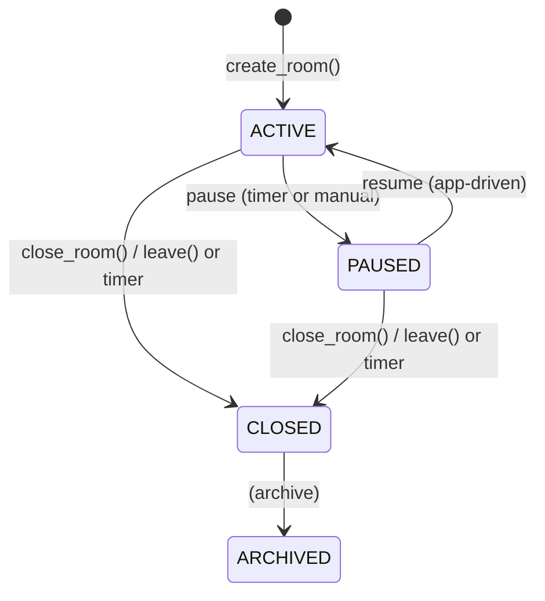
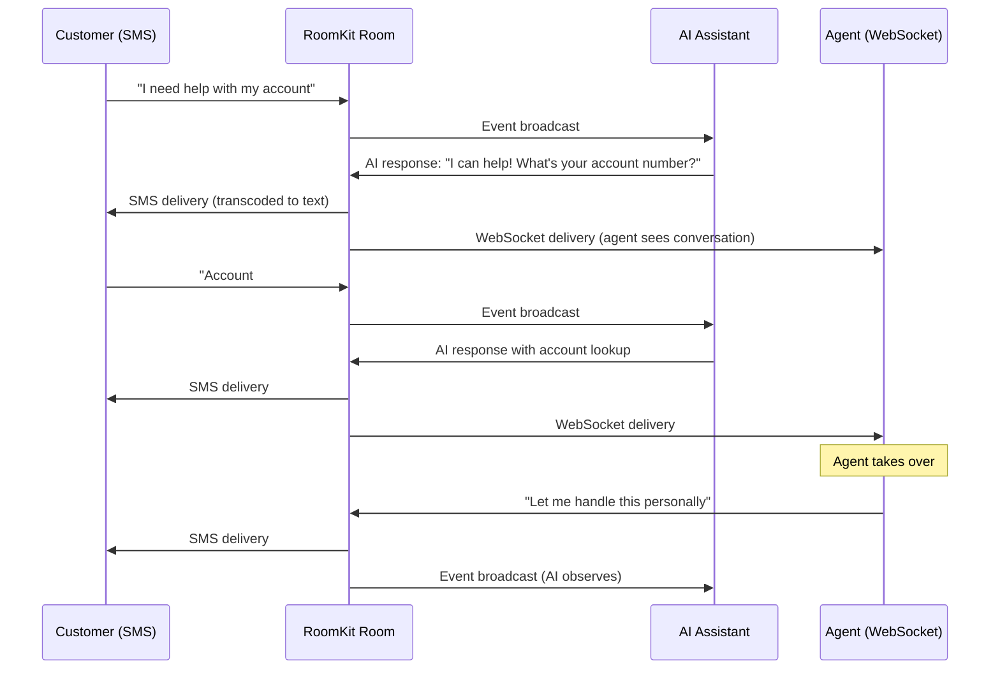
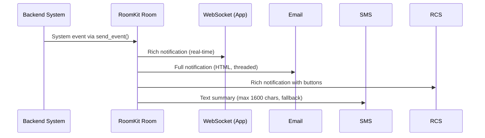
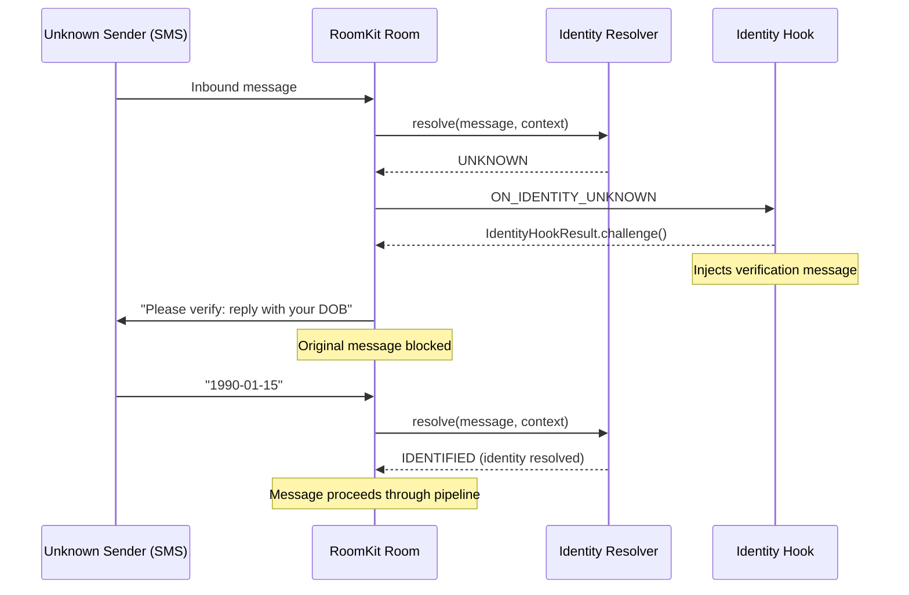
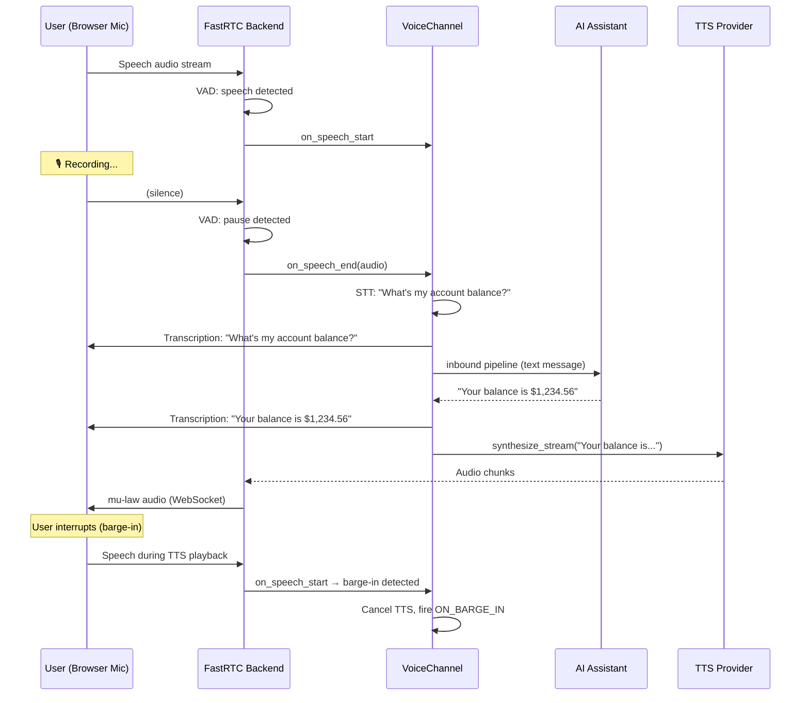
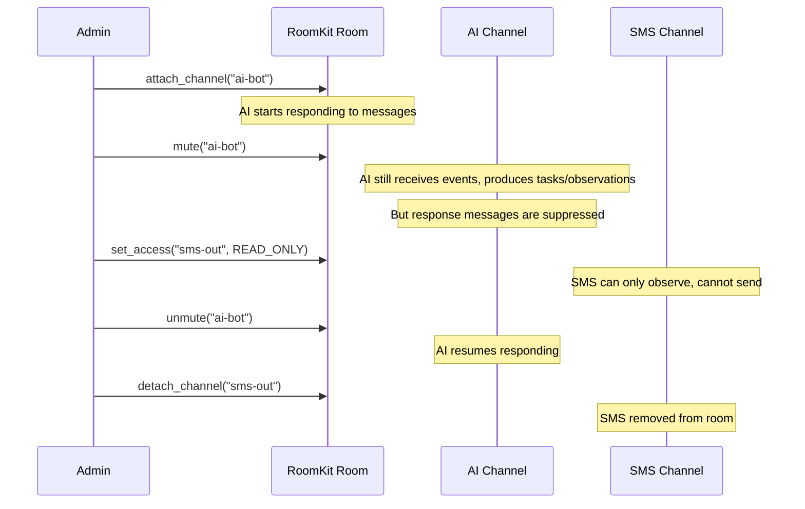

# Features

## Why RoomKit

RoomKit is designed around architectural patterns that solve real problems in multi-channel conversation systems. Here's what makes it valuable for production use:

### Hook System with 65 Triggers

Instead of a single "webhook" callback, RoomKit provides **65 distinct hook triggers** covering the full event lifecycle -- across text messaging, identity, voice, video, tool execution, and multi-agent orchestration. This enables:

- **Memory injection** — Add context before AI generates responses (`BEFORE_BROADCAST`)
- **Compliance filtering** — Block or modify messages based on content rules
- **Expertise weighting** — Route messages to specialized handlers based on content
- **Audit trails** — Log events at every stage for compliance requirements

Hooks support filtering by channel type, channel ID, and direction, so you don't need conditional logic inside your handlers.

### Channel Categories (Transport vs Intelligence)

RoomKit separates channels into two categories:

- **Transport** — Delivers messages to external systems (SMS, Email, WebSocket, etc.)
- **Intelligence** — Generates content (AI providers)

This clean separation means AI isn't bolted on as an afterthought. Intelligence channels participate in conversations as first-class citizens with their own lifecycle, muting, and configuration — and they say when that lifecycle may end: `Channel.active_turns` counts the turns a channel is producing, so a caller retiring a displaced object waits for zero instead of closing under a turn (see [Retiring a channel object](guides/acp-channel.md#retiring-a-channel-object-without-cutting-its-turn)).

### Identity Resolution Pipeline

The "who is this sender?" problem gets a dedicated pipeline with:

- Pluggable resolvers for any user directory
- Multiple resolution statuses: identified, pending, ambiguous, unknown, rejected
- Hook triggers for each status (`ON_IDENTITY_AMBIGUOUS`, `ON_IDENTITY_UNKNOWN`)
- Challenge/response flows for verification
- Channel type filtering (e.g., only resolve SMS, skip WebSocket)

### Ephemeral Events Without Persistence Overhead

Typing indicators, presence, and read receipts don't belong in your conversation store. RoomKit's `RealtimeBackend` handles ephemeral events separately:

- No storage bloat from transient state
- Pluggable backend (in-memory for single-process, Redis/NATS for distributed)
- Same pub/sub pattern as persistent events

### Production-Ready Resilience

Built-in patterns that you'd otherwise have to implement yourself:

- **Circuit breakers** — Failing providers don't take down the whole room
- **Rate limiting** — Per-channel token bucket with configurable limits
- **Retry with backoff** — Exponential backoff for transient failures
- **Connect timeout apart from read** — Every HTTP provider hands its client an `httpx.Timeout` with `connect_timeout` (5 s) beside `timeout`, so a host that no longer accepts connections fails in seconds rather than after the read budget (see [Connect vs Read Timeout](guides/production-resilience.md#connect-vs-read-timeout))
- **Chain depth limiting** — Prevents AI-to-AI infinite loops
- **Idempotency** — Duplicate detection inside the room lock

### Real-Time Voice as a First-Class Channel

Voice isn't bolted on -- it's a full `Channel` implementation with:

- Pluggable STT/TTS providers (Deepgram, ElevenLabs, Grok, Gemini, sherpa-onnx, or custom)
- STT language chosen per session at runtime (`set_stt_language`), with `STTLanguageLock` to start in Deepgram `multi` and pin the next stream to the language the caller uses
- Pluggable voice backends (FastRTC for WebSocket/WebRTC transport)
- Barge-in detection (user interrupts TTS playback)
- Audio bridging for human-to-human calls with N-party mixing and cross-rate resampling
- 10 voice-specific hook triggers for fine-grained control
- The same hook pipeline as text channels (transcription goes through the inbound pipeline)

### Speech-to-Speech AI (Realtime Voice)

`RealtimeVoiceChannel` wraps speech-to-speech APIs (Gemini Live, OpenAI Realtime, xAI Grok Realtime, ElevenLabs Conversational AI, Deepgram Voice Agent) as a first-class channel:

- Audio flows directly between the user and the AI provider -- no intermediate STT/TTS
- Transcriptions are emitted as RoomEvents so other channels see the conversation
- Text injection from supervisors or other channels into the AI session
- Tool/function calling with pluggable `ToolHandler` (supports MCP)
- One pre-execution gate for every tool call — declared catalogue, argument schema, skill gating and `BEFORE_TOOL_USE` — whatever serves it: a handler, an `ON_TOOL_CALL` hook, or the channel's own infrastructure tools
- `tool_recovery` (default on) — a call the model *speaks* as `call:name{args}` instead of issuing is recognised, gated like any other, and its outcome injected as context
- `setup_realtime_delegation()` — delegate tasks from voice agents without boilerplate
- `setup_realtime_vision()` — inject video/screen vision into voice sessions with dedup
- `inject_image()` — put a picture in the model's own context (Gemini Live, OpenAI Realtime)
- Task delivery via `inject_text()` — `ImmediateDelivery` and `WaitForIdleDelivery` auto-detect RealtimeVoiceChannel
- Gemini schema cleaning — tool schemas auto-stripped of unsupported fields (`$schema`, `additionalProperties`, `default`, `title`)
- Auto-reconnect on connection drops with exponential backoff
- Per-session configuration via binding metadata (system prompt, voice, tools, temperature)
- Deepgram Voice Agent composes its stages from independent vendors — including a non-Deepgram `speak` voice (ElevenLabs, Cartesia…) via `speak_provider`/`speak_endpoint`
- Pluggable transports: `WebSocketRealtimeTransport` (WebSocket) or `FastRTCRealtimeTransport` (WebRTC via FastRTC)

#### Images in the Conversation

Two different things carry a picture into a voice session, and the choice matters:

| | What travels | When to use it |
|---|---|---|
| `inject_image()` | The image itself, in the model's own context | The model should look at the picture and reason about it directly |
| `setup_realtime_vision()` | A vision model's *text* description, via `inject_text(silent=True)` | Continuous screen or camera feeds, where a described frame is enough and dedup matters |

```python
await channel.inject_image(
    session,
    image_bytes,
    "image/png",                    # PNG and JPEG
    prompt="What do you see?",      # optional, same item as the image
)
```

Supported by Gemini Live and by OpenAI Realtime on `gpt-realtime-2.1` and later.
Providers without image support raise `NotImplementedError`, which the channel
catches and logs. See the [realtime voice providers
guide](guides/realtime-voice-providers.md) for the fidelity and cost knob.

#### Voice Discovery

Every realtime voice provider can report which voices it supports, mirroring the
AI model catalog — so an integrator can list the `voice` ids before configuring:

```python
from roomkit.providers.openai.realtime import OpenAIRealtimeProvider

# Curated, offline catalog — a classmethod, so no API key, network, or SDK needed.
for voice in OpenAIRealtimeProvider.available_voices():
    print(voice.id, voice.name, voice.gender, voice.description)

# Live query — what the account exposes right now (ElevenLabs hits its voices API).
provider = ElevenLabsRealtimeProvider(ElevenLabsRealtimeConfig(api_key="...", agent_id="..."))
live = await provider.list_voices()
```

- **`available_voices()`** — classmethod returning a curated `list[VoiceInfo]`
  (`id`, `name`, `language`, `gender`, `description`, `deprecated`). Catalogs ship
  for OpenAI Realtime, Gemini Live, xAI Grok, PersonaPlex, Deepgram, and ElevenLabs.
- **`list_voices()`** — async query against the provider's voices endpoint,
  backfilling metadata from the curated catalog. OpenAI Realtime, Gemini Live,
  xAI, PersonaPlex, and Deepgram have fixed voice sets (no endpoint) and fall
  back to `available_voices()`; ElevenLabs queries `client.voices` live.

`VoiceInfo.id` is exactly what you pass as `connect(voice=...)` (e.g. `"alloy"`,
`"Puck"`, a PersonaPlex `"NATF2.pt"` prompt, or an ElevenLabs `voice_id`). See
`examples/list_voices.py`.

### Shared Patterns

RoomKit uses **FastAPI + Pydantic v2 + async Python** patterns throughout. If your application uses these, integration is straightforward — models work directly, async patterns align, and type hints are comprehensive.

---

## Core Features

### Multi-Channel Conversation Rooms

RoomKit provides a **room-based abstraction** for managing conversations across multiple communication channels simultaneously. A room is a shared conversation context where messages flow between all attached channels.

```python
kit = RoomKit()

# Register channels
kit.register_channel(WebSocketChannel("ws-user"))
kit.register_channel(SMSChannel("sms-user", provider=sms_provider))
kit.register_channel(RCSChannel("rcs-user", provider=rcs_provider))
kit.register_channel(AIChannel("ai-bot", provider=ai_provider))

# Create a room and attach channels
room = await kit.create_room(room_id="support-123")
await kit.attach_channel("support-123", "ws-user")
await kit.attach_channel("support-123", "sms-user",
    metadata={"phone_number": "+15551234567"})
await kit.attach_channel("support-123", "rcs-user",
    metadata={"phone_number": "+15551234567"})
await kit.attach_channel("support-123", "ai-bot", category=ChannelCategory.INTELLIGENCE)
```

When a message arrives on any channel, it is automatically broadcast to all other attached channels, with content transcoded as needed for each target's capabilities.

#### Attachment is a channel contract, not just a store write

Some channels have outside-world work to do when they are attached: `ConferenceChannel` creates the SFU room (RFC §12.10.4 step 1). That work runs through two `Channel` methods the framework awaits itself — no-ops on the base class, so an ordinary channel needs neither:

```python
class MyChannel(Channel):
    async def on_room_attached(self, room_id: str, binding: ChannelBinding) -> None:
        """Establish whatever the new binding claims exists."""

    async def on_room_detached(self, room_id: str) -> None:
        """Take it back down."""
```

Two consequences worth knowing about:

- **`attach_channel()` can fail on a remote backend.** `on_room_attached` is awaited between the binding write and the attachment being announced. A channel that raises there has not been attached: the binding is put back the way it was and the error reaches the caller, rather than leaving a room bound to a conference that was never created. Attaching *over* a live attachment is the case that "put back" matters for — the channel refusing the new binding has said nothing about the old one, so the previous binding is restored rather than deleted and `detach_channel()` can still tear the attachment down. `process_inbound()` inherits all of this wherever it auto-attaches a channel.
- **`ON_CHANNEL_ATTACHED` handlers run afterwards.** A handler that calls `ConferenceChannel.mint_access()` finds a conference to admit someone to. Async hooks of one trigger run concurrently with each other, so this ordering only holds because the channel's own work is not one of them. `on_room_detached` is awaited before the `ON_CHANNEL_DETACHED` handlers for the same reason.
- **A detach is announced whether or not the channel let go cleanly.** By the time `on_room_detached` runs the binding is gone and `CHANNEL_DETACHED` is indexed, so a channel that raises there changes how well it detached, not whether: `ON_CHANNEL_DETACHED` and `room_channel_detached` still fire, and the error reaches the caller afterwards.

### Room Lifecycle Management

Rooms follow a state machine with four statuses:


```mermaid
stateDiagram-v2
    [*] --> ACTIVE: create_room()
    ACTIVE --> PAUSED: pause (timer or manual)
    PAUSED --> ACTIVE: resume (app-driven)
    ACTIVE --> CLOSED: close_room() / leave() or timer
    PAUSED --> CLOSED: close_room() / leave() or timer
    CLOSED --> ARCHIVED: (archive)
```

- **ACTIVE** -- Messages flow normally between all attached channels
- **PAUSED** -- Room is temporarily suspended; closed timer continues
- **CLOSED** -- Conversation is ended; no new messages accepted
- **ARCHIVED** -- Final state for long-term storage

A `CLOSED` or `ARCHIVED` room refuses every write, at every entry (RFC §5.1):
`process_inbound()` returns `InboundResult(blocked=True, reason="room_closed")`,
`send_event()` raises `RoomClosedError`, and `regenerate_response()` is refused
the same way *before* the agent runs, so a closed room costs no generation for
an answer nothing could commit. Each refusal emits the `room_refused_event`
framework event with one `data` shape whichever path refused (RFC §8.2):
`status` (the room status that refused), `operation` (`inbound`, `reentry` or
`regenerate`) and `event_type` (the refused event's type; `None` when a
regenerate had nothing to replay). `event_id` is the refused event; for a
regenerate, the message it would have replayed (`None` when nothing qualified).

Timer-based automation:

```python
from roomkit import RoomTimers

room = await kit.create_room(
    room_id="support-123",
    timers=RoomTimers(
        inactive_after_seconds=300,    # Auto-pause after 5min inactivity
        closed_after_seconds=3600,     # Auto-close after 1hr inactivity
    ),
)

# Adjust timers on an existing room (no model_copy needed)
await kit.set_room_timers("support-123", RoomTimers(closed_after_seconds=7200))

# No internal scheduler — sweep periodically to apply timer transitions
transitioned = await kit.check_all_timers()
```

See the [Room Lifecycle & Timers guide](guides/room-lifecycle.md) for statuses, the activity model, and resuming paused rooms.

#### Organization-scoped room operations

Create tenant-owned rooms with `organization_id`, then pass the authenticated
tenant to room operations. A mismatch is reported as `RoomNotFoundError` so a
caller cannot probe room ids owned by another organization:

```python
await kit.create_room(room_id="support-123", organization_id="acme")
await kit.attach_channel(
    "support-123", "sms-user", organization_id="acme"
)
await kit.set_access(
    "support-123", "sms-user", Access.READ_ONLY, organization_id="acme"
)
events = await kit.get_timeline("support-123", organization_id="acme")
```

The scope is accepted consistently by room reads/writes, channel binding
operations, lifecycle/timer operations, participant resolution,
tasks/observations and read markers. `check_all_timers(organization_id="acme")`
sweeps only that tenant's rooms.

`organization_id` remains optional for single-tenant compatibility: RoomKit is
a library and has no request principal from which to infer it. A multi-tenant
application must derive it from authenticated context and pass it at every
boundary; never accept the scope itself from untrusted request data.

### Event Pipeline

Every message passes through a deterministic processing pipeline:

1. **Inbound routing** -- Resolve which room the message belongs to (by channel binding or participant)
2. **Auto-create** -- If no room found, create a new room and attach the channel
3. **Channel conversion** -- `handle_inbound()` converts the raw message to a `RoomEvent`
4. **Identity resolution** -- Identify the sender (optional, with timeout and channel filtering)
5. **Room lock** -- Acquire per-room lock for atomic processing
6. **Idempotency check** -- A repeated `idempotency_key` skips processing and returns the event the first delivery committed
7. **Sync hooks** -- Content filtering, modification, or blocking (BEFORE_BROADCAST), before any persistence
8. **Write-permission gate** -- A source whose binding cannot write (`READ_ONLY`/`NONE`, or muted) is stored `BLOCKED`, never `DELIVERED`; hook side effects are still collected
9. **Edit/delete mutation** -- For `EDIT`/`DELETE` events, the target message is mutated only here -- after hooks allow the event -- so a moderation hook that blocks the edit leaves the target untouched
10. **Event storage** -- Persist the allowed event as `DELIVERED`
11. **Broadcast** -- Deliver to all eligible channels via the EventRouter
12. **Reentry drain** -- Process AI response events in a loop (bounded by `max_chain_depth`)
13. **Side effects** -- Persist tasks and observations
14. **Activity update** -- Update room timestamp and latest event index
15. **Async hooks** -- Side effects, logging, analytics (AFTER_BROADCAST), run after the room lock is released

### Deferred Delivery

`process_inbound()` normally returns once its event's delivery set has
completed. Pass `defer_delivery=True` to return at the **commit point**
instead: the result carries the committed event immediately — a hook refusal
is still decided under the room lock, so a refused message still refuses the
call synchronously — while the delivery set, the reentry passes it spawns (an
AI reply included) and any streamed responses follow in the room's delivery
lane, in FIFO order like every other turn.

Built for HTTP surfaces: the route answers `200` with the created message
while the agent's turn runs on, instead of publishing a second, synthetic
copy of the message just to solicit the agent.

```python
result = await kit.process_inbound(message, room_id="r1", defer_delivery=True)
result.event         # committed -- the body of the 200
result.blocked       # still synchronous: a hook refusal reports here

await result.delivery.wait()   # DeliveryHandle: resolves once the whole turn
result.delivery_results        # ran (streamed responses included), backfilled
result.response_metadata       # final AI/ACP response record, also backfilled
```

`response_metadata` merges the root intelligence outputs for the turn. It is
available after ordinary streaming or non-streaming delivery and can contain
citations, provenance, or protocol-specific outcomes. A deferred result may be
empty at the commit point; `DeliveryHandle.wait()` backfills the same result
object after the stream and every reentry pass have completed.

`InboundResult.delivery` is `None` on the waiting path — and on a deferred
call refused **before** the commit region (rate limited, pre-commit timeout,
identity block), which has no delivery to follow. Whenever `blocked` is
`False` the handle is there; a hook refusal, decided inside the commit
region, gets one too. Awaited from a context the delivery lane cannot
progress past (a sync hook under the room lock, a tool handler inside the
lane), `wait()` returns unwaited instead of deadlocking. See
`examples/deferred_inbound.py` for a runnable end-to-end demonstration.

### Message Threading

RoomKit supports **flat, two-level threads** (Slack / Teams style) on the
`RoomEvent.parent_event_id` field: a reply points at its thread **root**; a root
or non-threaded message is `None`. Set it on the inbound message or on direct
injection, and the locked pipeline **normalises** any parent to the thread root
(replying to a reply collapses into one thread; a dangling or cross-room parent
drops to top level with a warning). Because normalisation is a single choke
point, the invariant "`parent_event_id` is always a root" holds for every entry
point and every channel — no per-channel wiring. An AI channel's response
inherits the trigger's thread root, so an `@`-mention inside a thread is
answered in-thread.

```python
reply = await kit.send_event("r1", "ws-bob", TextContent(body="Tuesday?"),
                             parent_event_id=root_id)

# Reads: main timeline (replies excluded) and one thread's replies
from roomkit.models.store_filter import EventFilter
timeline = await kit.store.list_events("r1", event_filter=EventFilter(top_level_only=True))
thread = await kit.store.list_events("r1", event_filter=EventFilter(parent_event_id=root_id))

# Per-root reply aggregates for a "N replies · last reply" affordance
summaries = await kit.store.get_thread_summaries("r1", [root_id])
```

Distinct from `ChannelData.thread_id` (the provider-native reference). See the
[Message Threading guide](guides/message-threading.md).

### Hook System

Hooks intercept events at specific points in the pipeline for business logic injection.

**Sync hooks** run before broadcast and can block, allow, or modify events:

```python
@kit.hook(HookTrigger.BEFORE_BROADCAST, name="profanity_filter")
async def profanity_filter(event: RoomEvent, ctx: RoomContext) -> HookResult:
    text = Channel.extract_text(event)
    if contains_profanity(text):
        return HookResult.block("Message contains inappropriate language")
    return HookResult.allow()
```

**Async hooks** run after broadcast for side effects:

```python
@kit.hook(HookTrigger.AFTER_BROADCAST, execution=HookExecution.ASYNC, name="logger")
async def log_event(event: RoomEvent, ctx: RoomContext) -> None:
    await analytics.track("message_sent", {"room": event.room_id})
```

Hook features:
- **Priority ordering** -- Hooks execute in priority order (lower numbers first)
- **Per-room hooks** -- Attach hooks to specific rooms dynamically via `add_room_hook()`
- **Global hooks** -- Apply to all rooms via the `@kit.hook()` decorator
- **Timeout protection** -- Configurable timeout per hook (default 30s)
- **Error isolation** -- Hook failures are logged and collected as `hook_errors` but don't crash the pipeline
- **Event injection** -- Hooks can inject synthetic events via `HookResult.injected_events`
- **Task/observation creation** -- Hooks can create side-effect tasks and observations
- **Event filtering** -- Hooks can be filtered by channel type, channel ID, and direction

**Hook filtering** allows hooks to run only for specific event sources:

```python
from roomkit import ChannelType
from roomkit.models.enums import ChannelDirection

# Only run for inbound SMS/MMS events
@kit.hook(
    HookTrigger.BEFORE_BROADCAST,
    name="rehost_media",
    channel_types={ChannelType.SMS, ChannelType.MMS},
    directions={ChannelDirection.INBOUND},
)
async def rehost_media(event: RoomEvent, ctx: RoomContext) -> HookResult:
    # Only called for inbound SMS/MMS — no need to check inside
    ...
    return HookResult.allow()

# Only run for a specific channel
@kit.hook(
    HookTrigger.BEFORE_BROADCAST,
    name="voicemeup_specific",
    channel_ids={"sms-voicemeup"},
)
async def voicemeup_hook(event: RoomEvent, ctx: RoomContext) -> HookResult:
    ...
```

Filter options:
- `channel_types: set[ChannelType]` -- Only run for these channel types (e.g., `{ChannelType.SMS}`)
- `channel_ids: set[str]` -- Only run for these channel IDs (e.g., `{"sms-voicemeup"}`)
- `directions: set[ChannelDirection]` -- Only run for these directions (e.g., `{ChannelDirection.INBOUND}`)

**Hook triggers:**

| Trigger | Execution | Use Case |
|---|---|---|
| `BEFORE_BROADCAST` | Sync | Content filtering, modification, blocking |
| `AFTER_BROADCAST` | Async | Logging, analytics, notifications |
| `ON_ROOM_CREATED` | Async | Room initialization |
| `ON_ROOM_PAUSED` | Async | Inactivity alerts |
| `ON_ROOM_CLOSED` | Async | Cleanup, archival |
| `ON_CHANNEL_ATTACHED` | Async | Welcome messages — runs after the channel's own `on_room_attached` ([above](#attachment-is-a-channel-contract-not-just-a-store-write)) |
| `ON_CHANNEL_DETACHED` | Async | Farewell messages — runs after the channel's own `on_room_detached` |
| `ON_CHANNEL_MUTED` | Async | State tracking |
| `ON_CHANNEL_UNMUTED` | Async | State tracking |
| `ON_IDENTITY_AMBIGUOUS` | Both | Multi-candidate disambiguation |
| `ON_IDENTITY_UNKNOWN` | Both | Unknown sender handling |
| `ON_PARTICIPANT_IDENTIFIED` | Async | Post-identification actions |
| `ON_PARTICIPANT_JOINED` | Async | Explicit member join (`add_member`) |
| `ON_PARTICIPANT_LEFT` | Async | Explicit member leave (`remove_member`) |
| `ON_TASK_CREATED` | Async | Task routing |
| `ON_DELIVERY_STATUS` | Async | Outbound message tracking |
| `ON_ERROR` | Async | Error monitoring |
| `ON_SPEECH_START` | Async | Voice: speech detected |
| `ON_SPEECH_END` | Async | Voice: speech ended with audio |
| `ON_TRANSCRIPTION` | Sync | Voice: modify/block transcription (`TranscriptionEvent`) |
| `BEFORE_TTS` | Sync | Voice: modify/block text before synthesis |
| `AFTER_TTS` | Async | Voice: after audio sent |
| `ON_BARGE_IN` | Async | Voice: user interrupted TTS |
| `ON_TTS_CANCELLED` | Async | Voice: TTS playback cancelled |
| `ON_PARTIAL_TRANSCRIPTION` | Async | Voice: streaming transcription |
| `ON_VAD_SILENCE` | Async | Voice: silence detected |
| `ON_VAD_AUDIO_LEVEL` | Async | Voice: audio level updates |
| `ON_SESSION_STARTED` | Async | Session started on any channel (voice or text), safe to greet |
| `ON_TOOL_CALL` | Sync | Tool call from any channel (AI or realtime voice) — observe, override, or block |
| `ON_USER_INPUT_REQUIRED` | Sync | Human-in-the-loop: tool paused, waiting for user input (see [guide](guides/human-in-the-loop.md)) |
| `BEFORE_AI_GENERATION` | Sync | Modify or block AI generation context before provider invocation |
| `ON_AI_THINKING` | Async | AI reasoning/thinking events (extended thinking). Carries a `ThinkingEvent`; fires with or without a realtime backend |
| `ON_AI_RESPONSE` | Async | A turn of intelligence completed — scoring, analytics, job tracking. `response_content` is the turn's transcript (the segments a tool call cut, separated by a blank line) and `segments` carries them one by one. Fires for **any** channel of category `INTELLIGENCE`, an ACP coding agent included |
| `ON_PLAN_UPDATED` | Async | An agent rewrote its structured task plan. Carries a `PlanUpdatedEvent` with the plan as the agent wrote it |
| `ON_STATUS_POSTED` | Async | A status reached the inter-agent StatusBus. Fires for the room named in the entry's `metadata["room_id"]` — the bus itself is global |

### AI Intelligence Layer

The `AIChannel` is a special channel category (`INTELLIGENCE`) that generates AI responses:

```python
from roomkit import AIChannel
from roomkit.providers.anthropic.ai import AnthropicAIProvider
from roomkit.providers.anthropic.config import AnthropicConfig

provider = AnthropicAIProvider(
    AnthropicConfig(api_key="sk-...", model="claude-opus-5")
)
ai = AIChannel(
    "ai-assistant",
    provider=provider,
    system_prompt="You are a helpful customer support agent.",
    temperature=0.7,
    max_tokens=1024,
    max_context_events=50,  # Window of conversation history
)
```

AI features:
- **Context-aware** -- Builds conversation context from recent room events
- **Self-loop prevention** -- Skips events from itself to prevent self-echoing
- **Chain depth limiting** -- Global `max_chain_depth` (default 5) prevents runaway AI-to-AI loops; exceeded events are stored as BLOCKED with an observation
- **Provider-agnostic** -- Swap between Anthropic, OpenAI, OpenRouter, a LiteLLM gateway, Gemini, Mistral, DeepSeek, Qwen, or custom providers
- **Data residency** -- `GeminiVertexProvider` runs Gemini through Vertex AI in a pinned region (in-region processing, no training-data retention) for regimes like Québec Law 25 / PIPEDA
- **Cost attribution** -- `GeminiVertexConfig.labels` rides every Vertex request as a billing label, so Cloud Billing splits one project's Gemini spend per tenant or partner; validated against Google's label rules at configuration
- **Capability-aware generation** -- AI considers target transport channel capabilities when generating responses
- **Mute-aware** -- Muted AI channels still process events (tasks, observations) but suppress response messages
- **Vision support** -- Providers with vision capability can receive and process images
- **Function calling** -- Tools can be defined for AI to call external functions

#### ACP Coding Agents

`ACPChannel` is a separate intelligence channel for external coding-agent
runtimes. RoomKit is the ACP client, while Claude Agent, Codex CLI, Gemini CLI,
or another compatible agent owns the ACP session and tool loop:

```python
from roomkit import ACPChannel, ChannelCategory

agent = ACPChannel(
    "coding-agent",
    command=["my-acp-agent", "--stdio"],
    cwd="/srv/workspaces/project",
)
kit.register_channel(agent)
await kit.attach_channel(
    "support-123",
    "coding-agent",
    category=ChannelCategory.INTELLIGENCE,
)
```

The channel maps one ACP session to each Room and supports streamed text,
thinking, tool-call activity, plans, permission requests, and cancellation.
Tool permissions are denied by default. The agent's session tunables are
readable and settable — `agent.session_config(room_id)` returns
`{"model": "sonnet", "mode": "auto", ...}` and
`await agent.set_config_option(room_id, "model", "opus[1m]")` switches one,
with every change published as an ephemeral event.

The turn's live response record starts with the negotiated ACP protocol
version. A prompt that returns for any reason other than `end_turn` adds
`response_metadata["acp"]["stop_reason"]`; one that never returns adds
`interrupted: true`. Clean turns add neither marker. The final record reaches
`InboundResult.response_metadata` even when a tool call was the last activity
and there is no final message to inspect; for deferred delivery, await the
delivery handle first.

An agent that is not addressed is skipped entirely — not asked, and not told
(RFC §19.3.2). Because an ACP session holds its history inside the agent's
process, the channel catches up from the room's timeline the moment it *is*
addressed: only what it missed, only what visibility would have delivered to
it (RFC §7.5 rule 8), bounded by `room_history` (default 20) and honest about
the bound when it truncates. `room_history=0` opts out.

What the catch-up cannot carry is what only the host holds — member notes, a
document corpus, an organisation's rules. `context_contributor` is awaited once
per solicited turn and its blocks open the prompt, ahead of the catch-up; one
that raises costs its blocks, not the turn. Install it with
`pip install "roomkit[acp]"`. See the [ACP Agent Channel
guide](guides/acp-channel.md).

#### Model Discovery

Discovery is `list_models()`. It asks the provider, so it is always current and
reflects your own account — entitlements, regional availability, whichever
weights someone pulled onto a local server:

```python
provider = OpenAIAIProvider(OpenAIConfig(api_key="sk-...", model="gpt-5.6-sol"))
for model in await provider.list_models():
    print(model.id, model.display_name, model.context_window, model.supports_vision)
```

`available_models()` answers a different question: what RoomKit knows about a
model *without* a network call. It exists because `context_window` is a sync
property — history trimming needs a number before any request goes out, and
cannot await one.

```python
# Offline metadata: a classmethod, so no API key, network, or SDK needed.
OpenAIAIProvider.available_models()
```

Read it that way and its limits stop being surprising. A lineup turns over
faster than a release cycle, so this list is never the authoritative answer to
"what does this provider offer" — and a model missing from it is a normal
outcome, not a bug: you get `context_window is None` and degrade, which beats
trusting a stale number.

- **`list_models()`** -- async query against the provider's models endpoint
  (OpenAI `/v1/models`, Anthropic/Mistral `models.list`, Gemini `models.list()`,
  Ollama `/api/tags`), backfilling metadata from the offline list. Providers
  without an endpoint fall back to `available_models()`.
- **`available_models()`** -- classmethod returning `list[ModelInfo]`
  (`id`, `display_name`, `context_window`, `supports_vision`, `deprecated`,
  `pricing`), shipped for Anthropic, OpenAI, OpenRouter, Gemini, Mistral, xAI,
  DeepSeek, Qwen, Ollama, and PolarGrid. Verified against a live upstream mirror on every
  release (`make check-models`), which is what catches a vendor shipping a new
  flagship — a stale list is internally consistent, so no test can. PolarGrid
  is the exception: absent from that mirror, its catalog is checked by hand
  against the vendor's autorouter (`/v1/route?model=<id>`, 404 when no edge
  serves the id).
- **Azure / vLLM** -- these serve user-named deployments or arbitrary local
  models, so neither has a meaningful offline list and both return an empty
  one. `context_window` is `None` there by design; `list_models()` asks the
  deployment or the server, which does know.
- **OpenRouter** -- its offline list is a deliberately small slice of current
  flagships; `list_models()` reads OpenRouter's `/models` endpoint (300+ models
  across providers, with live context windows and vision flags).
- **LiteLLM proxy** -- a self-hosted gateway serves whatever aliases its
  operator configured, so like Azure/vLLM the offline list is empty;
  `list_models()` reads the proxy's `/model/info`, which reports each alias's
  context window, vision support, and per-token costs from the deployment's
  own cost map (see the [LiteLLM guide](guides/litellm.md)).
- **Qwen** -- the inverse case: Model Studio's OpenAI-compatible deployment
  serves `/chat/completions` and nothing else, so the offline catalog *is* the
  discovery surface and `list_models()` returns it unchanged.

See `examples/list_models.py`.

#### Model Pricing

A `ModelInfo` carries its vendor's list price, so pricing a turn needs no
second table:

```python
entry = provider.catalog_entry()          # ModelInfo for the configured model
response = await provider.generate(context)
if entry and entry.pricing:
    print(entry.pricing.cost_for(response.usage), entry.pricing.currency)
```

The rates live beside the ids on purpose. Kept in a separate sheet they drift:
a model added to the catalog bills at zero until someone remembers the other
file, and nothing fails while that is true.

- **`ModelPricing`** -- `input_per_million`, `output_per_million`,
  `cache_read_per_million`, `cache_write_per_million`, the optional
  `long_context_threshold_tokens` and its input/output multipliers, `currency`,
  and `verified`, the date the rates were read from the vendor's own price
  list. It is importable from both `roomkit` and `roomkit.providers.ai`. Rates
  must be finite and non-negative and multipliers finite and positive;
  `cost_for()` likewise rejects negative, boolean, or non-integer token counters
  instead of producing an invalid negative cost. A rate changes without the
  model changing, so the date travels with it.
- **Four rates, not two** -- they mirror the counters RoomKit reports in
  `AIResponse.usage`. A cached prefix costs a tenth of fresh input at
  Anthropic's rates, so pricing everything at the input rate overstates a long
  conversation by an order of magnitude.
- **An unset rate is a statement** -- `None` means "not billed per token here":
  earlier OpenAI models charge nothing to write a cache, while Google bills
  cache *storage* by the hour. `cost_for()` omits a cache counter whose rate is
  `None`; a vendor that bills it as ordinary input must explicitly repeat the
  input rate. GPT-5.6's per-token cache writes are represented explicitly.
- **Tiered context is automatic** -- when total fresh + cached + created input
  crosses a catalog entry's threshold, `cost_for()` applies the vendor's
  published input and output multipliers. This covers GPT-5.6 Sol/Terra,
  Gemini Pro and current Grok long-context pricing without asking the caller to
  choose a tier. GPT-5.6 Luna has its separate 400k window and no such tier.
- **No price at all** -- Ollama (weights pulled onto your own hardware),
  PolarGrid's customer-pilot model (no public edge, no list price; its public
  model is priced), Azure and vLLM (no offline catalog). Per-client
  negotiated rates stay with whoever bills; this is the list price.
- **Two guards** -- every model in a priced catalog must carry a rate (a test,
  so it fails on the commit that adds one without), and the rates are compared
  against the upstream mirror at release (`make check-models`), which reports a
  disagreeing rate as `PRICE`.

#### Per-Room AI Configuration

AI channels support per-room configuration via binding metadata, allowing different rooms to have different AI behaviors:

```python
# Default AI configuration comes from the AIChannel constructor
ai = AIChannel("ai-bot", provider=provider, system_prompt="Default prompt")

# Override per room via binding metadata
await kit.attach_channel("legal-room", "ai-bot",
    category=ChannelCategory.INTELLIGENCE,
    metadata={
        "system_prompt": "You are a legal assistant. Be precise and cite sources.",
        "temperature": 0.3,
        "max_tokens": 2048,
    },
)

await kit.attach_channel("creative-room", "ai-bot",
    category=ChannelCategory.INTELLIGENCE,
    metadata={
        "system_prompt": "You are a creative writing assistant. Be imaginative!",
        "temperature": 0.9,
        "max_tokens": 4096,
    },
)
```

Binding metadata is a snapshot taken at attach time. When the configuration
changes underneath you — admin edits, per-user gating, feature flags — a
snapshot becomes a second source of truth that goes stale. `config_provider`
resolves the config fresh at the start of every turn instead:

```python
from roomkit import AIChannel, AIChannelTurnConfig

async def per_turn(binding, context) -> AIChannelTurnConfig | None:
    settings = await load_settings(context.room.id)   # your source of truth
    return AIChannelTurnConfig(
        system_prompt=settings.prompt,
        temperature=settings.temperature,
        enable_thinking=settings.thinking,
    )

ai = AIChannel("ai-bot", provider=provider, config_provider=per_turn)
```

Settings resolve from the most specific source that has an opinion: binding
metadata (per-room operator intent, always wins), then the `config_provider`
result, then the `AIChannel` constructor default, then the provider config.
`None` at a tier means "not set here" and defers outward.

`AIChannelTurnConfig` carries `system_prompt`, `tools`, `temperature`,
`max_tokens`, `thinking_budget`, `enable_thinking` and `reasoning_effort`.

#### Function Calling / Tools

AI channels support function calling via the `tools` binding metadata:

```python
await kit.attach_channel("support-room", "ai-bot",
    category=ChannelCategory.INTELLIGENCE,
    metadata={
        "system_prompt": "You are a support agent with access to tools.",
        "tools": [
            {
                "name": "lookup_order",
                "description": "Look up an order by order ID",
                "parameters": {
                    "type": "object",
                    "properties": {
                        "order_id": {"type": "string", "description": "The order ID"},
                    },
                    "required": ["order_id"],
                },
            },
            {
                "name": "create_ticket",
                "description": "Create a support ticket",
                "parameters": {
                    "type": "object",
                    "properties": {
                        "subject": {"type": "string"},
                        "priority": {"type": "string", "enum": ["low", "medium", "high"]},
                    },
                },
            },
        ],
    },
)
```

Tool calls are returned in `AIResponse.tool_calls` for the host application to execute.

#### Streaming with Tools

When tools are configured and the AI provider supports streaming, RoomKit uses a **streaming tool loop** that delivers text progressively while handling tool calls between generation rounds:

```python
from roomkit import AIChannel, Tool
from roomkit.providers.anthropic.ai import AnthropicAIProvider
from roomkit.providers.anthropic.config import AnthropicConfig


class LookupOrderTool:
    """Tool protocol: definition + handler in one object."""

    @property
    def definition(self) -> dict:
        return {
            "name": "lookup_order",
            "description": "Look up an order by ID",
            "parameters": {
                "type": "object",
                "properties": {"id": {"type": "string"}},
                "required": ["id"],
            },
        }

    async def handler(self, name: str, arguments: dict) -> str:
        return '{"status": "shipped", "eta": "2026-02-20"}'


ai = AIChannel(
    "ai-assistant",
    provider=AnthropicAIProvider(
        AnthropicConfig(api_key="sk-...", model="claude-opus-5")
    ),
    tools=[LookupOrderTool()],  # definitions + handlers extracted automatically
    max_tool_rounds=10,  # default
)
```

Pass `Tool` objects directly via `tools=[]` — each object bundles its JSON schema definition and async handler. The channel extracts definitions for the AI provider and composes handlers automatically.

!!! tip
    For advanced use cases (MCP integration, auditing, dynamic dispatch), the `tool_handler` parameter is still available. See the [Tool Calling guide](guides/tool-calling.md).

The streaming tool loop works as follows:

1. **Stream generation** -- text deltas are yielded to downstream channels as they arrive
2. **Collect tool calls** -- any tool calls from the generation are gathered after streaming completes
3. **Execute tools** -- each tool call is dispatched to the tool's handler
4. **Re-generate** -- the loop continues with tool results appended to the conversation context

This means downstream channels (WebSocket, Voice/TTS) receive text in real time during each generation round, with no delay waiting for tool calls to complete. The `max_tool_rounds` parameter controls the maximum number of tool execution rounds (default 10).

Providers that support structured streaming (`supports_structured_streaming=True`) emit `StreamTextDelta`, `StreamToolCall`, and `StreamDone` events. The Anthropic provider has native support; other providers use a default fallback that wraps `generate()`.

Two bounds keep a degenerate model from running away with a turn. `max_tool_rounds` caps how many rounds run; a **32-call ceiling per round** caps how wide one round may be, since a model that degenerates mid-completion can otherwise spend its whole output budget emitting tool calls.

The loop yields a final `LoopEndMarker(reason, rounds)` on every exit, `completed` included, so a consumer never has to infer why a stream ended. Read it by subclassing `AIChannel` and wrapping `ChannelOutput.response_stream`:

```python
from roomkit.models.streaming import LoopEndMarker

async def _observe(self, inner):
    async for delta in inner:
        if isinstance(delta, LoopEndMarker):
            if delta.reason != "completed":
                logger.warning("agent stopped: %s after %d rounds", delta.reason, delta.rounds)
            continue
        yield delta
```

`reason` is one of `completed`, `max_rounds`, `timeout`, `truncated`, `empty_response` or `cancelled`. Without it, a loop cut at its deadline is indistinguishable from a model that returned nothing — and gets reported as the latter. The terminal marker is not forwarded to downstream channels' `deliver_stream`, where it would arrive at a renderer as noise.

See the [Streaming with Tools guide](guides/streaming-tools.md) for architecture details and the full event protocol.

#### Per-Call Tool Context

A handler receives only `(name, arguments)`. An `AIChannel` object, meanwhile, is registered once per `channel_id` and shared by every room and speaker it serves — so whatever a handler closed over at construction time describes whoever attached it, not the turn now running. `roomkit.tools` exposes the turn itself, read from a contextvar the tool loop sets:

```python
from roomkit.models.enums import IdentificationStatus
from roomkit.tools import current_tool_actor_id, current_tool_allowed_names, current_tool_room_id


async def my_invoices(name: str, arguments: dict) -> str:
    room_id, actor_id = current_tool_room_id(), current_tool_actor_id()
    if room_id is None or actor_id is None:
        return '{"error": "This turn has no author to answer for."}'

    participant = await kit.store.get_participant(room_id, actor_id)
    if participant is None or participant.identification is not IdentificationStatus.IDENTIFIED:
        return '{"error": "Sender is not identified."}'

    return await fetch_rows_for(participant.identity_id)
```

`current_tool_allowed_names()` completes the set, returning the toolset the turn actually resolved so a call is validated against it rather than against an attach-time snapshot. All three return `None` outside a tool loop (realtime voice pipelines, direct calls).

!!! warning
    `current_tool_actor_id()` names the turn; it does not authenticate it. The value is a room `Participant.id`, and the inbound pipeline substitutes the resolved `Identity.id` for it only once identification succeeds — a sender still pending, ambiguous or unknown reads back just as non-`None`, and in a multi-agent room the author may be another agent. Resolve it against the roster before treating it as a principal, and treat `None` as an answer rather than a missing value: a system injection, a webhook or a scheduled run has no author, and falling back to whoever spoke last is how a tool answers one person with another's data.

See the [Tool Calling guide](guides/tool-calling.md#what-a-handler-knows-about-the-call) and `examples/tool_call_context.py`.

#### MCP Tool Provider

`MCPToolProvider` bridges [MCP](https://modelcontextprotocol.io/) servers into RoomKit's tool system. It discovers tools from a remote MCP server and exposes them as `AITool` objects with a standard `ToolHandler` for `AIChannel`:

```python
from roomkit import AIChannel
from roomkit.tools import compose_tool_handlers
from roomkit.tools import MCPToolProvider

async with MCPToolProvider.from_url("http://localhost:8000/mcp") as mcp:
    handler = compose_tool_handlers(local_handler, mcp.as_tool_handler())
    ai = AIChannel("ai", provider=provider, tool_handler=handler)
```

`compose_tool_handlers` chains multiple handlers with first-match-wins dispatch, so MCP tools and local tools work side by side. Supports both streamable HTTP and SSE transports. Install with `pip install roomkit[mcp]`. See the [MCP Tool Provider guide](guides/mcp-tool-provider.md) for details.

!!! note
    MCP tools use the `tool_handler` parameter because `MCPToolProvider` exposes a raw handler via `as_tool_handler()` rather than implementing the `Tool` protocol. For local tools, prefer passing `Tool` objects via `tools=[]` instead.

#### Agent Skills

RoomKit supports the [Agent Skills](https://agentskills.io) open standard for packaging knowledge, instructions, and scripts into reusable skill bundles. Skills complement MCP (runtime tool integration) with a structured knowledge-packaging format adopted by Claude Code, Cursor, Gemini CLI, and others.

```python
from roomkit import AIChannel
from roomkit.skills import SkillRegistry

# Discover skills from a directory of SKILL.md packages
registry = SkillRegistry()
registry.discover("./skills")

# Pass to AIChannel — tools are auto-registered
ai = AIChannel(
    "ai-assistant",
    provider=provider,
    system_prompt="You are a helpful assistant.",
    skills=registry,
)
```

When skills are configured, the AI channel automatically:

- Appends `<available_skills>` XML to the system prompt
- Registers `activate_skill` and `read_skill_reference` tools
- Optionally registers `run_skill_script` when a `ScriptExecutor` is provided
- Keeps an activation alive for the whole conversation: the skill's body moves into
  the system prompt and `activate_skill` answers later calls with a short ack instead
  of re-sending a multi-KB body every turn

The `ScriptExecutor` ABC has no default implementation — execution policy (sandboxing, timeouts, interpreters) is always the integrator's responsibility.

A registered skill has one of three visibility states: **available** (listed and activatable, the default), **unlisted** (`mark_unlisted` — absent from the prompt manifest but still activatable by any path that names it, for catalogues where advertising every entry would drown the ones that matter), and **unavailable** (`mark_unavailable` — not activatable, listed with a reason so the model can explain the gap).

See the [Agent Skills guide](guides/agent-skills.md) for full details on skill directory structure, visibility states, script execution, and configuration.

#### AI Thinking / Reasoning

AI models with chain-of-thought reasoning (Claude 3.5+, DeepSeek-R1, QwQ) can expose their internal thinking. RoomKit captures this reasoning, preserves it across tool-loop rounds, and exposes it through hooks and ephemeral events.

```python
ai = AIChannel(
    "ai-thinker",
    provider=provider,
    system_prompt="Think step by step before answering.",
    thinking_budget=8192,     # Token budget for reasoning
    enable_thinking=True,     # Reasoning block on/off
    reasoning_effort="low",   # Verbosity, for providers that grade it
)

# Per-room override via binding metadata
await kit.attach_channel("math-room", "ai-thinker",
    category=ChannelCategory.INTELLIGENCE,
    metadata={"thinking_budget": 16384, "reasoning_effort": "high"},
)
```

All three settings resolve through the same per-turn chain as sampling —
binding metadata, then the `config_provider` result, then the channel
default, then the provider config — so reasoning can be steered per room and
per turn, not only per provider instance.

That matters because a thinking model costs two to three times the tokens and
the latency of a direct answer, and the trade is not the same in an agent's
tool loop, where the model is mostly shaping results it already has, as in a
chat turn where the reasoning is the value. Steering it only on the provider
config forced a second channel, and a second provider, to say so.

Reasoning and the answer also compete for the same `max_tokens`. A round that
spends its whole budget thinking returns empty content with a truncation
finish reason; RoomKit recognises that case across every provider's spelling
of it (`length`, `max_tokens`, `MAX_TOKENS`) and does not waste a retry
re-prompting under the same cap.

Thinking support varies by provider:

- **Anthropic** — Native extended thinking API with signature-based round-trip fidelity
- **Ollama / vLLM** — `<think>...</think>` tag parsing with streaming support (handles tags split across chunk boundaries); vLLM also takes `enable_thinking` / `reasoning_effort` through its server-side chat template
- **Gemini** — Thought summaries via `thinking_level` or `thinking_budget`, with thought signatures replayed across tool rounds

During streaming, thinking arrives as `StreamThinkingDelta` events before text. The `ON_AI_THINKING` hook fires when reasoning is produced, and `THINKING_START` / `THINKING_END` ephemeral events enable real-time UI indicators.

See the [AI Thinking guide](guides/ai-thinking.md) for full details on configuration, streaming, and provider-specific behavior.

#### Vision Support

AI providers can optionally support vision (image processing) by setting `supports_vision=True`. When enabled:

- The `AIChannel.capabilities()` includes `MEDIA` in supported media types
- The transcoder passes images through instead of converting to text
- `AIMessage.content` becomes multimodal: `str | list[AITextPart | AIImagePart]`

```python
from roomkit import AIChannel
from roomkit.providers.ai.base import AIProvider, AIContext, AIResponse, AITextPart, AIImagePart

class VisionAIProvider(AIProvider):
    @property
    def supports_vision(self) -> bool:
        return True  # Enable vision capability

    @property
    def model_name(self) -> str:
        return "gpt-4o"

    async def generate(self, context: AIContext) -> AIResponse:
        for msg in context.messages:
            if isinstance(msg.content, list):
                # Multimodal content: text and images
                for part in msg.content:
                    if isinstance(part, AITextPart):
                        print(f"Text: {part.text}")
                    elif isinstance(part, AIImagePart):
                        print(f"Image: {part.url} ({part.mime_type})")
            else:
                # Plain text content
                print(f"Text: {msg.content}")
        return AIResponse(content="I can see the image!")

# Gemini has built-in vision support
from roomkit.providers.gemini.ai import GeminiAIProvider
from roomkit.providers.gemini.config import GeminiConfig

gemini = GeminiAIProvider(GeminiConfig(api_key="..."))
assert gemini.supports_vision is True  # All Gemini models support vision
```

#### Speaker Attribution in Multi-Speaker Rooms

Every event that is not the AI's own becomes a `user` turn in the model's history. In a room where several people speak, that erases who said what — the model can only guess the addressee, and it guesses wrong. When the history window holds **two or more distinct speakers**, `AIChannel` prefixes each attributable user turn with its speaker (`"Alice: Tuesday works for me."`) and appends a one-line note to the system prompt telling the model the prefix is transcript metadata, never to be echoed in its own replies. A single-speaker room builds a byte-identical prompt.

The speaker is a fact of the event: `metadata["sender_name"]` first (the Teams webhook parser and the WhatsApp Personal source stamp it; a host passes it on `InboundMessage`), then the room's `Participant.display_name` for `event.source.participant_id`. A turn with no name anywhere stays bare.

```python
await kit.process_inbound(
    InboundMessage(
        channel_id="teams-main",
        sender_id="u-alice",
        content=TextContent(body="Tuesday works for me."),
        metadata={"sender_name": "Alice"},
    )
)
await kit.process_inbound(
    InboundMessage(
        channel_id="teams-main",
        sender_id="u-bob",
        content=TextContent(body="Who proposed what?"),
        metadata={"sender_name": "Bob"},
    )
)
# The model receives:
#   user: "Alice: Tuesday works for me."
#   user: "Bob: Who proposed what?"
# plus the attribution note at the end of the system prompt.
```

Nothing to configure. See the [Multi-Speaker Rooms guide](guides/multi-speaker-rooms.md) and `examples/ai_multi_speaker.py`.

#### Regenerating the last answer

`regenerate_response(room_id)` re-runs the room's intelligence channel on the
newest message a transport wrote and the room accepted (a message a hook
blocked is never replayed), without ingesting anything: the user's
message keeps its id, index and timestamp, and only the agent reacts (the
re-broadcast is scoped to `visibility="intelligence"`, so no transport sees
the message twice). It generates; removing the answer it replaces is the
caller's job, and `regenerate_target(room_id)` names the message it would
re-run on, so that removal, or a refusal of the host's own (a runner's prompt
that must not be replayed), is keyed on the primitive's choice rather than on a
copy of its selection:

```python
trigger = await kit.regenerate_target("support-123")   # None: nothing to re-run
if trigger is not None:
    for event in await kit.store.list_events("support-123", after_index=trigger.index):
        if event.type == EventType.MESSAGE and event.source.channel_id == "agent":
            await kit.delete_event("support-123", event.id)
    result = await kit.regenerate_response("support-123", trigger_id=trigger.id)
    if result is not None and result.reason == "trigger_moved":
        ...  # a message landed in between and the pipeline answered it
```

`trigger_id` makes the call a compare-and-regenerate. The target is read
outside the room lock, so a message can land between that read and the
regenerate: the pipeline answers it, and a regenerate that re-selected under
the lock would answer it a second time, with the earlier answer already
deleted. Naming the trigger refuses that case with
`InboundResult(blocked=True, reason="trigger_moved")`, before the agent runs
and with nothing written; an empty selection (the source can no longer write)
is refused the same way. What the guard promises is exactly that the message
that landed in between is not answered twice. It does not undo the host's own
step: the answer it deleted stays deleted, and the newer message already has
its own, so the host is left with an earlier question the room no longer
answers. Deleting is the irreversible half of the two steps: keep the window
between the delete and the regenerate short, and re-read `regenerate_target`
right before deleting rather than after the refusal. Without `trigger_id`,
the call regenerates whatever the selection is.


Runnable: `examples/regenerate_answer.py`.

Both honour the room's status (RFC §5.1): on a `CLOSED` or `ARCHIVED` room
`regenerate_response()` returns `InboundResult(blocked=True, reason="room_closed")`
before the agent runs (`room_closed` wins over `trigger_moved`), and
`regenerate_target()` raises `RoomClosedError`.

### Image Generation

Vision is the input direction. `ImageProvider` is the output one — an agent that *draws* — and it is a surface of its own (RFC §25), not a mode of the conversational response:

```python
from roomkit.providers.gemini import GeminiImageConfig, GeminiImageProvider

images = GeminiImageProvider(GeminiImageConfig(api_key="...", model="gemini-3.1-flash-image"))
[result] = await images.generate("un renard en origami", size="1024x1024")

result.data          # "data:image/png;base64,…" — always a data URI
result.decoded()     # raw PNG bytes
```

The separation is the point: the agent holding the conversation is rarely one that draws, so an Anthropic agent draws with a Gemini or OpenAI key exactly as it transcribes with a Deepgram one. Nothing about `AIResponse` changes.

- **Five providers** -- `OpenAIImageProvider` (`/v1/images`), `GeminiImageProvider` (Interactions API), `XAIImageProvider` (Grok Imagine), `OpenRouterImageProvider` (OpenRouter's Image API, reaching its whole aggregated lineup — Seedream, FLUX, Recraft and the rest) and `AzureImageProvider` (Azure OpenAI deployments), plus `MockImageProvider`, which returns a real 1×1 PNG so a consumer tests the whole path without a key
- **Editing in the same call** -- `reference_images=[result.to_image_part()]` edits rather than redraws; each provider absorbs its vendor's split between generation and edit endpoints
- **One size string** -- `size="1920x1080"` is translated per vendor (an aspect ratio and a resolution tier for Gemini and xAI); a size a model cannot produce raises rather than silently becoming another
- **Data URI in, room out** -- `MediaContent.url` accepts `data:`, so a generated image enters a room with no conversion
- **Usage reported, cost optional** -- the four counters are disjoint, so each token is counted once. The OpenAI and Gemini lineups meter per token with the pixels on their own counter, so `ModelPricing` carries `image_input_per_million` / `image_output_per_million` and `cost_for(result.usage)` prices a generation directly; vendors that charge a flat amount per image carry no rate, and OpenRouter reports the billed amount itself as `result.usage["cost"]`
- **Disjoint catalogs** -- `ImageProvider.available_models()` is separate from the conversational catalog; no id draws *and* converses

See the [Image Generation guide](guides/image-generation.md) and `examples/image_generation.py`.

### Multi-Agent Orchestration

Route conversations between multiple AI agents with state tracking, handoff protocol, and pipeline workflows. Four declarative **orchestration strategies** handle the common patterns — pass one to `RoomKit` or `create_room` and all wiring is automatic:

```python
from roomkit import Agent, Pipeline, RoomKit, Swarm, Supervisor, Loop

# Linear pipeline: triage -> handler -> resolver
kit = RoomKit(orchestration=Pipeline(agents=[triage, handler, resolver]))

# Swarm: every agent can hand off to every other
kit = RoomKit(orchestration=Swarm(agents=[sales, support, billing], entry="sales"))

# Supervisor: sequential chain (framework-driven, no tools)
kit = RoomKit(orchestration=Supervisor(
    supervisor=manager, workers=[researcher, writer],
    strategy="sequential", auto_delegate=True,
))

# Supervisor: parallel fan-out (framework-driven, no tools)
kit = RoomKit(orchestration=Supervisor(
    supervisor=manager, workers=[technical, business],
    strategy="parallel", auto_delegate=True,
))

# Supervisor: voice + async delivery (background workers, deliver when idle)
kit = RoomKit(
    delivery_strategy=WaitForIdle(buffer=3.0),
    orchestration=Supervisor(
        supervisor=coordinator, workers=[technical, business],
        strategy="parallel", auto_delegate=True, async_delivery=True,
    ),
)

# Loop: single reviewer
kit = RoomKit(orchestration=Loop(agent=writer, reviewers=[editor], max_iterations=3))

# Loop: multi-reviewer parallel (all must approve)
kit = RoomKit(orchestration=Loop(
    agent=coder, reviewers=[security, perf, style], strategy="parallel",
))

room = await kit.create_room()
# Agents registered, attached, routing + handoff tools wired, state initialised.
```

Key features:

- **Orchestration strategies** — `Pipeline`, `Swarm`, `Supervisor`, `Loop` — declarative, zero-boilerplate setup
- **Per-room override** — `create_room(orchestration=...)` overrides or disables the kit default
- **ConversationState** — Immutable state model tracking phase, active agent, handoff count, and transition history
- **ConversationRouter** — Three-tier agent selection: affinity, rule matching, default fallback
- **HandoffHandler** — Validates targets, updates state, persists, emits system events
- **HandoffMemoryProvider** — Injects handoff context (summary, reason) into the receiving agent's prompt
- **ConversationPipeline** — Lower-level API for complex workflows with loops (`can_return_to`) and custom stages
- **Custom strategies** — Subclass `Orchestration` ABC to build your own
- **Delivery service** — `kit.deliver()` with `WaitForIdle`, `Immediate`, `Queued` strategies
- **Delivery hooks** — `BEFORE_DELIVER` / `AFTER_DELIVER` for observability

See the [Orchestration guide](guides/orchestration.md) for strategies, state management, routing rules, and handoff configuration.

### Addressing: Naming Who Is Asked

Routing rules answer *which agent handles this kind of event*. Addressing answers the question a human asks every time they type: **which agent am I talking to right now**. A message names its recipients, and only they are asked to act:

```python
await kit.process_inbound(
    InboundMessage(
        channel_id="you",
        sender_id="user",
        content=TextContent(body="review hello.py"),
        addressed_to=["codex"],       # only this agent is asked
    )
)

# A room that gains a second agent: stop the two from answering each other.
await kit.attach_channel(room_id, "codex", category=ChannelCategory.INTELLIGENCE)
await kit.set_agent_response_policy(room_id, AgentResponsePolicy.ADDRESSED_ONLY)
```

Key features:

- **`addressed_to` on the event** — `None` unaddressed (every eligible agent acts, or the router decides), `["codex"]` only that agent, `[]` nobody, which is a decision rather than an absence
- **Both entry points** — `InboundMessage(addressed_to=...)` and `kit.send_event(addressed_to=...)`; a direct injection that stores a message and triggers the answer itself passes `[]` so the stored event does not also wake the agent
- **Not visibility** — addressing narrows who is *asked*, never who may *see*; the humans in the room still get the message
- **Outranks the router** — a `ConversationRouter` cannot override what the sender asked for
- **Stored on the event** — a transcript shows who was asked, and a replay reproduces the same solicitation
- **`AgentResponsePolicy` per room** — `AGENT_CHAIN` (default) or `ADDRESSED_ONLY`, settable at creation *and* on a live room with `set_agent_response_policy()`
- **Unsolicited targets cost nothing** — a binding that is not asked to act is skipped before any work is done for it, so a roster can be attached lazily and rehydrated one agent at a time
- **RoomKit takes the decision, never the syntax** — `@codex`, a `/agent` command, a picker or a Slack payload all live in your application, which passes channel ids

See the [Orchestration guide](guides/orchestration.md#addressing-naming-who-is-asked) for the full semantics.

### Agent Delegation

Delegate tasks to background agents while conversations continue. A voice agent can hand off a PR review to a specialist while still chatting with the user:

```python
# One call: creates child room, attaches agent, shares channels, runs task
task = await kit.delegate(
    room_id="call-room",
    agent_id="pr-reviewer",
    task="Review the latest PR on roomkit",
    share_channels=["email-out"],
    notify="voice-assistant",
)

# Fire and forget, or block for result
result = await task.wait(timeout=30.0)
```

Key features:

- **Child room isolation** — each task gets its own room, event history, and agent
- **Channel sharing** — shared channels use the same provider instance (e.g. shared `EmailChannel`)
- **Result routing** — system prompt injection on the `notify` channel
- **Tool integration** — `setup_delegation()` for AIChannel, `setup_realtime_delegation()` for RealtimeVoiceChannel
- **Delivery strategies** — `ImmediateDelivery`, `WaitForIdleDelivery`, `ContextOnlyDelivery` — all support RealtimeVoiceChannel via `inject_text()`
- **Dedup** — `CompletedTaskCache` prevents re-delegating recently completed tasks (TTL-based)
- **Serialization** — `DelegateHandler(serialize_per_room=True)` queues concurrent delegations per room
- **Context injection** — previous task descriptions automatically injected into new delegations
- **Pluggable backend** — `TaskRunner` ABC with `InMemoryTaskRunner` default; swap in Redis/Celery for distributed deployments
- **Hooks** — `ON_TASK_DELEGATED` and `ON_TASK_COMPLETED` for observability

See the [Agent Delegation guide](guides/agent-delegation.md) for the full API, tool integration, and custom task runners.

### Status Bus

Share real-time status updates between agents. When an execution agent completes a task or makes progress, the voice agent is notified immediately — no polling needed.

```python
# Always available on kit — defaults to in-memory
kit.status_bus.post("exec", "search_google", "ok", detail="Found 7 results")

# Subscribe via framework events
@kit.on("status_posted")
async def on_status(event):
    entry = event.data  # dict with agent_id, action, status, detail, metadata
    if entry["status"] == "completed":
        await voice_channel.inject_text(session, f"Done: {entry['detail']}")
```

Key features:

- **Framework-wired** — `kit.status_bus` is always available, defaults to `InMemoryStatusBackend`
- **Sync and async posting** — `post()` (fire-and-forget) and `post_async()` (awaits subscribers)
- **Framework events** — every post emits `status_posted` via `kit.on("status_posted")`
- **Pluggable backend** — `StatusBackend` ABC with `InMemoryStatusBackend` default; `RedisStatusBackend` ships for distributed deployments (shared capped history + cross-process pub/sub)
- **JSONL persistence** — `StatusBus(persist_path="/tmp/session.jsonl")` for audit trails

See the [Status Bus guide](guides/status-bus.md) for the full API, backend implementation, and voice agent integration patterns.

### Session Auditing

`JSONLSessionAuditor` captures the complete conversation timeline — speech turns, tool calls, vision events, and interruptions — in a unified JSONL file with a human-readable transcript summary:

```python
from roomkit.orchestration.session_audit import JSONLSessionAuditor

auditor = JSONLSessionAuditor("/tmp/session.jsonl")
auditor.attach(kit)  # auto-capture via hooks

# Tool calls recorded manually from your handler
auditor.record_tool(tool_entry)

# After session
auditor.print_summary()
```

```
  [11:56:05] USER: "Open Chrome and search for roomkit"
  [11:56:07] ASSISTANT: "Let me check your screen first."
  [11:56:08] TOOL describe_screen → OK (5886ms)
  [11:56:14] VISION Chrome browser showing search results
  [11:56:30] BARGE-IN User interrupted

  Duration: 1m 40s | Turns: 2 user, 1 assistant
  Tool calls: 1 (5886ms) | Vision: 1 | Interruptions: 1
```

For tool-only auditing, `JSONLToolAuditor` and `ConsoleToolAuditor` are also available. See the [Auditing guide](guides/tool-audit.md).

### Memory Providers

The `MemoryProvider` ABC controls how conversation history is retrieved for AI context. By default, `AIChannel` uses a sliding window of recent events. The framework loads a room's tail for the channels that declare a `recent_events_window` (an `AIChannel` declares its memory provider's, an `ACPChannel` its `room_history`) and, while a hook is registered, a 50-event floor for the hooks; a custom channel or memory provider that reads `context.recent_events` must declare its window, or a room with no hook hands it an empty list. Custom providers can inject summaries, retrieve from vector stores, or combine strategies:

```python
from roomkit import AIChannel
from roomkit.memory import MemoryProvider, MemoryResult, SlidingWindowMemory
from roomkit.providers.ai.base import AIMessage

# Default — last 50 events (same as omitting memory)
ai = AIChannel("ai", provider=provider, max_context_events=50)

# Custom provider that injects a summary
class SummaryMemory(MemoryProvider):
    async def retrieve(self, room_id, current_event, context, *, channel_id=None):
        summary = await my_summarizer.summarize(room_id)
        return MemoryResult(
            messages=[AIMessage(role="system", content=summary)],
            events=context.recent_events[-5:],
        )

ai = AIChannel("ai", provider=provider, memory=SummaryMemory())
```

`MemoryResult` has two fields: `messages` (pre-built `AIMessage` objects prepended to context) and `events` (raw `RoomEvent` objects converted by `AIChannel` with vision support preserved). See the [Memory Provider guide](guides/memory-provider.md) for details.

The `context` a provider receives is already the requesting channel's view of the room: events [visibility](#channel-access-control) kept from that channel are gone before your `retrieve` runs, so `context.recent_events[-5:]` above is safe by construction and a summarizing provider cannot accidentally launder hidden content into a summary. You do not filter, and there is no way to opt out.

Built-in providers: `SlidingWindowMemory` (last N events), `BudgetAwareMemory` (token-budget trimming), `CompactingMemory` (LLM summarization), and `SummarizingMemory` (two-tier proactive budget management with truncation + summarization). See the [Advanced Memory guide](guides/advanced-memory.md) for details.

### Agentic AI Features

AIChannel includes built-in agentic capabilities for complex, multi-step AI workflows:

- **Dangling tool call recovery** — automatically patches orphaned tool calls from barge-in interruptions
- **Large output eviction** — oversized tool results are stored externally and replaced with previews; the AI can paginate back via `_read_tool_result` (configure with `evict_threshold_tokens`)
- **Planning tools** — opt-in `enable_planning=True` gives the AI a `plan_tasks` tool for structured task tracking (up to 100 tasks, 500 characters per title) with real-time UI updates via ephemeral events
- **Knowledge retrieval (RAG)** — `KnowledgeSource` ABC + `RetrievalMemory` provider for pluggable retrieval backends (vector stores, search engines). See the [Advanced Memory guide](guides/advanced-memory.md)
- **Response scoring** — `ConversationScorer` ABC + `ScoringHook` for automatic quality evaluation via `ON_AI_RESPONSE` hook. Scores stored as Observations
- **User feedback** — `kit.submit_feedback()` for collecting quality ratings with `ON_FEEDBACK` hook
- **Human-in-the-loop** — pause the AI tool loop to request user input via `HumanInputToolHandler`. The tool blocks until the user responds, then resumes with the answer. Works with any tool name (`AskUserQuestion`, confirmations, data collection), provided the turn actually offers it — `tool_names` gates dispatch, `tool_definitions` (or the channel's `tools=`) is what puts it in the toolset. Uses `ON_USER_INPUT_REQUIRED` sync hook for notifications, and the request carries `actor_id` so a notification layer can ask the person whose turn raised it rather than the whole room. See the [Human-in-the-Loop guide](guides/human-in-the-loop.md)
- **Pre-generation hooks** — `BEFORE_AI_GENERATION` sync hook fires after context is built but before the AI provider is called. Modify the context (system prompt, messages, tools) or block generation entirely:

```python
from roomkit.models.enums import HookTrigger
from roomkit.models.hook import HookResult

# Budget gating — block expensive generation before tokens are spent
@kit.hook(HookTrigger.BEFORE_AI_GENERATION)
async def check_budget(event, ctx):
    if await is_over_budget(ctx.room.metadata.get("tenant_id")):
        return HookResult.block(reason="Monthly token budget exceeded")
    return HookResult.allow()

# PII redaction — strip sensitive data before it leaves your infrastructure
@kit.hook(HookTrigger.BEFORE_AI_GENERATION)
async def redact_pii(event, ctx):
    for msg in event.ai_context.messages:
        if msg.role == "user" and isinstance(msg.content, str):
            msg.content = await pii_redactor.redact(msg.content)
    return HookResult.allow()

# Knowledge injection — enrich context with external data
@kit.hook(HookTrigger.BEFORE_AI_GENERATION)
async def inject_knowledge(event, ctx):
    docs = await knowledge_base.search(event.ai_context.messages[-1].content)
    if docs:
        event.ai_context.system_prompt += f"\n\nRelevant context:\n{docs}"
    return HookResult.allow()
```

### Realtime Events (Typing, Presence, Read Receipts)

RoomKit provides a pluggable realtime backend for ephemeral events that don't require persistence:

```python
from roomkit import RoomKit
from roomkit.realtime.base import EphemeralEvent, EphemeralEventType

kit = RoomKit()  # Uses InMemoryRealtime by default

# Subscribe to ephemeral events for a room
async def on_realtime(event: EphemeralEvent):
    if event.type == EphemeralEventType.TYPING_START:
        print(f"{event.user_id} is typing...")
    elif event.type == EphemeralEventType.READ_RECEIPT:
        print(f"{event.user_id} read event {event.data['event_id']}")

sub_id = await kit.subscribe_room("room-123", on_realtime)

# Publish typing indicator
await kit.publish_typing("room-123", "user-456")

# Publish presence update
await kit.publish_presence("room-123", "user-456", "online")

# Publish read receipt
await kit.publish_read_receipt("room-123", "user-456", "event-789")

# Unsubscribe when done
await kit.unsubscribe_room(sub_id)
```

**Event types:**

| Type | Description |
|------|-------------|
| `TYPING_START` | User started typing |
| `TYPING_STOP` | User stopped typing |
| `PRESENCE_ONLINE` | User is online |
| `PRESENCE_AWAY` | User is away |
| `PRESENCE_OFFLINE` | User went offline |
| `READ_RECEIPT` | User read a message |
| `CUSTOM` | Custom ephemeral event |

**Distributed deployments:**

The default `InMemoryRealtime` is single-process only. `RedisRealtimeBackend`
distributes ephemeral events across workers via Redis pub/sub (requires
`pip install roomkit[redis]`):

```python
from roomkit import RoomKit
from roomkit.realtime import RedisRealtimeBackend

kit = RoomKit(realtime=RedisRealtimeBackend("redis://localhost:6379"))
```

Per-subscription bounded queues isolate slow callbacks (same mechanism as
`InMemoryRealtime`); delivery is fire-and-forget, matching the ephemeral
contract. For another transport (NATS, ...), implement the `RealtimeBackend`
ABC — see the [Realtime Features guide](guides/realtime-features.md).

### Content Transcoding

When a message is delivered to a channel that doesn't support the original content type, RoomKit automatically transcodes:

| Source Content | Target Capability | Transcoded Output |
|---|---|---|
| `RichContent` (HTML) | Text only | Plain text fallback body |
| `MediaContent` | Text only | Caption + URL as text |
| `LocationContent` | Text only | `"[Location: label (lat, lon)]"` |
| `AudioContent` | Text only | Transcript text or `"[Voice message]"` |
| `VideoContent` | Text only | `"[Video: url]"` |
| `CompositeContent` | Text only | Recursively transcoded parts, flattened |
| `TemplateContent` | Text only | Template body text |
| `TextContent` | Any | Always passed through |

If a content type cannot be transcoded for the target, the delivery to that channel is skipped with a `transcoding_failed` warning.

### Identity Resolution

Pluggable identity pipeline for identifying inbound message senders:

```python
class MyIdentityResolver(IdentityResolver):
    async def resolve(self, message: InboundMessage, context: RoomContext) -> IdentityResult:
        user = await lookup_user(message.sender_id)
        if user:
            return IdentityResult(
                status=IdentificationStatus.IDENTIFIED,
                identity=Identity(id=user.id, display_name=user.name),
            )
        return IdentityResult(status=IdentificationStatus.UNKNOWN)

kit = RoomKit(identity_resolver=MyIdentityResolver())
```

**Restrict identity resolution to specific channel types:**

```python
# Only resolve identity for SMS channels (not WebSocket, AI, etc.)
kit = RoomKit(
    identity_resolver=MyIdentityResolver(),
    identity_channel_types={ChannelType.SMS, ChannelType.MMS},
)
```

Two senders are skipped without any configuration, because a resolver maps an
*address* and they carry none: one the room has already marked `IDENTIFIED`, and
one arriving on a channel whose `sender_id` is a room `Participant.id` rather
than an address (`Channel.sender_is_participant`, which `ConferenceChannel` and
`CLIChannel` set — RoomKit named those senders itself, so there is nothing to
look up). See the [identity resolution guide](guides/identity-resolution.md).

Identity statuses and their hooks:

| Status | Hook Trigger | Use Case |
|---|---|---|
| `IDENTIFIED` | `ON_PARTICIPANT_IDENTIFIED` | User found, proceed normally |
| `PENDING` | `ON_IDENTITY_AMBIGUOUS` | Awaiting asynchronous verification |
| `AMBIGUOUS` | `ON_IDENTITY_AMBIGUOUS` | Multiple candidates; prompt for clarification |
| `UNKNOWN` | `ON_IDENTITY_UNKNOWN` | No match found; request identification |
| `CHALLENGE_SENT` | -- | Identity hook sent verification challenge; message blocked |
| `REJECTED` | -- | Identity verification failed; message blocked |

Identity hooks can return `IdentityHookResult` with:
- `resolved()` -- Provide the resolved identity
- `pending()` -- Keep the participant in pending state
- `challenge()` -- Send a verification message and block the original
- `reject()` -- Block the message with a reason

Identity hooks also support filtering:

```python
@kit.identity_hook(
    HookTrigger.ON_IDENTITY_UNKNOWN,
    channel_types={ChannelType.SMS},
    directions={ChannelDirection.INBOUND},
)
async def challenge_unknown_sms(event, ctx, id_result):
    # Only runs for unknown SMS senders
    return IdentityHookResult.challenge(
        injected_events=[...],
        reason="Please verify your identity",
    )
```

After-the-fact resolution is also supported via `resolve_participant()`.

### One participant record, several channels

A participant is one record per `(room_id, id)` (RFC §5.5). `channel_id` is
their *primary* channel; `connected_via` lists every channel the room has
reached them through, primary included. Looking a participant up on a second
channel — `ensure_participant("room", "conference:x", pid)` on a record created
by a WebSocket channel — returns that record unchanged and records the new
channel; it never forks a second record, and it logs a warning naming both
channels so a caller cannot unknowingly keep per-channel state on a record
another channel also drives. Only a deliberate `add_member` moves the primary
channel, and it keeps the one it replaced. See
[Room Membership](guides/room-membership.md#one-record-several-channels).

---

## Channel Support

### Feature Matrix

| Feature | WebSocket | SMS | RCS | Email | Messenger | Teams | WhatsApp | Telegram | Discord | HTTP | AI | Voice | Conference |
|---|:---:|:---:|:---:|:---:|:---:|:---:|:---:|:---:|:---:|:---:|:---:|:---:|:---:|
| **Text** | x | x | x | x | x | x | x | x | x | x | x | x | x |
| **Rich text** | x | -- | x | x | x | x | x | x | x | x | x | -- | -- |
| **Audio** | -- | -- | -- | -- | -- | -- | -- | -- | -- | -- | -- | x | x |
| **Media** | x | x* | x | x | x | -- | x | x | x | -- | *[1] | -- | -- |
| **Location** | -- | -- | x | -- | -- | -- | x | x | -- | -- | -- | -- | -- |
| **Templates** | -- | -- | x | -- | x | -- | x | -- | -- | -- | -- | -- | -- |
| **Buttons** | -- | -- | x | -- | x | -- | x | -- | -- | -- | -- | -- | -- |
| **Quick replies** | -- | -- | x | -- | x | -- | x | -- | -- | -- | -- | -- | -- |
| **Threading** | -- | -- | -- | x | -- | x | -- | -- | x | -- | -- | -- | -- |
| **Reactions** | x | -- | x | -- | -- | x | x | -- | x | -- | -- | -- | -- |
| **Read receipts** | x | x | x | -- | x | x | x | -- | -- | -- | -- | -- | -- |
| **Typing indicators** | x | -- | -- | -- | -- | -- | x | -- | -- | -- | -- | -- | -- |
| **Max length** | -- | 1600 | 3000 | -- | 2000 | 28000 | 4096 | 4096 | 2000 | -- | -- | -- | -- |
| **Bidirectional** | x | x | x | x | x | x | x | x | x | x | x | x | x |
| **Category** | Transport | Transport | Transport | Transport | Transport | Transport | Transport | Transport | Transport | Transport | Intelligence | Transport | Transport |

*SMS supports MMS for media attachments.
*[1] AI channels support media when the provider has vision capability (`supports_vision=True`).*

### WebSocket Channel

Real-time bidirectional communication via callback-based connection registry:

```python
ws = WebSocketChannel("ws-user")
kit.register_channel(ws)

# Register a connection and send function
await kit.connect_websocket("ws-user", "conn-123", send_fn)

# Later: disconnect
await kit.disconnect_websocket("ws-user", "conn-123")
```

The `WebSocketChannel` is the only transport channel with a dedicated class (not using `TransportChannel`). It supports typing indicators, reactions, and read receipts.

### SMS Channel

SMS transport with 1600-character limit and provider abstraction:

```python
from roomkit import SMSChannel
from roomkit.providers.telnyx.sms import TelnyxSMSProvider
from roomkit.providers.telnyx.config import TelnyxConfig

provider = TelnyxSMSProvider(TelnyxConfig(
    api_key="KEY...",
    from_number="+15551234567",
))
sms = SMSChannel("sms-channel", provider=provider)
```

The recipient phone number is read from `binding.metadata["phone_number"]` at delivery time.

**Available providers:**

| Provider | Status | Features |
|----------|--------|----------|
| Sinch | Implemented | SMS/MMS send, webhook parsing, signature verification (HMAC-SHA1) |
| Telnyx | Implemented | SMS/MMS send, webhook parsing, signature verification (ED25519) |
| Twilio | Implemented | SMS/MMS send, webhook parsing, signature verification (HMAC-SHA1) |
| VoiceMeUp | Implemented | SMS/MMS send, webhook parsing, MMS aggregator |

#### MMS Support

RoomKit supports MMS (Multimedia Messaging Service) through SMS providers. When an MMS arrives, the event's `channel_type` is automatically set to `mms` instead of `sms`.

**Provider differences:**

| Provider | MMS Webhook Behavior |
|----------|---------------------|
| Twilio | Single webhook with all media URLs |
| Sinch | Single webhook with media array |
| Telnyx | Single webhook with media array |
| VoiceMeUp | **Split webhooks** - automatic aggregation in `parse_voicemeup_webhook()` |

**VoiceMeUp MMS handling**: VoiceMeUp sends MMS as two separate webhooks (text + metadata, then image). `parse_voicemeup_webhook()` automatically buffers and merges them into a single event:

```python
from roomkit.providers.voicemeup.sms import parse_voicemeup_webhook, configure_voicemeup_mms

# Configure timeout for split MMS aggregation
async def handle_orphaned_mms(message):
    await kit.process_inbound(message)  # still valid for text/SMS inbound

configure_voicemeup_mms(timeout_seconds=5.0, on_timeout=handle_orphaned_mms)

# Webhook handler
@app.post("/webhooks/sms/voicemeup")
async def voicemeup_webhook(payload: dict):
    message = parse_voicemeup_webhook(payload, channel_id="sms")
    if message:  # None if buffered (waiting for second part)
        await kit.process_inbound(message)  # still valid for text/SMS inbound
    return {"ok": True}
```

**SMS Utilities:**

```python
from roomkit.providers.sms.meta import extract_sms_meta, WebhookMeta
from roomkit.providers.sms.phone import normalize_phone

# Extract normalized metadata from any provider's webhook payload
meta: WebhookMeta = extract_sms_meta("twilio", payload)
print(f"From: {meta.sender}, Body: {meta.body}")

# Convert directly to InboundMessage
sender = normalize_phone(meta.sender, "CA")
inbound = meta.to_inbound(channel_id="sms-channel")
result = await kit.process_inbound(inbound)

# Normalize phone numbers to E.164 format (requires phonenumbers)
normalized = normalize_phone("418-555-1234", "CA")  # "+14185551234"
```

**Webhook signature verification:**

```python
# Telnyx (ED25519, requires pynacl)
from roomkit.providers.telnyx.sms import TelnyxSMSProvider
from roomkit.providers.telnyx.config import TelnyxConfig

telnyx = TelnyxSMSProvider(
    TelnyxConfig(api_key="KEY...", from_number="+15551234567"),
    public_key="your-telnyx-public-key-base64",
)
is_valid = telnyx.verify_signature(
    payload=request.body,
    signature=request.headers["Telnyx-Signature-Ed25519"],
    timestamp=request.headers["Telnyx-Timestamp"],
)

# Twilio (HMAC-SHA1)
from roomkit.providers.twilio.sms import TwilioSMSProvider
from roomkit.providers.twilio.config import TwilioConfig

twilio = TwilioSMSProvider(TwilioConfig(
    account_sid="AC...", auth_token="...", from_number="+15551234567"
))
is_valid = twilio.verify_signature(
    payload=request.body,
    signature=request.headers["X-Twilio-Signature"],
    url=str(request.url),  # Full URL required for Twilio
)
```

### RCS Channel

Rich Communication Services (RCS) for enhanced messaging with fallback to SMS:

```python
from roomkit import RCSChannel
from roomkit.providers.telnyx.rcs import TelnyxRCSProvider, TelnyxRCSConfig

provider = TelnyxRCSProvider(TelnyxRCSConfig(
    api_key="KEY...",
    agent_id="your-rcs-agent-id",
))
rcs = RCSChannel("rcs-channel", provider=provider)
```

**Available providers:**

| Provider | Status | Features |
|----------|--------|----------|
| Telnyx | Implemented | RCS send, capability check, SMS fallback, webhook parsing, ED25519 signature verification |
| Twilio | Implemented | RCS send, SMS fallback, webhook parsing |

**RCS features:**
- Rich text and buttons
- Templates
- Location sharing
- Read receipts
- Automatic SMS fallback when RCS is unavailable

```python
# Check RCS capability before sending
can_rcs = await rcs_provider.check_capability("+15551234567")

# Send with or without fallback
result = await rcs_provider.send(event, to="+15551234567", fallback=True)
if result.fallback:
    print("Message sent via SMS fallback")
```

### Email Channel

Email transport with threading support:

```python
from roomkit import EmailChannel
from roomkit.providers.elasticemail.email import ElasticEmailProvider
from roomkit.providers.elasticemail.config import ElasticEmailConfig

provider = ElasticEmailProvider(ElasticEmailConfig(
    api_key="...",
    from_email="support@example.com",
    from_name="Support Team",
))
email = EmailChannel("email-channel", provider=provider)
```

The recipient email is read from `binding.metadata["email_address"]`. Available providers: ElasticEmail (implemented), SendGrid (scaffolded).

### Messenger Channel

Facebook Messenger integration with rich interactive elements:

```python
from roomkit import MessengerChannel
from roomkit.providers.messenger.facebook import FacebookMessengerProvider
from roomkit.providers.messenger.config import MessengerConfig

provider = FacebookMessengerProvider(MessengerConfig(
    page_access_token="...",
    app_secret="...",
))
messenger = MessengerChannel("fb-channel", provider=provider)
```

Recipient ID read from `binding.metadata["facebook_user_id"]`. Supports buttons (max 3), quick replies, and templates. Includes `parse_messenger_webhook()` for inbound webhook parsing.

### Teams Channel

Microsoft Teams integration via the Bot Framework SDK:

```python
from roomkit import TeamsChannel
from roomkit.providers.teams.bot_framework import BotFrameworkTeamsProvider
from roomkit.providers.teams.config import TeamsConfig

provider = BotFrameworkTeamsProvider(TeamsConfig(
    app_id="YOUR_APP_ID",
    app_password="YOUR_APP_PASSWORD",
))
teams = TeamsChannel("teams-channel", provider=provider)
```

Conversation ID read from `binding.metadata["teams_conversation_id"]`. Uses stored conversation references for proactive messaging. Supports rich text, threading, reactions, and read receipts. Max message length: 28,000 characters. Includes `parse_teams_webhook()` for inbound Activity parsing with automatic `<at>` mention stripping in group chats, `bot_mentioned` metadata detection, `is_bot_added()` for installation events, `parse_teams_activity()` for lifecycle event handling, and `create_channel_conversation()` for proactive channel messaging.

### Telegram Channel

Telegram Bot integration over the Bot API:

```python
from roomkit import TelegramChannel
from roomkit.providers.telegram.bot import TelegramBotProvider
from roomkit.providers.telegram.config import TelegramConfig

provider = TelegramBotProvider(TelegramConfig(bot_token="YOUR_BOT_TOKEN"))
kit.register_channel(TelegramChannel("telegram-main", provider=provider))
```

Recipient read from `binding.metadata["telegram_chat_id"]`. Outbound Markdown is
rendered into native Telegram entities (bold, code, links); set
`rich_messages=True` to opt in to Bot API 10.1 Rich Messages (native tables and
headings), with automatic fallback to entity formatting. Supports text, rich
text, media, location, and reactions. Max message length: 4096 characters.

Inbound media — `photo`, `voice`, `audio`, `video_note`, `video`, `document` —
parses with the caption as body (empty for a voice note) and the file reference
in `metadata`: `file_id`, `media_type`, plus `duration` / `mime_type` /
`file_name` / `file_size` when Telegram sends them. `parse_telegram_message()`
is the layer below `parse_telegram_webhook()`: it returns the message's parts
and attributes nothing, for consumers whose sender is not `message.from.id`.
Malformed nested objects and invalid coordinates are rejected at this boundary.
Webhook messages use `<chat_id>:<message_id>` for `external_id` and
`idempotency_key`, because Telegram message ids are chat-local. Resolving the
file id to bytes belongs to the provider, which holds the bot token:
`get_file(file_id)` returns
a path and `download_file(path)` returns the bytes, both `None` on failure and
capped by Telegram at 20 MB. What happens to those bytes — transcription,
storage — is the application's call.

`TelegramBotProvider` is `TelegramBotAPI` plus that rendering. The API half is
the Bot API surface an application needs around its sends — `get_me`,
`get_updates`, `set_webhook`, `delete_webhook`, `leave_chat`, `send_message`,
`send_force_reply`, `send_chat_action`, `answer_callback_query`,
`edit_message_text`, `edit_message_reply_markup` — so it never writes a second
HTTP client for the same token. Every call answers with a `ProviderResult`:
`telegram_<code>` / `http_<status>` / `timeout` / a safe transport exception
class, with Telegram's own words under `metadata["description"]`, and the two
reads carrying its `result` under `metadata["result"]`. Transport failures
never echo the token-bearing Bot API URL.

`parse_telegram_update()` says which form an Update took — `message`,
`edited_message` (same shape, flagged), or `callback_query`, parsed into a
`TelegramCallback`. `mentions_bot()` says whether a group message addressed the
bot (reply, unqualified `bot_command`, command qualified with this bot's exact
username, `mention`, `text_mention`, or a boundary-delimited plain-text handle);
whether to answer is your policy. Commands qualified for another bot are not
attributed to this one, even when Telegram delivers them to an administrator or
a bot without privacy mode. `entity_text()` slices by entity offsets, which
count UTF-16 code units — a code-point slice goes wrong the moment an emoji
precedes the mention. See the
[Telegram API reference](api/providers-telegram.md).

### Discord Channel

Discord bot integration via the gateway (`discord.py`). Unlike webhook-based
channels, a Discord bot keeps a persistent gateway connection for inbound and
uses REST for outbound, so it is wired as a **source + provider pair** sharing
a single `discord.Client` (like WhatsApp-personal):

```python
from roomkit import DiscordChannel
from roomkit.providers.discord import DiscordBotProvider, DiscordConfig
from roomkit.sources.discord import DiscordGatewaySource

config = DiscordConfig(bot_token="YOUR_BOT_TOKEN")
source = DiscordGatewaySource(config, channel_id="discord-main")
provider = DiscordBotProvider(source)        # reuses the source's client

kit.register_channel(DiscordChannel("discord-main", provider=provider))
await kit.attach_source("discord-main", source)
```

Channel ID read from `binding.metadata["discord_channel_id"]`. Inbound messages
are parsed by `parse_discord_message()` (text → `TextContent`, attachments →
`MediaContent`, replies → `thread_id`); the bot's own and other bots' messages
are dropped by default. Outbound supports text, embeds (`RichContent`), media,
and replies (`channel_data.thread_id`). Reactions are surfaced via the source's
`on_event` callback and sent with `provider.send_reaction()`. Requires the
privileged **Message Content** intent. Max message length: 2000 characters.
See the [Discord Bot guide](guides/discord.md).

### Buzz (Nostr) Channel

[Block's Buzz](https://github.com/block/buzz) integration via a Nostr relay. Like
Discord, the agent keeps a persistent authenticated connection (NIP-42) for
inbound and publishes outbound over the relay's HTTP bridge, so it is wired as a
**source + provider pair** sharing one [`buzzkit`](https://pypi.org/project/buzzkit/)
client:

```python
from roomkit import BuzzChannel
from roomkit.providers.buzz import BuzzConfig, BuzzProvider
from roomkit.sources.buzz import BuzzRelaySource

config = BuzzConfig(relay_url="wss://you.communities.buzz.xyz", private_key="nsec1...")
source = BuzzRelaySource(config, "buzz-main", relay_channel_id="<channel-uuid>")
provider = BuzzProvider(source)          # reuses the source's client

kit.register_channel(BuzzChannel("buzz-main", provider=provider))
await kit.attach_source("buzz-main", source)
```

Channel UUID read from `binding.metadata["buzz_channel_id"]`. Inbound Nostr
events are parsed by `parse_buzz_event()` (kind-9 text → `TextContent`, sender
pubkey → `sender_id`, NIP-10 thread root → `thread_id`); the agent's own events
are dropped (no echo loop). Outbound publishes a signed kind-9 message over the
HTTP bridge; `channel_data.thread_id` threads it as a NIP-10 reply. Reactions
are surfaced via the source's `on_event` callback (kind 7 add / kind 5 remove,
outside the message pipeline — same contract as Discord) and sent with
`provider.send_reaction()` / `remove_reaction()`. Graceful relay restarts
(close code 1012) reconnect quietly, and `BuzzConfig.leave_on_stop` opts into a
NIP-29 leave on shutdown. The agent's key must be a member of the community
(claim an invite once via `buzzkit`). Max message length: 65536 characters.

A RoomKit process can run as a **first-class Buzz agent**: presence (kind
20001) heartbeats while serving and flips to `offline` on a deliberate stop;
the platform's owner control commands (`!shutdown`/`!cancel`/`!rotate`,
gated on the NIP-OA auth tag's Schnorr-verified attester or an explicit
`owner_pubkey`, fail-closed) are consumed before the pipeline so the AI never
answers its own stop command; and the `BuzzAgent` runner ties it together —
SIGTERM/SIGINT handling, an opt-in `exit_after_inactivity` bound, and one
graceful exit path (`kit.close()`) for every stop cause.
`BuzzConfig.from_env()` reads the reserved `BUZZ_PRIVATE_KEY` /
`BUZZ_RELAY_URL` / `BUZZ_AUTH_TAG` triplet, so the same script deploys under
any launcher.

Requires `pip install roomkit[buzz]` (buzzkit>=0.3.0). See the
[Buzz (Nostr) guide](guides/buzz.md).

### WhatsApp Channel

WhatsApp Business integration:

```python
from roomkit import WhatsAppChannel

wa = WhatsAppChannel("wa-channel", provider=whatsapp_provider)
```

Recipient phone read from `binding.metadata["phone_number"]`. Supports text, rich text, media, location, templates, buttons (max 3), and quick replies. Max message length: 4096 characters. Currently mock-only; no production provider.

### HTTP Webhook Channel

Generic webhook transport for custom integrations:

```python
from roomkit import HTTPChannel
from roomkit.providers.http.provider import WebhookHTTPProvider
from roomkit.providers.http.config import HTTPProviderConfig

provider = WebhookHTTPProvider(HTTPProviderConfig(
    webhook_url="https://example.com/webhook",
))
http = HTTPChannel("http-channel", provider=provider)
```

Recipient ID read from `binding.metadata["recipient_id"]`. Includes `parse_http_webhook()` for inbound webhook parsing.

### CLI Channel

Interactive terminal transport — a stdin/stdout REPL for talking to any room
(AI channel, orchestration, ACP coding agent) without a web frontend:

```python
from roomkit import CLIChannel

cli = CLIChannel("cli")                    # plain streaming REPL
cli = CLIChannel("cli", markdown=True)     # progressive Markdown (console extra)
cli = CLIChannel("cli", console=True)      # branded console mode (console extra)
```

Console mode adds a startup banner (RoomKit logo and version, AI models
discovered from the room's intelligence bindings, room and channels),
brand-palette styling, and Claude-Code-style tool activity lines — rendered
inline in the normal scrollback, unlike the full-screen voice dashboard.
Examples enable it with `CONSOLE=1`. See the
[CLI Channel & Console Mode guide](guides/cli-channel.md).

### Voice Channel

Real-time voice communication with STT, TTS, and VAD integration:

```python
from roomkit import VoiceChannel
from roomkit.voice.stt.mock import MockSTTProvider
from roomkit.voice.tts.mock import MockTTSProvider
from roomkit.voice.backends.fastrtc import FastRTCVoiceBackend, mount_fastrtc_voice

# Create providers
stt = DeepgramSTTProvider(DeepgramConfig(api_key="..."))
tts = ElevenLabsTTSProvider(ElevenLabsConfig(api_key="..."))
backend = FastRTCVoiceBackend(input_sample_rate=48000, output_sample_rate=24000)

# Create voice channel
voice = VoiceChannel(
    "voice-1",
    stt=stt,
    tts=tts,
    backend=backend,
    enable_barge_in=True,           # Detect user interrupting TTS
    barge_in_threshold_ms=200,      # Min TTS playback before barge-in triggers
)
kit.register_channel(voice)

# Mount FastRTC WebSocket endpoint on FastAPI app
mount_fastrtc_voice(app, backend, path="/fastrtc")
```

The `VoiceChannel` orchestrates the full real-time pipeline:

1. **Client connects** via WebSocket → `FastRTCVoiceBackend` handles the connection
2. **VAD detects speech** → `on_speech_start` callback fires
3. **VAD detects pause** → `on_speech_end` callback fires with accumulated audio
4. **STT transcribes** the audio → text sent to client UI via `send_transcription()`
5. **Text routed** through the standard inbound pipeline (hooks, AI, etc.)
6. **AI response** delivered back via `deliver()` → TTS synthesizes audio
7. **Audio streamed** back to client via `send_audio()` (PCM → mu-law encoding)

**Voice backends:**

| Backend | Transport | VAD | Dependency |
|---------|-----------|-----|------------|
| `FastRTCVoiceBackend` | WebSocket | ReplyOnPause (built-in) | `roomkit[fastrtc]` |
| `WebTransportBackend` | QUIC datagrams (HTTP/3) | External (pipeline) | `roomkit[webtransport]` |
| `MockVoiceBackend` | In-memory | Simulated | None |

**STT providers:**

| Provider | Features | Dependency |
|----------|----------|------------|
| `DeepgramSTTProvider` | Streaming STT, interim results, VAD, punctuation, diarization, language detection (Nova-3 `multi`) and a per-call language | `roomkit[deepgram]` |
| `SherpaOnnxSTTProvider` | Local transducer/Whisper, streaming, batch | `roomkit[sherpa-onnx]` |
| `GeminiSTTProvider` | Batch only — one pass over a whole recording returns transcript, speaker turns and timestamps together. For meetings, voicemail and audio files, not live turn-taking | `roomkit[gemini]` |
| `MockSTTProvider` | Configurable responses, cycling transcripts | None |

**TTS providers:**

| Provider | Features | Dependency |
|----------|----------|------------|
| `ElevenLabsTTSProvider` | Streaming synthesis, voice listing, configurable stability | `roomkit[httpx,websocket]` |
| `GrokTTSProvider` | REST + WebSocket streaming, 5 voices, 20 languages, expressive tags | `httpx`, `websockets` |
| `GeminiTTSProvider` | Generative speech, natural-language style direction, 30 voices, 80+ languages. Seconds of latency — for prompts and messages, not live turn-taking | `roomkit[gemini]` |
| `SherpaOnnxTTSProvider` | Local VITS/Piper, streaming, multi-speaker | `roomkit[sherpa-onnx]` |
| `MockTTSProvider` | Simulated audio content | None |

#### Proactive Audio: `say()` and `play()`

The channel can speak without an inbound message: `say()` synthesizes text through TTS, `play()` sends a pre-recorded WAV straight to the transport (no TTS, no LLM round-trip).

```python
await voice.say(session, "Welcome to Acme Support.")
await voice.play(session, "prompts/menu.wav", text="[menu]")   # 16-bit PCM mono
```

`play()` accepts a path or raw WAV bytes, resamples to the transport rate when the pipeline has a `contract`, and awaits until the audio has drained — on SIP that is the real-time length of the file. Pair it with `kit.mute()` to keep the AI from talking over or answering a prompt: muting the intelligence channel drops its reply, muting the voice channel drops inbound audio before the VAD (no barge-in, nothing reaches STT). Neither mute blocks `play()`, which writes to the backend directly.

See the [Audio Prompts guide](guides/voice-prompts.md) and `examples/voice_sip_play_prompt.py`.

#### Barge-In Detection

When `enable_barge_in=True` (default), the `VoiceChannel` detects when a user starts speaking while TTS is playing:

```python
@kit.hook(HookTrigger.ON_BARGE_IN, execution=HookExecution.ASYNC)
async def handle_barge_in(event, ctx):
    # event is a BargeInEvent with:
    #   event.session - the voice session
    #   event.interrupted_text - what the AI was saying
    #   event.audio_position_ms - how far into playback
    logger.info("User interrupted at %dms: %s", event.audio_position_ms, event.interrupted_text)
```

Barge-in triggers:
1. `ON_BARGE_IN` hook fires
2. TTS playback is cancelled via `cancel_audio()`
3. `ON_TTS_CANCELLED` hook fires with reason `"barge_in"`

#### Voice Hook Triggers

| Trigger | Execution | Use Case |
|---|---|---|
| `ON_SPEECH_START` | Async | UI feedback (show recording indicator) |
| `ON_SPEECH_END` | Async | Analytics (speech duration tracking) |
| `ON_TRANSCRIPTION` | Sync | Modify or block transcription — receives `TranscriptionEvent(session, text)` |
| `BEFORE_TTS` | Sync | Modify or block AI response text before synthesis |
| `AFTER_TTS` | Async | Analytics (TTS usage tracking) |
| `ON_BARGE_IN` | Async | Handle user interruption during TTS |
| `ON_TTS_CANCELLED` | Async | Track cancelled TTS events |
| `ON_PARTIAL_TRANSCRIPTION` | Async | Real-time transcription UI (requires backend support) |
| `ON_VAD_SILENCE` | Async | Custom silence handling logic |
| `ON_VAD_AUDIO_LEVEL` | Async | Audio level UI meters |
| `ON_DTMF` | Async | IVR navigation, call transfer |
| `BEFORE_BRIDGE_AUDIO` | Sync | Block, modify or monitor per-frame audio bridge forwarding |
| `BEFORE_BRIDGE_VIDEO` | Sync | Block, modify or monitor per-frame video bridge forwarding |

#### DTMF (Touch-Tone Digits)

RoomKit supports both inbound and outbound DTMF:

- **Inbound**: Detected via the pipeline's `DTMFDetector` (in-band) or the backend's signaling layer (RFC 4733). Both fire the `ON_DTMF` hook.
- **Outbound**: `VoiceChannel.send_dtmf(session, digit, duration_ms=160)` sends an RFC 4733 telephone-event to the remote party. Useful for AI agents navigating IVR menus, entering PINs, or interacting with phone systems. Supported by SIP and RTP backends.

```python
# Receive DTMF
@kit.hook(HookTrigger.ON_DTMF, execution=HookExecution.ASYNC)
async def on_dtmf(event, ctx):
    logger.info("DTMF digit: %s", event.digit)

# Send DTMF (e.g., from an AI tool handler)
voice.send_dtmf(session, "1")
```

#### Audio Bridging (Human-to-Human Voice)

Audio bridging enables direct session-to-session audio forwarding for human-to-human voice calls, bypassing the STT/TTS roundtrip. Audio passes through the full inbound pipeline (AEC, denoiser, AGC) and the outbound pipeline (recorder tap, AEC reference, resampler) before reaching the other participant.

```python
from roomkit import VoiceChannel
from roomkit.voice.bridge import AudioBridgeConfig

# Basic 2-party bridge
voice = VoiceChannel("voice", backend=sip_backend, bridge=True)

# N-party conference with additive mixing
voice = VoiceChannel(
    "voice",
    backend=sip_backend,
    bridge=AudioBridgeConfig(mixing_strategy="mix", max_participants=10),
)

# Bridge + live transcription (both run in parallel)
voice = VoiceChannel("voice", backend=sip_backend, bridge=True, stt=deepgram)
```

Bridge mode works alongside STT/TTS -- neither blocks the other:

| Configuration | Behavior |
|---|---|
| `bridge=True` | Pure audio bridge -- human-to-human only |
| `bridge=True, stt=provider` | Bridge + live transcription |
| `bridge=True, stt=provider, tts=provider` | Bridge + AI can speak into the call via `say()` |
| `bridge=AudioBridgeConfig(mixing_strategy="mix")` | N-party conference with additive mixing |

**N-party mixing**: With `mixing_strategy="mix"`, each participant hears a mix of all other participants (excluding their own audio). Auto-detects NumPy for ~20x faster mixing; falls back to pure Python.

**Cross-rate resampling**: When participants have different sample rates (e.g., SIP at 8kHz + WebRTC at 48kHz), the bridge automatically resamples audio to match each target's native rate.

**Per-frame filtering** allows muting or modifying audio before forwarding:

```python
# Mute a specific session
def mute_filter(session, frame):
    if session.id == muted_session_id:
        return None  # drop frame
    return frame

voice.set_bridge_filter(mute_filter)
```

**BEFORE_BRIDGE_AUDIO hook** fires for each frame before forwarding, with `HookResult.block()` and `HookResult.modify()` support:

```python
@kit.hook(HookTrigger.BEFORE_BRIDGE_AUDIO, execution=HookExecution.SYNC)
async def monitor_bridge(event, ctx):
    if should_mute(event.session):
        return HookResult.block(reason="muted")
    return HookResult.allow()
```

#### Video Bridging (Human-to-Human Video)

Video bridging enables direct session-to-session video forwarding, mirroring audio bridging. Video frames are forwarded without decode/re-encode, preserving native codec quality.

```python
from roomkit import AudioVideoChannel
from roomkit.video.bridge import VideoBridgeConfig

# Full A/V bridge: audio + video forwarding between participants
av = AudioVideoChannel(
    "av",
    backend=sip_backend,
    bridge=True,                    # audio bridge
    video_bridge=VideoBridgeConfig(), # video bridge
)

# Video-only bridge on a standalone VideoChannel
video = VideoChannel("video", backend=video_backend, bridge=True)
```

| Configuration | Behavior |
|---|---|
| `video_bridge=True` | Direct video forwarding between participants |
| `video_bridge=VideoBridgeConfig(max_participants=4)` | Forwarding with participant limit |
| `bridge=True, video_bridge=True` | Full A/V bridge (audio + video) |

**Per-frame filtering** allows muting or modifying video before forwarding:

```python
def hide_video(session, frame):
    if session.id == hidden_id:
        return None  # drop frame
    return frame

av.set_bridge_filter(hide_video)  # VideoChannel method
```

**BEFORE_BRIDGE_VIDEO hook** fires for each frame before forwarding, with `HookResult.block()` and `HookResult.modify()` support:

```python
@kit.hook(HookTrigger.BEFORE_BRIDGE_VIDEO)
async def monitor_video(event, ctx):
    if should_hide(event.session):
        return HookResult.block(reason="hidden")
    return HookResult.allow()
```

See the [Video Bridging guide](guides/video-bridge.md) for configuration, frame processors, and examples.

#### FastRTC Backend

The `FastRTCVoiceBackend` uses [FastRTC](https://github.com/gradio-app/fastrtc) for WebSocket audio transport with built-in VAD:

```python
from roomkit.voice.backends.fastrtc import FastRTCVoiceBackend, mount_fastrtc_voice

backend = FastRTCVoiceBackend(
    input_sample_rate=48000,     # Browser default
    output_sample_rate=24000,    # TTS default
)

# Mount on FastAPI app (in lifespan)
mount_fastrtc_voice(
    app,
    backend,
    path="/fastrtc",
    session_factory=create_session,  # Optional: auto-create sessions on connect
)
```

The backend:
- Manages WebSocket connections and voice sessions
- Uses FastRTC's `ReplyOnPause` for VAD (Voice Activity Detection)
- Converts outbound PCM audio to mu-law encoding (pure Python, no `audioop` dependency)
- Sends audio and transcription updates to clients as JSON over WebSocket

Lazy-loaded via `roomkit.voice.get_fastrtc_backend()` to avoid requiring `fastrtc`/`numpy` at import time.

#### FastRTC Realtime Transport (WebRTC)

For speech-to-speech AI (`RealtimeVoiceChannel`), the `FastRTCRealtimeTransport` provides WebRTC-based audio transport in **passthrough mode** -- no VAD, no intermediate STT/TTS. Audio flows bidirectionally between the browser and the AI provider, which handles its own server-side VAD.

```python
from roomkit.voice.realtime.fastrtc_transport import (
    FastRTCRealtimeTransport,
    mount_fastrtc_realtime,
)

transport = FastRTCRealtimeTransport(
    input_sample_rate=16000,
    output_sample_rate=24000,
)

# Mount WebRTC endpoints on FastAPI app
mount_fastrtc_realtime(app, transport, path="/rtc-realtime")
```

The transport:
- Uses FastRTC's `Stream` with a passthrough handler (no `ReplyOnPause`)
- Converts between numpy arrays (FastRTC) and PCM16 LE bytes (transport ABC) automatically
- Supports WebRTC DataChannel for JSON messages (transcriptions, speaking indicators)
- Fires `on_client_connected` callback for auto-session creation

| Transport | Use Case | Protocol | VAD | Dependency |
|-----------|----------|----------|-----|------------|
| `WebSocketRealtimeTransport` | Speech-to-speech over WebSocket | WebSocket | Provider-side | `roomkit[websocket]` |
| `FastRTCRealtimeTransport` | Speech-to-speech over WebRTC | WebRTC | Provider-side | `roomkit[fastrtc]` |
| `FastRTCVoiceBackend` | Traditional voice (STT/TTS pipeline) | WebSocket | `ReplyOnPause` | `roomkit[fastrtc]` |

Lazy-loaded via `roomkit.voice.get_fastrtc_realtime_transport()` and `roomkit.voice.get_mount_fastrtc_realtime()`.

#### WebTransport Backend (QUIC Datagrams)

The `WebTransportBackend` uses [WebTransport](https://www.w3.org/TR/webtransport/) (HTTP/3 over QUIC) for low-latency audio transport via **unreliable datagrams** — no head-of-line blocking, no ICE/STUN/TURN negotiation:

```python
from roomkit.voice.backends.webtransport import WebTransportBackend

backend = WebTransportBackend(
    host="0.0.0.0",
    port=4433,
    certificate="cert.pem",
    private_key="key.pem",
    input_sample_rate=16000,
    output_sample_rate=16000,
)
```

The backend:

- Runs a QUIC server (separate UDP port) via `aioquic`
- Sends/receives audio as QUIC datagrams with a 2-byte sample rate header + PCM-16 LE data
- Supports `session_factory` for custom session creation on new connections
- Requires TLS certificates (WebTransport mandates HTTPS)

Wire protocol: `[2 bytes sample_rate/100 LE] [PCM-16 LE audio data]`

Lazy-loaded via `roomkit.voice.get_webtransport_backend()`. Install with `pip install 'roomkit[webtransport]'`.

#### Packet Loss Concealment (SIP/RTP)

The SIP backend replaces RTP packets confirmed lost in transit with
concealment PCM (`plc=True` by default), keeping the inbound stream
temporally continuous — recordings keep their duration, AEC reference
alignment is preserved, and no pipeline stage needs loss awareness:

```python
backend = SIPVoiceBackend(
    local_sip_addr=("0.0.0.0", 5060),
    local_rtp_ip="10.0.0.5",
    plc=True,   # default — set False to skip lost audio silently
)
```

Opus uses native libopus PLC; G.711/G.722/L16 fall back to last-frame
repetition fading to silence over 60 ms. Loss detection is
sequence-number based, so sender pauses (DTMF, VAD suppression) are never
mistaken for loss. The per-session `concealed=N` counter appears in the
backend's periodic and final stats logs.

See the [SIP Voice Backend guide](guides/sip-backend.md#packet-loss-concealment)
for details.

#### Shared Microphone Capture (Capture Outliving a Session)

A `VoiceBackend` takes the capture device when a session starts and releases it
when the session ends. Anything that must listen *before* a session exists — a
wake word, a level meter — therefore has to hand the device over at the worst
possible moment: while the person is still talking. `AudioCaptureSource` moves
device ownership out of the session, and a **mark** taken when speech began lets
the session replay what was said before it existed:

```python
from roomkit.voice.capture import LocalMicSource
from roomkit.voice.backends.local import LocalAudioBackend

mic = LocalMicSource(sample_rate=24000, backlog_seconds=10)
mic.start()                                      # the device opens once
detector = mic.subscribe(enqueue, name="wakeword")   # no session in sight

transport = LocalAudioBackend(source=mic)        # a subscriber, not the owner

# … VAD reports SPEECH_START:
mark = mic.mark()
# … the trigger matched — the utterance that preceded the session is replayed:
await channel.start_session(room_id, participant_id, connection=None,
                            metadata={"capture_since": mark})
```

Key properties:

- **No new API on the channel.** Replayed frames travel the ordinary inbound
  path into the realtime channel's pre-connect buffer, and flush in order once
  the provider handshake completes.
- **Lifetime is explicit.** `start()`/`stop()` alone acquire and release the
  device; dropping to zero subscribers never stops capture.
- **Fan-out is synchronous on the capture thread**, which is what keeps AEC
  timing correct. A subscriber must enqueue the frame and return — the source
  times each callback and warns, by name, when one runs long.
- **Frames are pre-AEC.** Echo cancellation is per-session and applied
  downstream, so a detector should detach for the duration of a call.

`MockCaptureSource` drives the whole path with no device. See the
[Shared Microphone Capture guide](guides/shared-mic-capture.md) and
`examples/shared_mic_capture.py`.

---

### Voice test bench

`roomkit.voice.testing` is what a voice scenario is written with, at every
fidelity level. `ScenarioVoiceBackend` extends `MockVoiceBackend` into a
simulated phone: `play()` cuts a WAV or a `PCMAudio` clip into 20 ms frames
delivered at a transport's cadence (or back to back with `realtime=False`),
and everything the bot sends is captured per session, readable as a clip or
written to a WAV. `VoiceTrace` subscribes to the voice hooks of a kit and
records when each fired, so a test waits for the hook it needs instead of
sleeping and reads the turn's order and latencies off the timeline:

```python
from roomkit import HookTrigger, RoomKit, ScenarioVoiceBackend, VoiceTrace
from roomkit.voice.testing import tone

backend = ScenarioVoiceBackend()
kit = RoomKit(stt=stt, tts=tts, voice=backend)
trace = VoiceTrace(kit)                  # before the first session
...
await backend.play(session, tone(300), realtime=False)
heard = await trace.wait_for(HookTrigger.ON_TRANSCRIPTION, timeout=2)
await trace.wait_for(HookTrigger.AFTER_TTS)
speech_end = trace.first(HookTrigger.ON_SPEECH_END)
assert speech_end is not None
print(trace.elapsed_ms(speech_end, heard))              # STT latency, ms
backend.write_capture(session, "reports/bot.wav")                         # what the bot said
```

`read_wav`, `write_wav`, `pcm_frames`, `silence` and `tone` are the stdlib
WAV and PCM helpers around `PCMAudio`. See the
[Testing Patterns guide](guides/testing-patterns.md#scenariovoicebackend-and-voicetrace)
and `examples/voice_scenario_backend.py`.

## Video

### Video Channel

Real-time video capture and AI-powered frame analysis:

```python
from roomkit import VideoChannel
from roomkit.video.vision.gemini import GeminiVisionConfig, GeminiVisionProvider
from roomkit.video.ai_integration import setup_video_vision
from roomkit.video.backends.local import LocalVideoBackend

# Webcam backend
backend = LocalVideoBackend(device=0, fps=15)

# Vision AI (Gemini, Ollama, or OpenAI)
vision = GeminiVisionProvider(GeminiVisionConfig(api_key="..."))

# Channel with periodic analysis
video = VideoChannel("video", backend=backend, vision=vision, vision_interval_ms=3000)
kit.register_channel(video)

# Wire vision results into AI conversation context
setup_video_vision(kit, room_id="room", ai_channel_id="ai")

# Connect and start capture (previously connect_video(), now unified as join())
session = await kit.join("room", "video")
await backend.start_capture(session)
```

**Vision providers:**

| Provider | API | Install |
|----------|-----|---------|
| `GeminiVisionProvider` | Google Gemini 2.5 Flash | `roomkit[gemini]` |
| `OpenAIVisionProvider` | OpenAI / Ollama / vLLM | `roomkit[openai]` |
| `MockVisionProvider` | Testing | Built-in |

**Video hooks:** `ON_VIDEO_SESSION_STARTED`, `ON_VIDEO_SESSION_ENDED`, `ON_VIDEO_TRACK_ADDED`, `ON_VIDEO_TRACK_REMOVED`, `ON_SCREEN_SHARE_STARTED`, `ON_SCREEN_SHARE_STOPPED`, `ON_VIDEO_DETECTION`.

### Video Detection Filters

Pipeline filters can emit detection events via `ON_VIDEO_DETECTION` — a generic hook trigger for all filter-originated detections (face touch, object detection, etc.):

```python
from roomkit import RoomKit, HookTrigger, HookExecution, VideoDetectionEvent
from roomkit.channels.video import VideoChannel
from roomkit.video.pipeline.config import VideoPipelineConfig
from roomkit.video.pipeline.filter.mediapipe_face_touch import (
    FaceTouchConfig, FaceTouchFilter, FaceTouchSensitivity,
)

pipeline = VideoPipelineConfig(
    filters=[FaceTouchFilter(FaceTouchConfig(sensitivity=FaceTouchSensitivity.HIGH))],
)
video = VideoChannel("video", backend=backend, pipeline=pipeline)

@kit.hook(HookTrigger.ON_VIDEO_DETECTION, execution=HookExecution.ASYNC)
async def on_detection(event: VideoDetectionEvent, ctx):
    if event.kind == "face_touch":
        print(f"Touch on {event.metadata['zone']}!")
```

**Detection filters:**

| Filter | Detection | Install |
|--------|-----------|---------|
| `FaceTouchFilter` | Hand-to-face contact (MediaPipe) | `roomkit[mediapipe]` |
| `YOLODetectorFilter` | Object detection (YOLO) | `roomkit[yolo]` |
| `MockFaceTouchFilter` | Testing | Built-in |

See the [Face Touch Guard guide](guides/face-touch-guard.md) for configuration, sensitivity presets, and zone setup.

### Screen Capture

Capture your screen (or a region of it) for AI-powered analysis and recording:

```python
from roomkit import VideoChannel
from roomkit.video.ai_integration import setup_video_vision
from roomkit.video.backends.screen import ScreenCaptureBackend

# Capture primary monitor at 2 FPS, half resolution, skip static frames
backend = ScreenCaptureBackend(monitor=1, fps=2, scale=0.5, diff_threshold=0.02)
video = VideoChannel("video-screen", backend=backend, vision=vision, vision_interval_ms=5000)
kit.register_channel(video)

session = await kit.join("room", "video-screen")
await backend.start_capture(session)
```

**Video backends:**

| Backend | Source | Install |
|---------|--------|---------|
| `LocalVideoBackend` | Webcam (OpenCV) | `roomkit[local-video]` |
| `ScreenCaptureBackend` | Screen / monitor / region | `roomkit[screen-capture]` |
| `MockVideoBackend` | Simulated frames | Built-in |

Key features: multi-monitor selection, region cropping, downscaling (saves vision API tokens), and diff-based frame skipping for static screens. Declares `VideoCapability.SCREEN_SHARE`.

See the [Screen Capture guide](guides/screen-capture.md) for full documentation.

### Video Recording

Record webcam frames to compressed MP4 files. Two recorders available:

| Recorder | Codec | Compression | Install |
|----------|-------|-------------|---------|
| `PyAVVideoRecorder` | H.264 / H.265 / NVENC | 10-50x (production) | `roomkit[video]` |
| `OpenCVVideoRecorder` | mp4v | Raw (quick dev) | `roomkit[local-video]` |
| `MockVideoRecorder` | None | In-memory (testing) | Built-in |

```python
from roomkit.video.pipeline.config import VideoPipelineConfig
from roomkit.video.recorder.pyav import PyAVVideoRecorder
from roomkit.video.recorder import VideoRecordingConfig

recorder = PyAVVideoRecorder()
config = VideoRecordingConfig(storage="./recordings", codec="auto")

video = VideoChannel(
    "video",
    backend=backend,
    pipeline=VideoPipelineConfig(recorder=recorder, recording_config=config),
)
```

`codec="auto"` uses NVIDIA NVENC when available, falls back to `libx264`. See the [PyAV Video Recorder guide](guides/pyav-video-recorder.md) for codec options and hardware encoding.

See the [Video & Vision guide](guides/video-vision.md) for full documentation.

### Video Backends (RTP/SIP)

Real-time video transport over RTP, extending the voice backends with parallel video sessions. A single backend handles both audio and video for a call.

```python
from roomkit.video.backends.sip import SIPVideoBackend

# SIP backend with audio + video
backend = SIPVideoBackend(
    local_sip_addr=("0.0.0.0", 5060),
    local_rtp_ip="10.0.0.5",
    supported_video_codecs=["H264", "VP8"],
)

# Receive inbound video frames
backend.on_video_received(lambda session, frame: print(
    f"Video: {frame.codec} {'KEY' if frame.keyframe else '   '} seq={frame.sequence}"
))

# Audio-only calls work transparently
async def on_call(session):
    has_video = session.metadata.get("has_video", False)
    # route to room...

backend.on_call(on_call)
await backend.start()
```

**Video backends:**

| Backend | Signaling | Dependencies | Use Case |
|---------|-----------|-------------|----------|
| `RTPVideoBackend` | None (direct RTP) | `roomkit[rtp]` | Pre-configured RTP endpoints |
| `SIPVideoBackend` | Full SIP (INVITE/BYE/SDP) | `roomkit[sip]` | PBX/trunk integration |

Both backends extend their voice counterparts (`RTPVoiceBackend`, `SIPVoiceBackend`) — audio-only calls work without changes. Video is added when the remote party offers it.

See the [Video Backends guide](guides/video-backends.md) for constructor parameters, callbacks, and sending/receiving video.

### Anam AI Avatar (Realtime Audio+Video)

Connect to [Anam AI](https://anam.ai) for photorealistic talking-head avatars. Anam handles the full STT → LLM → TTS → face animation pipeline in the cloud, delivering synchronized audio and video over WebRTC.

Use `RealtimeAVBridge` to wire any voice/video backend (SIP, RTP, local mic) to the avatar, with optional video pipeline (filters, watermark, resize) and H.264 encoding:

```python
from roomkit.providers.anam.config import AnamConfig
from roomkit.providers.anam.realtime import AnamRealtimeProvider
from roomkit.video.pipeline.config import VideoPipelineConfig
from roomkit.video.backends.sip import SIPVideoBackend
from roomkit.video.pipeline.encoder.pyav import PyAVVideoEncoder
from roomkit.video.pipeline.filter.watermark import WatermarkFilter
from roomkit.voice.realtime.bridge import RealtimeAVBridge

sip = SIPVideoBackend(local_sip_addr=("0.0.0.0", 5060), ...)
provider = AnamRealtimeProvider(AnamConfig(
    api_key="...", avatar_id="...", voice_id="...", llm_id="...",
))

bridge = RealtimeAVBridge(
    provider, sip,
    video_pipeline=VideoPipelineConfig(
        filters=[WatermarkFilter("RoomKit | {timestamp}")],
    ),
    encoder=PyAVVideoEncoder(fps=25, bitrate=3_000_000),
)
await sip.start()
```

The bridge handles audio resampling (48kHz → SIP codec rate), H.264 encoding, session lifecycle (auto-connect on INVITE, auto-disconnect on BYE), and graceful cleanup. For room-based integration, use `RealtimeAudioVideoChannel` instead.

See the [Anam AI Avatar guide](guides/anam-avatar.md) for configuration, SIP integration, video pipeline, and testing patterns.

### Room-Level Media Recording

Mux audio and video from multiple channels into a single MP4 per room — the production path for recording conversations:

```python
from roomkit.recorder import MediaRecordingConfig, RoomRecorderBinding
from roomkit.recorder.pyav import PyAVMediaRecorder

voice = VoiceChannel("voice", ...)
video = VideoChannel("video", ...)

# Bind recorder to room — all channels record automatically
room = await kit.create_room(
    room_id="my-room",
    recorders=[
        RoomRecorderBinding(
            recorder=PyAVMediaRecorder(),
            config=MediaRecordingConfig(storage="./recordings", video_codec="auto"),
            name="main",
        ),
    ],
)
```

Recording starts automatically when all tracks receive their first frame. A/V sync is maintained via a shared monotonic clock. See the [Room Media Recorder guide](guides/room-media-recorder.md) for configuration, custom recorders, and testing patterns.

---

## Conference

### Conference Channel (SFU Orchestration)

RoomKit joins multi-party meetings whose media plane an external SFU owns (RFC §12.10, conformance Level 3). Human clients connect directly to the SFU with credentials RoomKit mints; RoomKit is never in the media path between humans. It joins as a bot participant to transcribe, speak the AI's answers, record, and bridge the meeting to every other channel attached to the room:

```python
from roomkit import LiveKitConferenceBackend, LiveKitConfig, RoomKit
from roomkit.channels.conference import ConferenceChannel

kit = RoomKit()
conference = ConferenceChannel(
    "conf",
    backend=LiveKitConferenceBackend(LiveKitConfig(url="wss://my-project.livekit.cloud")),
    stt=stt,   # transcription, attributed per speaker
    tts=tts,   # the bot's voice
)
kit.register_channel(conference)
await kit.create_room("standup")
await kit.attach_channel("standup", "conf")

# The client uses this to connect to the SFU directly — and the mint is
# what brings the bot into the meeting (the lazy join).
await kit.ensure_participant("standup", "conf", "alice", display_name="Alice")
access = await conference.mint_access("standup", "alice")
```

The bot joins lazily — on a mint, on an attach that finds the conference already occupied (a restart over a live meeting), on a delivery, on an arrival — and an empty conference is never joined. The triggers answer to a need: a channel with no `stt`, no `tts` and no `recording` never joins at all and skips the occupancy probe — pure transport, where RoomKit stays the meeting's admission gate and roster with no participant of its own in it (RFC §12.10.4; see the [guide](guides/conference.md#pure-transport-mode) for what that trades away). `mint_access()` enforces admission (roster membership, bans) before it mints; eviction is reactive (`remove_participant()`), and the credential TTL (`access_ttl`, 15 min default) bounds the exposure of a token already issued.

A mint may also carry `attributes={"app.user": ...}` — string pairs the backend puts in the credential and the SFU reports back on every participant, so an integrator's own clients can tell who a tile belongs to without the participant id becoming a format to parse (RFC §12.10.3). Opt-in per mint: the channel adds none of its own, because an `identity_id` minted unasked would publish everyone's platform identity to every peer of a conference that may be pseudonymous. What comes back is *unasserted* — readable, renderable, and unable to found an identity — and what a mint may carry is bounded by what the room would persist. See the [conference guide](guides/conference.md#attributes).

### Hot-Plugging Intelligence

The configuration first need is read from is not fixed at construction (RFC §12.10.4): `plug_stt()` / `unplug_stt()`, `plug_tts()` / `unplug_tts()` and `plug_recording()` / `unplug_recording()` change a channel serving live conferences. Plugging a need is a first need — the occupancy probe is re-run, an occupied conference is joined before the plug returns, and the tracks already published are subscribed retroactively: the meeting is transcribed from the plug forward. Unplugging the last need takes the bot out (`conference_ended` announced) and the channel is pure transport again — the notetaker that enters when the host asks and leaves when dismissed is the use case:

```python
# Mid-meeting, on the host's explicit request (the §17.7 consent gesture):
await conference.plug_stt(stt)
await conference.plug_recording(ConferenceRecordingConfig(), recorder=recorder)
# ... the bot is in, transcription and recording run ...
await conference.unplug_stt()
await conference.unplug_recording()   # last need gone: the bot leaves
```

The bot's derived grants follow the configuration at each join; a plug that widens what a live session must do is applied in place where the backend declares `ConferenceCapability.BOT_GRANT_UPDATE` (LiveKit does, over `UpdateParticipant` — same session, event bridge intact) and by an announced re-join otherwise. A plug refuses exactly what construction refuses (E2EE × stt, E2EE × recording, an occupied slot); unplugging an empty slot is a no-op; an unplugged provider is closed under the existing `close_providers` rule. `conference.info()` answers §17.7 with the configuration in force, not the constructor's. See the [guide](guides/conference.md#hot-plugging-intelligence) and `examples/conference_notetaker_on_demand.py`.

Explicit `bot_grants=` are owned, not frozen: the plugs never rewrite them, and `set_bot_grants()` is their owner speaking at runtime (RFC §12.10.4) — replace the explicit set, or pass `None` to return to derivation. The change is an instruction applied to every live session in full: in place where the backend can, by the announced re-join where it cannot or the update fails. The flagship move is the observer that reveals itself — a bot hidden from the first second (`ConferenceGrants.observer()`, the events-without-listening pattern) made visible mid-meeting when the host starts the notetaker; on LiveKit the reveal propagates to already-connected clients in place (verified live). Concealment is asymmetric — no SFU can un-tell clients about a participant, so visible→hidden always replaces the session. `info()["bot_grant_update_in_place"]` answers before the call, per-room `bot_hidden` reports the status in force on the session (§17.7), and each effective change emits `conference_bot_grants_changed`.

### Per-Track Transcription Lanes

Each subscribed audio track runs through the shared audio pipeline in a lane of its own (`Resampler -> [AGC] -> [Denoiser] -> VAD -> STT`) under the track's identity: one utterance becomes one `RoomEvent` attributed to its speaker — no diarization needed, the track says who — and one participant's slow recognizer never delays another's frames. Backpressure is bounded and counted (`max_queued_frames`, oldest frame dropped, `lane.dropped_frames`). `ON_TRANSCRIPTION` fires synchronously before the text reaches the room and may rewrite or block it (redaction); it fails closed. Interruption is policy (`ConferenceInterruptionConfig`: scope any/none/allowlist), and `ON_BARGE_IN` names the interrupting participant.

### The AI in the Meeting

The flagship combination — a human speaks, the model understands, the bot answers out loud — needs no wiring: transcriptions are RoomEvents, so attaching an `AIChannel` to the room *is* the STT → LLM → TTS loop, and the conference speaks the model's answers on the bot's track (it voices only AI-sourced events; `speak_text_events=True` widens that). Both loop protections are built in — the bot never subscribes to its own track (media), and `AIChannel` never answers itself, with AI-to-AI chains bounded by `max_chain_depth` (events). `BEFORE_TTS` may rewrite or hold an answer back (orchestration during a handoff); `AFTER_TTS` reports what was actually said; barge-in policy decides who may cut the bot off. See [the guide's section](guides/conference.md#the-ai-in-the-meeting) and `examples/conference_ai_meeting.py` (deterministic, mock) / `examples/conference_livekit.py` with `ANTHROPIC_API_KEY` (live).

### Speech-to-Speech in the Meeting (Realtime N→1)

The sub-second alternative to the STT → LLM → TTS loop (RFC §12.10.12): `ConferenceChannel(realtime=ConferenceRealtimeConfig(provider=GeminiLiveProvider(...)))` mixes every subscribed audio track N→1 (additive, `1/√k` headroom, 20 ms windows, silence-only windows never forwarded) into one realtime session per conference — established lazily on the first mixed window, torn down with the bot's session — and publishes the provider's voice on the bot track under the ordinary utterance contract. Attribution ends at the provider boundary: its user-side transcription of the mix names nobody and is discarded (configure `stt=` beside it and the per-track lanes keep the transcript attributed, in parallel), while its assistant finals become room events attributed to the channel. The per-lane VAD stays the barge-in sensor — `ConferenceInterruptionConfig` scope is enforced on it, and a landed barge-in also cancels the provider's response (best-effort). `tts=` and `realtime=` are mutually exclusive (one bot track, one voice); inbound text is injected into the provider's context. Hot-plugs like every other need (`plug_realtime()` / `unplug_realtime()`), and the lanes it shares with a recognizer survive whichever unplugs first. See [the guide's section](guides/conference.md#speech-to-speech-the-realtime-ai-as-a-participant) and `examples/conference_realtime_ai.py`.

### Conference Events

The meeting's whole surface reaches hooks: `ON_CONFERENCE_PARTICIPANT_JOINED`/`_LEFT`, `ON_CONFERENCE_TRACK_PUBLISHED`/`_UNPUBLISHED`/`_MUTED`/`_UNMUTED` (with track kind — a muted VIDEO track is "camera off"), `ON_SCREEN_SHARE_STARTED`/`_STOPPED`, `ON_SPEECH_START`/`ON_SPEECH_END` (the VAD's real-time utterance boundaries, per participant and track), `ON_ACTIVE_SPEAKER_CHANGED`, `ON_CONNECTION_QUALITY_CHANGED` (the bot included). Framework events `conference_started`/`conference_ended` bracket the bot's session, and `conference_bot_grants_changed` says a connected session's effective grants moved (RFC §12.10.7). Three read surfaces serve a management UI: `backend.list_participants()` (the SFU's media truth), `kit.store.list_participants()` (the room's roster), `conference.info()` (the RFC §17.7 disclosure — bot present, STT/recording active, right now).

### Conference Backends

| Backend | Purpose | Install |
|---------|---------|---------|
| `LiveKitConferenceBackend` | LiveKit as SFU — media plane only (`livekit.rtc` + `livekit.api`, deliberately not `livekit-agents`) | `pip install roomkit[livekit]` |
| `MockConferenceBackend` | Tests and demos — full ABC, `simulate_*` events, fault injection | built-in |

`ConferenceBackend` is the ABC to implement for any other SFU: decoded PCM frames and opaque credentials cross the boundary; SDP, ICE and codecs never do. A backend that observes the bot's session ending without a `leave()` reports it, and the channel finalizes recordings, announces `conference_ended`, and re-joins with bounded backoff. See the [Conference guide](guides/conference.md) and `examples/conference_quickstart.py` / `examples/conference_livekit.py` / `examples/conference_ai_meeting.py`.

---

## Webhook Handling

### Generic Webhook Processing

RoomKit provides a unified webhook handling method that automatically routes inbound messages and delivery status updates:

```python
from roomkit.providers.sms.meta import extract_sms_meta

@app.post("/webhooks/sms/{provider}")
async def sms_webhook(provider: str, payload: dict):
    meta = extract_sms_meta(provider, payload)
    await kit.process_webhook(meta, channel_id=f"sms-{provider}")
    return {"ok": True}
```

The `process_webhook()` method:
- Detects inbound messages and calls `process_inbound()` (for text/SMS channels)
- Detects delivery status updates and calls `process_delivery_status()`
- Silently acknowledges unknown webhook types

### Delivery Status Tracking

Track outbound message delivery via the `ON_DELIVERY_STATUS` handler:

```python
from roomkit import DeliveryStatus

@kit.on_delivery_status
async def track_delivery(status: DeliveryStatus):
    if status.status == "delivered":
        logger.info("Message %s delivered to %s", status.message_id, status.recipient)
    elif status.status == "failed":
        logger.error("Message %s failed: %s", status.message_id, status.error_message)
        # Create alert, retry, etc.
```

The `DeliveryStatus` model includes:
- `provider`: Provider name (e.g., "telnyx", "twilio")
- `message_id`: Provider's unique message identifier
- `status`: Status string (e.g., "sent", "delivered", "failed")
- `recipient`: Phone number/address the message was sent to
- `error_code`, `error_message`: Error details if failed
- `raw`: Original webhook payload for debugging

---

## Resilience Features

### Circuit Breaker

Automatic fault isolation for failing provider channels:

- **Closed** -- Normal operation; requests flow through
- **Open** -- After 5 consecutive failures, all requests are rejected immediately
- **Half-open** -- After 60s recovery timeout, allows one probe request
- Successful probe resets to Closed; failure keeps Open
- Per-channel instances managed by the EventRouter

### Rate Limiting

Per-channel token bucket rate limiter:

```python
await kit.attach_channel("room-1", "sms-channel",
    rate_limit=RateLimit(max_per_second=1.0),
    metadata={"phone_number": "+15551234567"},
)
```

Configurable via `max_per_second`, `max_per_minute`, or `max_per_hour`. Uses wait-based backpressure (queues requests until a token is available).

### Retry with Backoff

Configurable exponential backoff for transient delivery failures:

```python
await kit.attach_channel("room-1", "email-channel",
    retry_policy=RetryPolicy(
        max_retries=3,
        base_delay_seconds=1.0,
        max_delay_seconds=60.0,
        exponential_base=2.0,    # delay = base * (2 ^ attempt)
    ),
    metadata={"email_address": "user@example.com"},
)
```

After exhausting all retries, the last exception is raised and recorded in the circuit breaker.

### Chain Depth Limiting

Prevents infinite loops when AI channels generate responses that trigger other AI channels:

```python
kit = RoomKit(max_chain_depth=5)  # Default: 5
```

Events exceeding the chain depth limit are stored with `status=BLOCKED` and `blocked_by="event_chain_depth_limit"`. An `Observation` is created documenting the exceeded depth. A framework event `chain_depth_exceeded` is emitted.

### Delivery outcomes

`process_inbound` waits for its event's delivery set to complete, so the result
carries the per-channel outcome by the time it returns:

```python
result = await kit.process_inbound(message)

for channel_id, outcome in result.delivery_results.items():
    if outcome.status == "failed":
        print(channel_id, outcome.error.code, outcome.error.retryable)
```

A `DeliveryResult` carries `status` (`"sent"`, `"queued"`, `"failed"`),
`provider_message_id` where the channel supplies one, and on failure a
`DeliveryError` with `code`, `message` and `retryable` — `retryable` says what
the retry loop would decide, read from the provider's own exception rather than
guessed from its message.

The map covers the caller's own event. An AI reply is a separate event with its
own delivery set and its own result.

#### What survives the call

`RoomEvent.delivery_results` records the same map **only when at least one
channel failed**:

```python
stored = await kit.store.get_event(result.event.id)

stored.delivery_results          # {} — every delivery succeeded
stored.delivery_results["sms"]   # {"status": "failed", "error": {...}}
```

The asymmetry is deliberate. A set that all succeeded is its own record, and
one extra write per event to say so costs the whole message volume. A set with
a failure is the one someone comes back to hours later, when the live
`delivery_failed` event is long gone — so that one is written, and written
whole, successes included: which channels *did* receive it is half the answer.

### Idempotency

Duplicate message detection via idempotency keys:

```python
result = await kit.process_inbound(InboundMessage(
    channel_id="sms-channel",
    sender_id="+15551234567",
    content=TextContent(body="Hello"),
    idempotency_key="provider-msg-id-12345",
))
```

The idempotency check is performed inside the room lock to prevent TOCTOU races.

A redelivery is not reprocessed, and it is not refused either: it comes back
carrying the event the *first* delivery committed, so the caller can read the
outcome it missed.

```python
first = await kit.process_inbound(message)
again = await kit.process_inbound(message)   # same idempotency_key

assert again.event.id == first.event.id      # the same event, not a new one
assert not again.blocked                     # the message was accepted, once
```

That matters for the case idempotency keys exist to serve: a provider retries
because it never saw the first response, and the retry is how it asks what
happened. Reporting the redelivery as blocked would answer a question it did
not ask.

A `ConversationStore` resolves the original through
`get_event_by_idempotency_key`. It is not abstract and returns `None` by
default, so a store that only records keys without being able to read them back
still conforms — a duplicate then comes back as `blocked=True` with
`reason="duplicate"`, and nothing is reprocessed either way.

---

## Participant Roles and Permissions

### Roles

| Role | Description |
|---|---|
| `OWNER` | Room creator with full control |
| `AGENT` | Support agent or operator |
| `MEMBER` | Regular participant |
| `OBSERVER` | Read-only observer (analytics, compliance) |
| `BOT` | Automated participant (AI, webhook) |

### Participant Statuses

| Status | Description |
|---|---|
| `ACTIVE` | Currently participating |
| `INACTIVE` | Temporarily away |
| `LEFT` | Has left the room |
| `BANNED` | Removed from the room |

### Explicit Membership (Join/Leave)

Explicit membership models a deliberate roster on top of the participant model,
distinct from the lazy `ensure_participant` that materialises a sender the first
time they speak.

```python
await kit.add_member("team", channel_id="ws-alice", participant_id="alice",
                     identity_id="alice", display_name="Alice")
roster = await kit.list_members("team")            # ACTIVE only; include_left=True for history
joined = await kit.is_member("team", "alice")      # True if that identity is ACTIVE
await kit.remove_member("team", "alice")           # soft leave: status -> LEFT
```

- **`add_member`** is idempotent — joining an already-`ACTIVE` member is a no-op
  (no write, no event). A genuine join or re-join upserts to `ACTIVE`, preserves
  the original `joined_at`, and fires `ON_PARTICIPANT_JOINED`.
- **`remove_member`** is a *soft* leave — it flips `status` to `LEFT` (or
  `BANNED`) rather than deleting the row, so history and read markers survive,
  and fires `ON_PARTICIPANT_LEFT`.
- Both write a `PARTICIPANT_JOINED` / `PARTICIPANT_LEFT` system event for
  auditing.

### Read Markers ("Seen By")

`read_markers` is the single source of truth for read position
(`ChannelBinding.last_read_index` is a non-authoritative hint the read API does
not advance). Channels advance their marker with `mark_read` / `mark_all_read`;
`list_read_markers` returns every channel's high-water-mark as
`channel_id -> event index`, which — with one channel per member — aggregates
into a per-member "seen by" receipt.

```python
markers = await kit.list_read_markers("team")      # {"ws-bob": 8, "ws-carol": 6}
by_channel = {p.channel_id: p.display_name for p in await kit.list_members("team")}
seen_by = {by_channel.get(cid, cid): idx for cid, idx in markers.items()}
```

See the [Room Membership guide](guides/room-membership.md) for the full
walkthrough.

### Channel Access Control

Access levels control what each channel can do within a room:

| Access | Can Send | Receives Broadcasts |
|---|:---:|:---:|
| `READ_WRITE` | x | x |
| `READ_ONLY` | -- | x |
| `WRITE_ONLY` | x | -- |
| `NONE` | -- | -- |

Access can be changed dynamically:

```python
await kit.set_access("room-1", "observer-channel", Access.READ_ONLY)
await kit.set_visibility("room-1", "ai-channel", "intelligence")
```

**Visibility holds on the next turn, not just at delivery.** An event a channel
was not allowed to see is not handed back to it later as reconstructed history
either — an AI channel's prompt is built from *its* view of the room, never the
whole timeline. Two things this deliberately does not cover: a channel always
keeps its own events (or an assistant bound `visibility="advisor-ws"` would lose
its own answers from its own context), and hooks receive the full timeline
(they are your code, running in your process, holding the store anyway). The
same holds for an event the room refused: a message a hook blocked is stored
`BLOCKED` and delivered to nobody, so it is not handed to any channel as
history either, its own source included; hooks and `get_conversation` still
see it.

Because a source's visibility is resolved from its binding when the history is
read, visibility is a **live** policy: widening a binding widens its past too.
If you need a scope that cannot be revoked retroactively, set it on the event
(`visibility=` on the inbound message or `send_event`) rather than on the
binding — an event's own scope travels with it.

### Response Visibility

`visibility` controls where **inbound** events are routed, but AI is asymmetric -- it transforms rather than participates. `response_visibility` controls where the AI's **response** gets delivered, using the same value vocabulary (`"all"`, `"none"`, `"transport"`, `"intelligence"`, channel ID, or comma-separated IDs):

```python
# Via BEFORE_BROADCAST hook
@kit.hook(HookTrigger.BEFORE_BROADCAST)
async def route_response(event, context):
    if event.source.channel_id == "text-input":
        return HookResult(
            action="modify",
            event=event.model_copy(update={
                "visibility": "ai",              # only AI sees the message
                "response_visibility": "ws-ui",   # AI reply goes to WebSocket only
            }),
        )
    return HookResult(action="allow")

# Or via send_event
await kit.send_event(
    room_id=room_id,
    channel_id="voice",
    content=TextContent(body=user_text),
    visibility="ai",
    response_visibility="ws-ui",
)
```

This enables hybrid voice+text setups where typed text produces a text-only reply without triggering TTS. `None` (the default) preserves existing behavior. See the [Response Visibility guide](guides/response-visibility.md) for details.

### Muting

Muting suppresses a channel's response events without detaching it:

```python
await kit.mute("room-1", "ai-bot")    # AI stops responding but keeps analyzing
await kit.unmute("room-1", "ai-bot")   # AI resumes responding
```

Muted channels still receive events via `on_event()` and can produce tasks and observations. Only their `response_events` are suppressed. This enables "silent observer" patterns where AI monitors without participating.

---

## Observability

### Framework Events

RoomKit emits `FrameworkEvent` objects for observability via the `@kit.on()` decorator:

```python
@kit.on("room_created")
async def handle_room_created(event: FrameworkEvent) -> None:
    print(f"Room created: {event.data}")
```

Framework event types:

**Rooms** — `room_created`, `room_paused`, `room_closed`, `room_archived`,
`room_refused_event` (a room whose status refuses new events turned one away),
`room_channel_attached`, `room_channel_detached`

**Events** — `event_blocked`, `event_processed`, `chain_depth_exceeded`

**Delivery** — `delivery_succeeded`, `delivery_failed`,
`broadcast_partial_failure`. These are *live*: they reach whoever is
subscribed when the broadcast runs. For the outcome after the fact, see
[Delivery outcomes](#delivery-outcomes).

**Channels and sources** — `channel_registered`, `channel_unregistered`
(the registry itself changing), `channel_connected`, `channel_disconnected`
(WebSocket), `source_connected` / `source_disconnected`, also emitted under
their original names `source_attached` / `source_detached`

**Identity** — `identity_resolved`, `identity_timeout`

**Hooks** — `hook_error` (a hook raised), `hook_timeout` (a hook never came
back — a distinct condition, not folded into `hook_error`)

**Resilience** — `circuit_breaker_opened`, `circuit_breaker_closed`, fired once
per transition rather than per rejected delivery, and `process_timeout`

**Voice** — `voice_session_ready` (the audio path is live)

### Telemetry Providers

RoomKit includes a provider-agnostic telemetry system for tracing spans and recording metrics. Instrument STT, TTS, LLM, hooks, audio pipeline, and realtime voice sessions with zero configuration overhead.

```python
from roomkit import RoomKit
from roomkit.telemetry import ConsoleTelemetryProvider

kit = RoomKit(telemetry=ConsoleTelemetryProvider())
```

Built-in providers:

- **NoopTelemetryProvider** -- Zero-overhead default (no-ops)
- **ConsoleTelemetryProvider** -- Logs span summaries via Python logging
- **MockTelemetryProvider** -- Records spans/metrics for test assertions
- **OpenTelemetryProvider** -- Bridges to the OTel SDK (`pip install 'roomkit[opentelemetry]'`)
- **PyroscopeProfiler** -- Continuous CPU profiling with per-session tagging (`pip install 'roomkit[pyroscope]'`)

14 span kinds cover the full stack: `STT_TRANSCRIBE`, `TTS_SYNTHESIZE`, `LLM_GENERATE`, `LLM_TOOL_CALL`, `HOOK_SYNC`, `HOOK_ASYNC`, `INBOUND_PIPELINE`, `REALTIME_SESSION`, `REALTIME_TURN`, `REALTIME_TOOL_CALL`, and more.

See the [Telemetry Guide](guides/telemetry.md) for details on custom providers, span hierarchy, and configuration.

### Hook-Based Monitoring

Async hooks can be used for real-time monitoring and analytics:

```python
@kit.hook(HookTrigger.AFTER_BROADCAST, execution=HookExecution.ASYNC)
async def monitor(event: RoomEvent, ctx: RoomContext) -> None:
    await metrics.increment("messages_processed")
    await metrics.gauge("room_event_count", ctx.room.event_count)
```

### Side Effects: Tasks and Observations

Hooks and intelligence channels can produce structured side effects:

- **Tasks** -- Work items with status tracking (`PENDING`, `IN_PROGRESS`, `COMPLETED`, `FAILED`, `CANCELLED`). Include title, description, assigned_to, and metadata.
- **Observations** -- Intelligence findings with `category` (e.g., "sentiment", "compliance_flag"), `confidence` score (0-1), and metadata.

Both are persisted via the `ConversationStore` and queryable per room:

```python
tasks = await kit.list_tasks("room-1", status="pending")
observations = await kit.list_observations("room-1")
```

---

## User Workflows

### Customer Support Flow


```mermaid
sequenceDiagram
    participant Customer as Customer (SMS)
    participant Room as RoomKit Room
    participant AI as AI Assistant
    participant Agent as Agent (WebSocket)

    Customer->>Room: "I need help with my account"
    Room->>AI: Event broadcast
    AI->>Room: AI response: "I can help! What's your account number?"
    Room->>Customer: SMS delivery (transcoded to text)
    Room->>Agent: WebSocket delivery (agent sees conversation)

    Customer->>Room: "Account #12345"
    Room->>AI: Event broadcast
    AI->>Room: AI response with account lookup
    Room->>Customer: SMS delivery
    Room->>Agent: WebSocket delivery

    Note over Agent: Agent takes over
    Agent->>Room: "Let me handle this personally"
    Room->>Customer: SMS delivery
    Room->>AI: Event broadcast (AI observes)
```

### Multi-Channel Notification Flow


```mermaid
sequenceDiagram
    participant System as Backend System
    participant Room as RoomKit Room
    participant WS as WebSocket (App)
    participant Email as Email
    participant SMS as SMS
    participant RCS as RCS

    System->>Room: System event via send_event()
    Room->>WS: Rich notification (real-time)
    Room->>Email: Full notification (HTML, threaded)
    Room->>RCS: Rich notification with buttons
    Room->>SMS: Text summary (max 1600 chars, fallback)
```

### Identity Verification Flow


```mermaid
sequenceDiagram
    participant User as Unknown Sender (SMS)
    participant Room as RoomKit Room
    participant IR as Identity Resolver
    participant Hook as Identity Hook

    User->>Room: Inbound message
    Room->>IR: resolve(message, context)
    IR-->>Room: UNKNOWN

    Room->>Hook: ON_IDENTITY_UNKNOWN
    Hook-->>Room: IdentityHookResult.challenge()
    Note over Hook: Injects verification message

    Room->>User: "Please verify: reply with your DOB"
    Note over Room: Original message blocked

    User->>Room: "1990-01-15"
    Room->>IR: resolve(message, context)
    IR-->>Room: IDENTIFIED (identity resolved)
    Note over Room: Message proceeds through pipeline
```

### Voice Conversation Flow


```mermaid
sequenceDiagram
    participant User as User (Browser Mic)
    participant VB as FastRTC Backend
    participant VC as VoiceChannel
    participant AI as AI Assistant
    participant TTS as TTS Provider

    User->>VB: Speech audio stream
    VB->>VB: VAD: speech detected
    VB->>VC: on_speech_start
    Note over User: 🎙️ Recording...

    User->>VB: (silence)
    VB->>VB: VAD: pause detected
    VB->>VC: on_speech_end(audio)
    VC->>VC: STT: "What's my account balance?"
    VC->>User: Transcription: "What's my account balance?"

    VC->>AI: inbound pipeline (text message)
    AI-->>VC: "Your balance is $1,234.56"
    VC->>User: Transcription: "Your balance is $1,234.56"
    VC->>TTS: synthesize_stream("Your balance is...")
    TTS-->>VB: Audio chunks
    VB->>User: mu-law audio (WebSocket)

    Note over User: User interrupts (barge-in)
    User->>VB: Speech during TTS playback
    VB->>VC: on_speech_start → barge-in detected
    VC->>VC: Cancel TTS, fire ON_BARGE_IN
```

### Dynamic Channel Management


```mermaid
sequenceDiagram
    participant Admin as Admin
    participant Room as RoomKit Room
    participant AI as AI Channel
    participant SMS as SMS Channel

    Admin->>Room: attach_channel("ai-bot")
    Note over Room: AI starts responding to messages

    Admin->>Room: mute("ai-bot")
    Note over AI: AI still receives events, produces tasks/observations
    Note over AI: But response messages are suppressed

    Admin->>Room: set_access("sms-out", READ_ONLY)
    Note over SMS: SMS can only observe, cannot send

    Admin->>Room: unmute("ai-bot")
    Note over AI: AI resumes responding

    Admin->>Room: detach_channel("sms-out")
    Note over SMS: SMS removed from room
```

---

## Integration Points

### Inbound Message Ingestion

External systems deliver text messages to RoomKit via `process_inbound()`:

```python
# From a FastAPI webhook handler
@app.post("/webhook/sms")
async def sms_webhook(request: Request):
    payload = await request.json()
    message = parse_voicemeup_webhook(payload, channel_id="sms")
    if message:
        result = await kit.process_inbound(message)
        return {"status": "ok", "blocked": result.blocked}
    return {"status": "buffered"}  # MMS part buffered
```

### Direct Event Injection

Send events directly into a room without an inbound channel message. Injection runs the **same locked pipeline** as inbound -- BEFORE_BROADCAST hooks, the source write-permission gate, persistence, broadcast, reentry drain, and AFTER_BROADCAST hooks -- so moderation, orchestration, and transformations apply exactly as they do to channel messages (a blocking hook returns a `BLOCKED` event and suppresses delivery):

```python
event = await kit.send_event(
    room_id="room-1",
    channel_id="system-channel",
    content=TextContent(body="System maintenance in 5 minutes"),
)
```

### Webhook Parsers

Built-in webhook parsers for provider-specific payloads:

- `parse_sinch_webhook()` -- Sinch SMS webhooks
- `parse_telnyx_webhook()` -- Telnyx SMS webhooks
- `parse_telnyx_rcs_webhook()` -- Telnyx RCS webhooks
- `parse_twilio_webhook()` -- Twilio SMS webhooks (form-encoded)
- `parse_twilio_rcs_webhook()` -- Twilio RCS webhooks
- `parse_voicemeup_webhook()` -- VoiceMeUp SMS webhooks (with MMS aggregation)
- `parse_messenger_webhook()` -- Facebook Messenger webhooks
- `parse_teams_webhook()` -- Microsoft Teams Bot Framework Activities (messages)
- `parse_teams_activity()` -- Microsoft Teams Activity metadata extraction (all types)
- `is_bot_added()` -- Detect bot installation from `conversationUpdate` Activities
- `parse_http_webhook()` -- Generic HTTP webhook payloads
- `extract_sms_meta()` -- Normalized metadata extraction for any SMS provider

### Custom Storage Backends

Implement `ConversationStore` for any persistence layer:

```python
class PostgresStore(ConversationStore):
    async def create_room(self, room: Room) -> Room:
        async with self.pool.acquire() as conn:
            await conn.execute("INSERT INTO rooms ...", room.model_dump())
        return room
    # ... implement remaining 29 abstract methods
```

### Custom AI Providers

Implement `AIProvider` for any AI service:

```python
class CustomAIProvider(AIProvider):
    @property
    def model_name(self) -> str:
        return "custom-model"

    async def generate(self, context: AIContext) -> AIResponse:
        response = await my_ai_client.chat(context.messages)
        return AIResponse(
            content=response.text,
            usage={"tokens": response.usage},
            tool_calls=[...],  # If function calling
        )
```

### Custom Memory Providers

Implement `MemoryProvider` to control AI context construction:

```python
class VectorMemory(MemoryProvider):
    async def retrieve(self, room_id, current_event, context, *, channel_id=None):
        relevant = await self.vector_store.search(current_event.content.body)
        return MemoryResult(
            messages=[AIMessage(role="system", content=f"Relevant context: {relevant}")],
            events=context.recent_events[-3:],
        )

ai = AIChannel("ai", provider=provider, memory=VectorMemory())
```

### Custom Identity Resolvers

Implement `IdentityResolver` for any user directory:

```python
class CRMIdentityResolver(IdentityResolver):
    async def resolve(self, message: InboundMessage, context: RoomContext) -> IdentityResult:
        user = await crm.lookup_by_phone(message.sender_id)
        if user:
            return IdentityResult(
                status=IdentificationStatus.IDENTIFIED,
                identity=Identity(id=user.id, display_name=user.name),
            )
        return IdentityResult(status=IdentificationStatus.UNKNOWN)
```

### Custom Inbound Routers

Override the default room routing strategy:

```python
class TenantRouter(InboundRoomRouter):
    async def route(self, channel_id, channel_type, participant_id) -> str | None:
        # Route to room based on tenant-specific logic
        return await self.lookup_tenant_room(participant_id)

kit = RoomKit(inbound_router=TenantRouter())
```

---

## Current Limitations

- **Single-process defaults** -- `InMemoryLockManager`, `InMemoryRealtime`, and `InMemoryStatusBackend` use asyncio primitives; distributed deployments must opt in to `PostgresAdvisoryLockManager`, `RedisRealtimeBackend`, and `RedisStatusBackend` (see the [Scaling guide](guides/scaling.md))
- **Single-process SQLite** -- The embedded `SQLiteStore` persists data, but the complete inbound pipeline is not coordinated across worker processes; horizontally scaled deployments should use PostgreSQL with distributed locking
- **No built-in HTTP server** -- RoomKit is a library, not a server; webhook endpoints must be provided by the host application
- **No file/media storage** -- `MediaContent` stores URLs; actual file hosting must be handled externally
- **No end-to-end encryption** -- Content is available in plaintext within the pipeline; encryption must be handled at the transport level
- **Limited WhatsApp support** -- Mock provider only; no production WhatsApp Business API integration
- **No push notification channel** -- `ChannelType.PUSH` is defined but not implemented
- **Voice store-and-forward not implemented** -- `VoiceChannel` only supports streaming mode; store-and-forward mode requires a `MediaStore` not yet built
- **No pause_room() method** -- Rooms can only be paused via timers (`check_room_timers`), not directly

---

## Potential Enhancements

- **Additional persistent storage backends** -- Redis or MongoDB `ConversationStore` implementations beyond the shipped SQLite and PostgreSQL stores
- **Distributed locking** -- Redis-based `RoomLockManager` for multi-process deployments
- **Event streaming** -- Kafka or Redis Streams integration for cross-service event distribution
- **Voice MediaStore** -- Store-and-forward mode for VoiceChannel (S3/GCS audio hosting)
- **Additional voice backends** -- Twilio Voice or raw WebRTC backends (LiveKit now ships as a conference backend)
- **Additional STT/TTS providers** -- Google Cloud Speech, Amazon Polly (local sherpa-onnx now available)
- **Push notifications** -- Firebase Cloud Messaging or APNs provider
- **WhatsApp Business API** -- Full provider implementation with template management
- **Cross-backend message search** -- `SQLiteStore` ships FTS5 search; a common search contract and PostgreSQL implementation remain future work
- **File storage abstraction** -- S3/GCS integration for media content hosting
- **Admin dashboard** -- Web UI for room management and monitoring
- **Rate limit queuing** -- Queue-and-drain instead of drop when rate limited
- **Direct pause/resume** -- Explicit `pause_room()` and `resume_room()` methods
